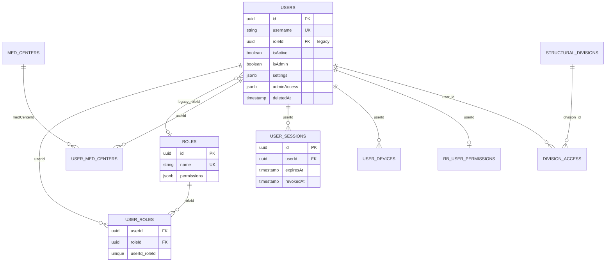
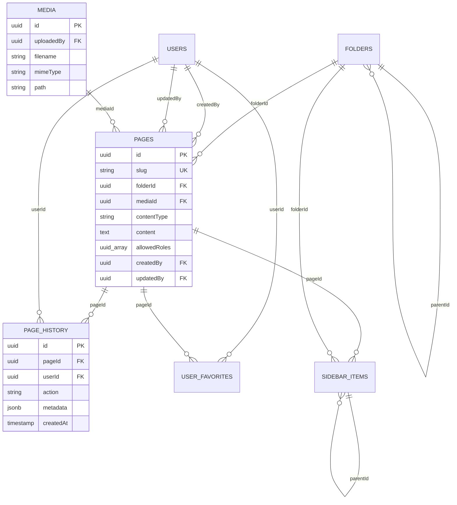
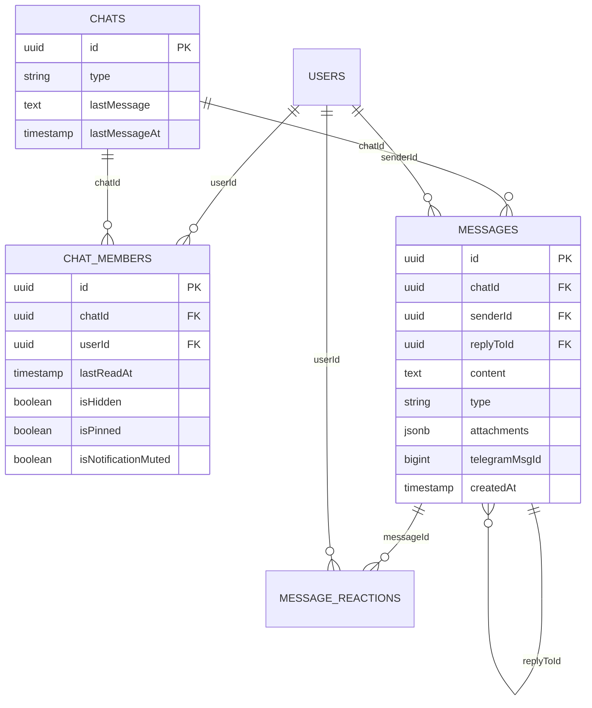
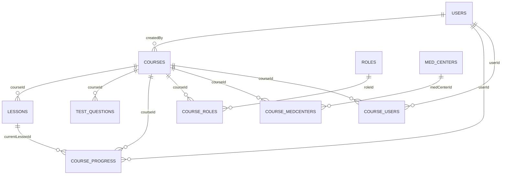
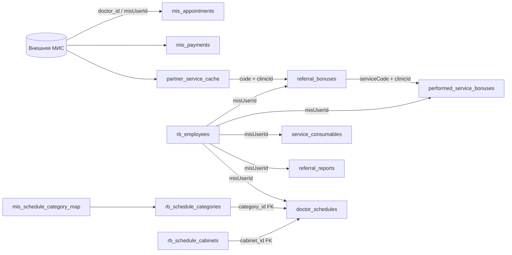
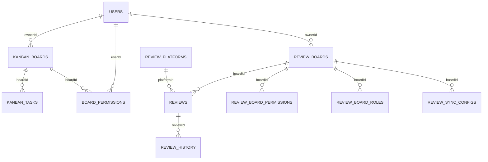
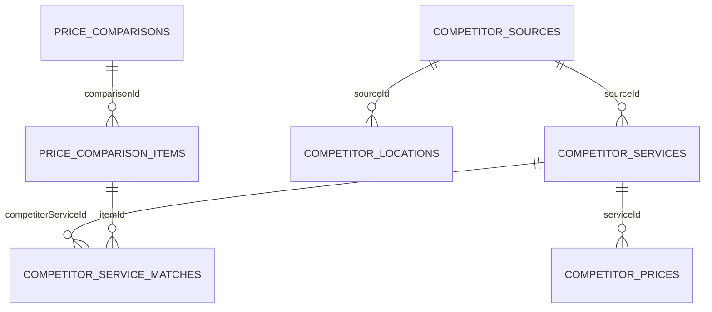
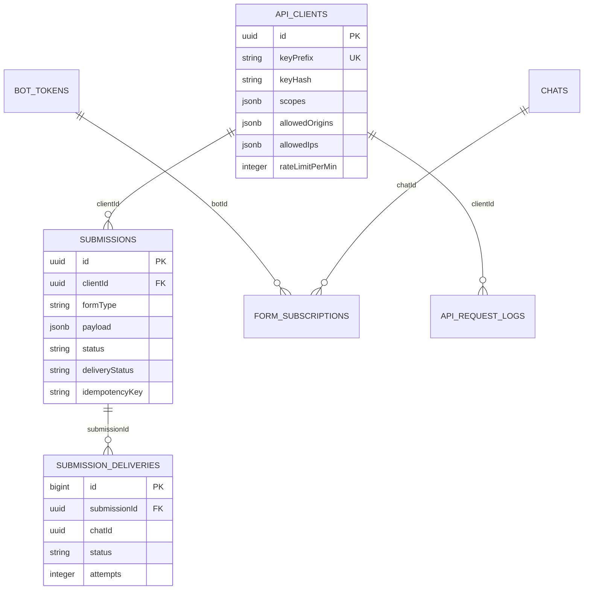
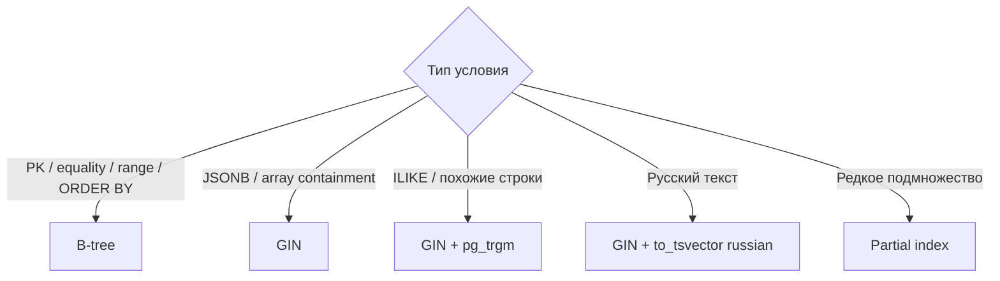
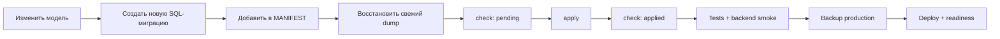

# Alfa-Wiki: база данных

Актуально на **2026-08-04**, версия приложения **6.54**. Документ сверён с
production-дампом PostgreSQL 18.4 и миграциями 6.52–6.54.

## 1. Быстрый паспорт

| Параметр | Значение |
|---|---|
| СУБД | PostgreSQL 18.4 |
| Схема | `public` |
| ORM | Sequelize 6.37.8 |
| Драйвер | `pg` 8.16.3, `pg-hstore` 2.3.4 |
| Расширения | `pg_trgm` |
| Таблицы | 110 после миграций 6.52–6.54 |
| Индексы | около 287, преимущественно B-tree; также GIN/trigram/full-text |
| Внешние ключи | 99 |
| Основные PK | UUID с `gen_random_uuid()` / UUIDv4 |
| Гибкие данные | JSONB: права, настройки, payload, отчёты, вложения, история |
| Backend | Node.js + Express, один процесс в `tmux`, запуск `npm run dev` |
| Пул по умолчанию | `min=0`, `max=10` |
| Readiness | `GET /api/ready`: БД, пул, Socket.IO adapter |

Production snapshot, использованный для ревью:

- backup: 283–284 МБ в custom format;
- `page_history`: 70 816 строк;
- `rb_activity_log`: 37 833 строки;
- автоматическое удаление истории не включено.

## 2. Архитектура доступа

```mermaid
flowchart LR
    WEB[Web / desktop / mobile] --> API[Express routes]
    API --> ORM[Sequelize models]
    API --> SQL[Параметризованный raw SQL]
    JOBS[Cron / sync / delivery jobs] --> ORM
    JOBS --> SQL
    ORM --> POOL[pg connection pool]
    SQL --> POOL
    POOL --> PG[(PostgreSQL 18.4)]
    PG --> TRGM[pg_trgm / GIN / full-text]
    API --> READY[/api/ready]
    READY --> POOL
```

Источники схемы, в порядке приоритета:

1. Фактическая production-схема PostgreSQL.
2. Применённые SQL-миграции и `schema_migrations`.
3. Sequelize-модели в `backend/models/index.js` и
   `backend/models/messageReaction.js`.

`sequelize.sync()` при старте сервера **не выполняется**. Не использовать
`backend/scripts/initDb.js` на существующей БД: там есть `sync({ force: true })`,
который удаляет таблицы.

## 3. Карта доменов

| Домен | Основные таблицы |
|---|---|
| Пользователи и доступ | `users`, `roles`, `user_roles`, `med_centers`, `user_med_centers`, `user_sessions`, `user_devices`, `structural_divisions`, `division_access`, `rb_user_permissions` |
| Wiki и контент | `folders`, `pages`, `page_history`, `media`, `user_favorites`, `sidebar_items`, `search_index`, `announcements`, `release_notes`, `release_note_reads` |
| Чаты и боты | `chats`, `chat_members`, `messages`, `message_reactions`, `bot_tokens`, `bot_updates`, `bot_subscribers`, `telegram_subscribers`, `form_subscriptions` |
| Курсы | `courses`, `lessons`, `test_questions`, `course_progress`, `course_roles`, `course_medcenters`, `course_users` |
| Канбан | `kanban_boards`, `kanban_tasks`, `board_permissions` |
| Отзывы | `review_boards`, `reviews`, `review_platforms`, `review_history`, `review_board_permissions`, `review_board_roles`, `review_sync_configs` |
| МИС и справочники | `mis_appointments`, `mis_payments`, `analyses`, `services`, `nomenclature_804n`, `partner_service_cache`, `doctor_cards`, `accreditations`, `accreditation_files` |
| Реферальные бонусы и зарплата | `referral_bonuses`, `performed_service_bonuses`, `service_consumables`, `referral_reports`, `salary_records`, `cash_payments`, `executor_settings`, `rb_employees`, `rb_activity_log`, `rb_excel_sources` |
| Расписания и нормы | `doctor_schedules`, `rb_schedule_categories`, `rb_schedule_cabinets`, `mis_schedule_category_map`, `rb_holidays`, `hour_norms`, `role_norms`, `category_norms`, `tabel_records`, `tabel_record_doctors` |
| Сравнение цен | `price_comparisons`, `price_comparison_items`, `competitor_sources`, `competitor_locations`, `competitor_services`, `competitor_prices`, `competitor_service_matches` |
| Публичный API | `api_clients`, `api_request_logs`, `submissions`, `submission_deliveries`, `int_id_map` |
| Email | `email_templates`, `email_logs`, `email_favorite_templates`, `email_favorite_recipients` |
| Реестры и отчёты | `ambulance_report_entries`, `certificate_registry_entries`, `doctor_day_report_entries`, `operations_report_entries`, `gynecology_report_entries`, `therapy_report_entries`, `surgery_report_entries`, `discount_report_entries` |
| Прочее | `calendar_events`, `promotions`, `vehicles`, `vehicle_files`, `map_markers`, `directories_meta`, `settings`, `schema_migrations` |

## 4. Ключевые схемы

Диаграммы показывают ключи и связи, а не все столбцы.

### 4.1 Пользователи и права



Важно: `users.roleId` сохранён для обратной совместимости. Новая логика должна
использовать M:N-связь `user_roles`.

### 4.2 Wiki и файлы



Файлы хранятся на диске; в `media` находятся метаданные и путь. Исключения:
некоторые отчёты и Excel-источники хранят крупные данные непосредственно в
`TEXT`/JSONB.

### 4.3 Чаты



Горячие индексы:

- `messages (chatId, createdAt)` — история и последнее сообщение;
- `chat_members (userId, isHidden, chatId)` — список чатов пользователя;
- unread counts считаются одним агрегатным запросом, не N+1.

### 4.4 Курсы



Доступ к курсу может быть разрешён одновременно по роли, медцентру или явно
конкретному пользователю.

### 4.5 Реферальные бонусы, расписания и МИС



Основные бизнес-ключи:

| Таблица | Ключ/индекс |
|---|---|
| `referral_bonuses` | UNIQUE (`misUserId`, `serviceCode`, `clinicId`) |
| `performed_service_bonuses` | UNIQUE (`misUserId`, `serviceCode`, `clinicId`, `cabinetId`, период) |
| `service_consumables` | индексы по `misUserId`, `serviceCode` и их паре |
| `partner_service_cache` | UNIQUE (`clinicId`, `serviceId`) |
| `hour_norms` | UNIQUE (`professionTitle`, `year`, `month`) |
| `role_norms` | UNIQUE (`roleTitle`, `year`, `month`) |
| `category_norms` | UNIQUE (`categoryId`, `year`, `month`) |

`misUserId`, `serviceCode`, `clinicId` и многие идентификаторы МИС — логические
связи, а не PostgreSQL FK. Они должны сохраняться без изменения регистра и
формата. Запросы `mis_appointments` и `mis_payments` обязаны иметь диапазон дат.

### 4.6 Канбан и отзывы



`reviews` использует soft delete (`deletedAt`). Конфигурация workflow, колонки,
назначения и вложения частично хранятся в JSONB.

### 4.7 Сравнение цен



Поиск названий конкурентов использует `pg_trgm` и GIN по
`competitor_services.nameNormalized`. Массив кодов также индексирован GIN.

### 4.8 Публичный API и доставка форм



`submissions` — источник истины. Сообщение в чате является доставкой, а не
единственным хранилищем заявки. Тело запроса не записывается в
`api_request_logs`, поскольку может содержать персональные данные.

`clientId` в `submissions` и `api_request_logs` — логическая ссылка на
`api_clients`, но PostgreSQL FK для неё сейчас не задан.

## 5. Типы и соглашения

| Правило | Практика проекта |
|---|---|
| Идентификаторы | UUID; BIGINT используется для Telegram/external IDs и некоторых журналов |
| Имена таблиц | `snake_case`, во множественном числе |
| Имена колонок | Исторически смешаны: Sequelize `camelCase` и SQL/MIS `snake_case` |
| Raw SQL | `camelCase`-колонки обязательно заключать в двойные кавычки: `"userId"` |
| Время | Обычно `TIMESTAMPTZ`; бизнес-даты без времени — `DATE` / Sequelize `DATEONLY` |
| Деньги | `NUMERIC/DECIMAL`, не `float` |
| Гибкие структуры | JSONB; часто требуют явной валидации на уровне API |
| Удаление | В основном физическое; `reviews` и часть пользовательских сущностей поддерживают soft delete |
| Timestamps | Sequelize-таблицы обычно имеют `createdAt`, `updatedAt` |
| Внешняя МИС | Связь через строковые/числовые business IDs без FK |

Не выбирать тяжёлые поля в списочных API без необходимости: `diff`, `reportData`,
`fileData`, `excelData`, большие JSONB и base64. Детали загружать отдельным
endpoint.

## 6. Индексы и поиск



Примеры специальных индексов:

- trigram: названия услуг конкурентов и `searchText` реестров;
- full-text Russian: `partner_service_cache.title`;
- JSONB/array GIN: `folders.allowedRoles`, коды услуг конкурентов;
- partial: незавершённые `submission_deliveries`, активные подписки форм;
- composite: чаты пользователя, сообщения чата, бонусы врача/клиники.

Перед добавлением индекса:

1. Получить реальный запрос и `EXPLAIN (ANALYZE, BUFFERS)` на копии БД.
2. Проверить существующие индексы в `pg_indexes`.
3. Для крупной production-таблицы использовать `CREATE INDEX CONCURRENTLY`.
4. Не помещать `CONCURRENTLY` внутрь `BEGIN/COMMIT`.

## 7. Миграции

Новый контролируемый runner ведёт таблицу `schema_migrations`:

```bash
cd backend
npm run migrate:safe-db:check
npm run migrate:safe-db
npm run migrate:safe-db:check
```

Коды `migrate:safe-db:check`:

| Код | Значение |
|---:|---|
| 0 | все миграции применены |
| 2 | есть pending-миграции |
| 1 | ошибка или checksum mismatch |

Правила:

- новый SQL-файл добавить в `MANIFEST` внутри
  `backend/scripts/migrateSafeDatabase.js`;
- применённый файл не редактировать: runner проверяет SHA-256;
- runner использует PostgreSQL advisory lock и не допускает параллельное
  применение двумя деплоями;
- старые миграции до 6.52 не занесены задним числом в ledger;
- миграция должна быть идемпотентной и по возможности аддитивной;
- удаление/переименование колонок выполнять отдельным многоэтапным релизом.

## 8. Соединения и окружение

Основные переменные `backend/.env`:

| Переменная | Default | Назначение |
|---|---:|---|
| `DB_HOST` | — | PostgreSQL host |
| `DB_PORT` | 5432 | PostgreSQL port |
| `DB_NAME` | — | database |
| `DB_USER` | — | application role |
| `DB_PASSWORD` | — | password; не выводить в логи |
| `DB_POOL_MAX` | 10 | соединений на один backend-процесс |
| `DB_POOL_MIN` | 0 | постоянно открытые соединения |
| `DB_POOL_ACQUIRE_MS` | 30000 | ожидание соединения |
| `DB_POOL_IDLE_MS` | 10000 | idle timeout |
| `DB_CONNECT_TIMEOUT_MS` | 10000 | connect timeout |
| `DB_STATEMENT_TIMEOUT_MS` | 0 | statement timeout; 0 = отключён |
| `DB_APPLICATION_NAME` | `alfa-wiki-<env>` | метка в `pg_stat_activity` |
| `RUN_BACKGROUND_JOBS` | true | cron/jobs только на одной реплике |

```text
DB_POOL_MAX <=
  (max_connections - reserved_connections - worker_connections)
  / backend_instances
```

При нескольких backend-репликах:

- рассчитать общий лимит пула;
- `RUN_BACKGROUND_JOBS=true` оставить только на одной реплике;
- Socket.IO переключить на Redis adapter;
- PgBouncer добавлять только при фактическом дефиците соединений.

## 9. Диагностика

Readiness:

```bash
curl -kfsS https://127.0.0.1:9001/api/ready
```

Активность соединений:

```sql
SELECT application_name, state, count(*)
FROM pg_stat_activity
WHERE datname = current_database()
GROUP BY application_name, state
ORDER BY application_name, state;
```

Размеры крупнейших таблиц:

```sql
SELECT relname,
       pg_size_pretty(pg_total_relation_size(relid)) AS total_size,
       n_live_tup
FROM pg_stat_user_tables
ORDER BY pg_total_relation_size(relid) DESC
LIMIT 20;
```

Проверка индексов:

```sql
SELECT schemaname, tablename, indexname, indexdef
FROM pg_indexes
WHERE schemaname = 'public'
ORDER BY tablename, indexname;
```

Не запускать тяжёлый `EXPLAIN ANALYZE` на production без оценки запроса: он
реально выполняет SQL.

## 10. Backup и восстановление

Backup custom format:

```bash
PGPASSWORD='<password>' pg_dump \
  -h '<host>' -p 5432 -U '<user>' -d '<database>' \
  -Fc --no-owner --no-privileges \
  -f 'backups/alfa_wiki-YYYYMMDD-HHMMSS.backup'

pg_restore --list backups/alfa_wiki-YYYYMMDD-HHMMSS.backup >/dev/null
sha256sum backups/alfa_wiki-YYYYMMDD-HHMMSS.backup
chmod 600 backups/alfa_wiki-YYYYMMDD-HHMMSS.backup
```

`backend/.env` нельзя напрямую `source`: значение `SMTP_FROM` не является
валидной shell-строкой. Передавать DB-параметры отдельно либо читать `.env`
через `dotenv`.

Проверять восстановление только в отдельную БД:

```bash
createdb alfa_wiki_review
pg_restore --exit-on-error --no-owner --no-privileges \
  -d alfa_wiki_review backups/alfa_wiki-YYYYMMDD-HHMMSS.backup
```

Backup содержит персональные и служебные данные:

- не коммитить в Git;
- права файла `0600`;
- не передавать через публичные хранилища;
- production restore выполнять только как отдельную аварийную процедуру.

## 11. Чек-лист изменения схемы



Для нового endpoint:

- запрос параметризован;
- список имеет pagination и максимальный `limit`;
- большие временные таблицы требуют диапазон дат;
- нет запросов внутри цикла;
- bulk-write обёрнут в транзакцию;
- для FK явно выбран `ON DELETE`;
- индекс соответствует `WHERE + ORDER BY`, а не добавлен «на всякий случай»;
- удаление данных и rollback описаны заранее.

## 12. Известные особенности

- Большинство моделей находится в одном крупном
  `backend/models/index.js`; проверять также отдельные SQL-миграции.
- В схеме смешаны `camelCase` и `snake_case`.
- Не все логические связи оформлены FK, особенно интеграции с МИС.
- JSONB ускоряет развитие модулей, но переносит часть проверки структуры в API.
- История страниц и RB activity log растут постоянно; retention пока не включён.
- `PartnerServiceCache.sync({ alter: false })` ещё вызывается cron-задачей;
  новые таблицы всё равно следует создавать миграциями.
- Старые SQL/JS-миграции неоднородны; ledger является источником истины только
  начиная с миграций 6.52–6.54.

## 13. Где смотреть код

| Что | Файл |
|---|---|
| Sequelize и связи | `backend/models/index.js` |
| Реакции сообщений | `backend/models/messageReaction.js` |
| Настройка пула | `backend/utils/databaseRuntimeConfig.js` |
| Контролируемые миграции | `backend/scripts/migrateSafeDatabase.js` |
| SQL-миграции | `backend/migrations/` |
| Readiness/startup | `backend/server.js` |
| Практика масштабирования | `backend/DATABASE_SCALING.md` |
| Runbook релиза 6.54 | `docs/DEPLOY_SCALING_2026-08-04.md` |
