# Production-БД Alfa-Wiki: ERD и словарь данных

## Паспорт

| Параметр | Значение |
|---|---|
| База данных | `alfa_wiki` |
| Схема | `public` |
| PostgreSQL | 18.4 (Ubuntu 18.4-1.pgdg24.04+1) |
| Таблиц | 111 |
| Полей | 1161 |
| Первичных ключей | 111 |
| Внешних ключей | 101 |
| Индексов | 439 |
| Enum-типов | 12 |
| Расширения | `pg_trgm` 1.6, `plpgsql` 1.0 |

## Содержание

- [ERD](#erd)
  - [Пользователи и доступ](#erd-пользователи-и-доступ)
  - [Wiki и контент](#erd-wiki-и-контент)
  - [Чаты и боты](#erd-чаты-и-боты)
  - [Курсы](#erd-курсы)
  - [Канбан](#erd-канбан)
  - [Отзывы](#erd-отзывы)
  - [МИС и медицинские справочники](#erd-мис-и-медицинские-справочники)
  - [Зарплата и реферальные бонусы](#erd-зарплата-и-реферальные-бонусы)
  - [Расписания и нормы](#erd-расписания-и-нормы)
  - [Сравнение цен](#erd-сравнение-цен)
  - [Публичный API и формы](#erd-публичный-api-и-формы)
  - [Email](#erd-email)
  - [Реестры и отчёты](#erd-реестры-и-отчёты)
  - [Прочее и системные данные](#erd-прочее-и-системные-данные)
- [Каталог таблиц](#catalog)
  - [Пользователи и доступ](#catalog-пользователи-и-доступ) — 10 табл.
  - [Wiki и контент](#catalog-wiki-и-контент) — 12 табл.
  - [Чаты и боты](#catalog-чаты-и-боты) — 9 табл.
  - [Курсы](#catalog-курсы) — 7 табл.
  - [Канбан](#catalog-канбан) — 3 табл.
  - [Отзывы](#catalog-отзывы) — 7 табл.
  - [МИС и медицинские справочники](#catalog-мис-и-медицинские-справочники) — 10 табл.
  - [Зарплата и реферальные бонусы](#catalog-зарплата-и-реферальные-бонусы) — 11 табл.
  - [Расписания и нормы](#catalog-расписания-и-нормы) — 10 табл.
  - [Сравнение цен](#catalog-сравнение-цен) — 7 табл.
  - [Публичный API и формы](#catalog-публичный-api-и-формы) — 5 табл.
  - [Email](#catalog-email) — 4 табл.
  - [Реестры и отчёты](#catalog-реестры-и-отчёты) — 8 табл.
  - [Прочее и системные данные](#catalog-прочее-и-системные-данные) — 8 табл.
- [Словарь полей](#fields)
  - [Пользователи и доступ](#fields-пользователи-и-доступ)
    - [`users`](#table-users)
    - [`roles`](#table-roles)
    - [`user_roles`](#table-user_roles)
    - [`user_med_centers`](#table-user_med_centers)
    - [`med_centers`](#table-med_centers)
    - [`user_sessions`](#table-user_sessions)
    - [`user_devices`](#table-user_devices)
    - [`structural_divisions`](#table-structural_divisions)
    - [`division_access`](#table-division_access)
    - [`rb_user_permissions`](#table-rb_user_permissions)
  - [Wiki и контент](#fields-wiki-и-контент)
    - [`folders`](#table-folders)
    - [`pages`](#table-pages)
    - [`page_history`](#table-page_history)
    - [`media`](#table-media)
    - [`user_favorites`](#table-user_favorites)
    - [`sidebar_items`](#table-sidebar_items)
    - [`search_index`](#table-search_index)
    - [`announcements`](#table-announcements)
    - [`release_notes`](#table-release_notes)
    - [`release_note_reads`](#table-release_note_reads)
    - [`analysis_page_notes`](#table-analysis_page_notes)
    - [`service_page_notes`](#table-service_page_notes)
  - [Чаты и боты](#fields-чаты-и-боты)
    - [`chats`](#table-chats)
    - [`chat_members`](#table-chat_members)
    - [`messages`](#table-messages)
    - [`message_reactions`](#table-message_reactions)
    - [`bot_tokens`](#table-bot_tokens)
    - [`bot_updates`](#table-bot_updates)
    - [`bot_subscribers`](#table-bot_subscribers)
    - [`telegram_subscribers`](#table-telegram_subscribers)
    - [`form_subscriptions`](#table-form_subscriptions)
  - [Курсы](#fields-курсы)
    - [`courses`](#table-courses)
    - [`lessons`](#table-lessons)
    - [`test_questions`](#table-test_questions)
    - [`course_progress`](#table-course_progress)
    - [`course_roles`](#table-course_roles)
    - [`course_medcenters`](#table-course_medcenters)
    - [`course_users`](#table-course_users)
  - [Канбан](#fields-канбан)
    - [`kanban_boards`](#table-kanban_boards)
    - [`kanban_tasks`](#table-kanban_tasks)
    - [`board_permissions`](#table-board_permissions)
  - [Отзывы](#fields-отзывы)
    - [`review_boards`](#table-review_boards)
    - [`reviews`](#table-reviews)
    - [`review_platforms`](#table-review_platforms)
    - [`review_history`](#table-review_history)
    - [`review_board_permissions`](#table-review_board_permissions)
    - [`review_board_roles`](#table-review_board_roles)
    - [`review_sync_configs`](#table-review_sync_configs)
  - [МИС и медицинские справочники](#fields-мис-и-медицинские-справочники)
    - [`mis_appointments`](#table-mis_appointments)
    - [`mis_payments`](#table-mis_payments)
    - [`analyses`](#table-analyses)
    - [`services`](#table-services)
    - [`nomenclature_804n`](#table-nomenclature_804n)
    - [`partner_service_cache`](#table-partner_service_cache)
    - [`doctor_cards`](#table-doctor_cards)
    - [`doctor_service_durations`](#table-doctor_service_durations)
    - [`accreditations`](#table-accreditations)
    - [`accreditation_files`](#table-accreditation_files)
  - [Зарплата и реферальные бонусы](#fields-зарплата-и-реферальные-бонусы)
    - [`referral_bonuses`](#table-referral_bonuses)
    - [`performed_service_bonuses`](#table-performed_service_bonuses)
    - [`service_consumables`](#table-service_consumables)
    - [`referral_reports`](#table-referral_reports)
    - [`salary_records`](#table-salary_records)
    - [`cash_payments`](#table-cash_payments)
    - [`executor_settings`](#table-executor_settings)
    - [`rb_employees`](#table-rb_employees)
    - [`rb_activity_log`](#table-rb_activity_log)
    - [`rb_excel_sources`](#table-rb_excel_sources)
    - [`rb_doctor_headers`](#table-rb_doctor_headers)
  - [Расписания и нормы](#fields-расписания-и-нормы)
    - [`doctor_schedules`](#table-doctor_schedules)
    - [`rb_schedule_categories`](#table-rb_schedule_categories)
    - [`rb_schedule_cabinets`](#table-rb_schedule_cabinets)
    - [`mis_schedule_category_map`](#table-mis_schedule_category_map)
    - [`rb_holidays`](#table-rb_holidays)
    - [`hour_norms`](#table-hour_norms)
    - [`role_norms`](#table-role_norms)
    - [`category_norms`](#table-category_norms)
    - [`tabel_records`](#table-tabel_records)
    - [`tabel_record_doctors`](#table-tabel_record_doctors)
  - [Сравнение цен](#fields-сравнение-цен)
    - [`price_comparisons`](#table-price_comparisons)
    - [`price_comparison_items`](#table-price_comparison_items)
    - [`competitor_sources`](#table-competitor_sources)
    - [`competitor_locations`](#table-competitor_locations)
    - [`competitor_services`](#table-competitor_services)
    - [`competitor_prices`](#table-competitor_prices)
    - [`competitor_service_matches`](#table-competitor_service_matches)
  - [Публичный API и формы](#fields-публичный-api-и-формы)
    - [`api_clients`](#table-api_clients)
    - [`api_request_logs`](#table-api_request_logs)
    - [`submissions`](#table-submissions)
    - [`submission_deliveries`](#table-submission_deliveries)
    - [`int_id_map`](#table-int_id_map)
  - [Email](#fields-email)
    - [`email_templates`](#table-email_templates)
    - [`email_logs`](#table-email_logs)
    - [`email_favorite_templates`](#table-email_favorite_templates)
    - [`email_favorite_recipients`](#table-email_favorite_recipients)
  - [Реестры и отчёты](#fields-реестры-и-отчёты)
    - [`ambulance_report_entries`](#table-ambulance_report_entries)
    - [`certificate_registry_entries`](#table-certificate_registry_entries)
    - [`doctor_day_report_entries`](#table-doctor_day_report_entries)
    - [`operations_report_entries`](#table-operations_report_entries)
    - [`gynecology_report_entries`](#table-gynecology_report_entries)
    - [`therapy_report_entries`](#table-therapy_report_entries)
    - [`surgery_report_entries`](#table-surgery_report_entries)
    - [`discount_report_entries`](#table-discount_report_entries)
  - [Прочее и системные данные](#fields-прочее-и-системные-данные)
    - [`calendar_events`](#table-calendar_events)
    - [`promotions`](#table-promotions)
    - [`vehicles`](#table-vehicles)
    - [`vehicle_files`](#table-vehicle_files)
    - [`map_markers`](#table-map_markers)
    - [`directories_meta`](#table-directories_meta)
    - [`settings`](#table-settings)
    - [`schema_migrations`](#table-schema_migrations)

## 1. ERD

Диаграммы построены на основании **101 фактического внешнего ключа**. Для читаемости схема разделена на функциональные области; внешние сущности, на которые ссылается область, также показаны на соответствующей диаграмме. В блоках сущностей приведены только поля PK/FK.

### 1.1. Пользователи и доступ

Учётные записи, роли, сессии, устройства и разграничение доступа.

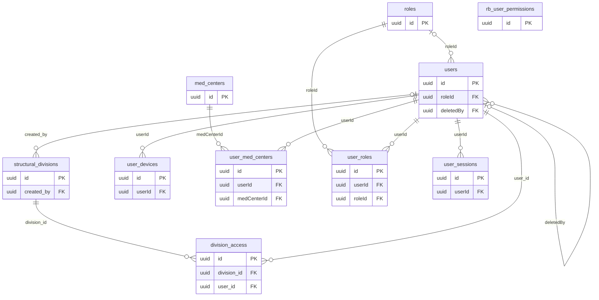

### 1.2. Wiki и контент

Страницы базы знаний, структура меню, файлы, поиск и журнал изменений.

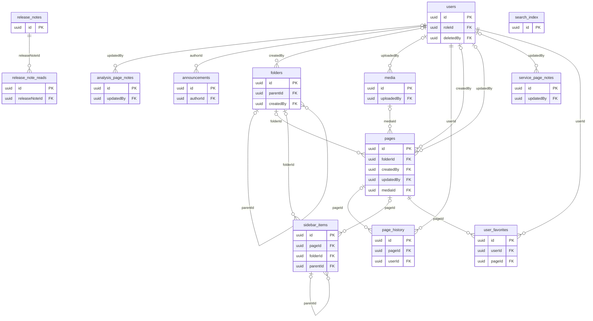

### 1.3. Чаты и боты

Чаты, сообщения, реакции, подписчики и интеграции ботов.

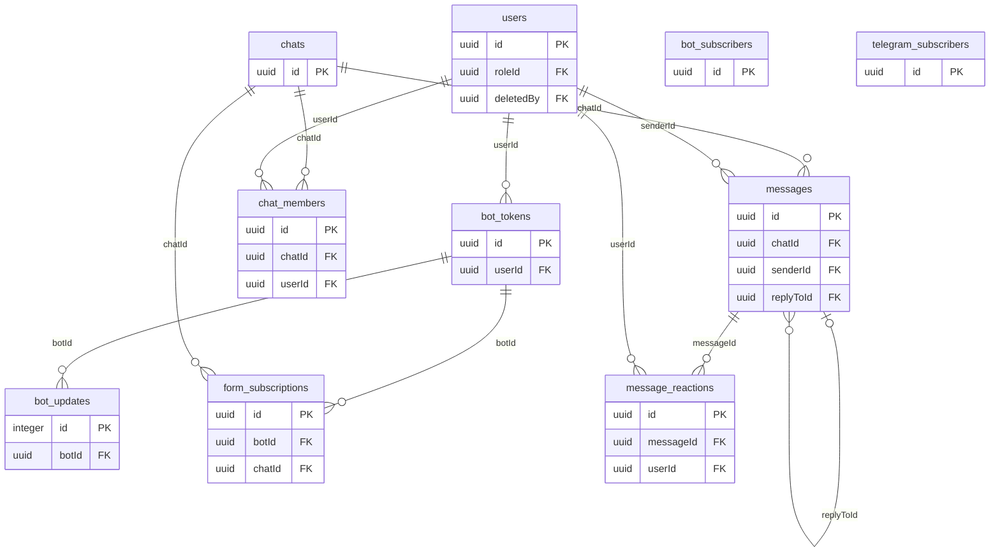

### 1.4. Курсы

Учебные курсы, уроки, вопросы, прогресс и правила доступа.

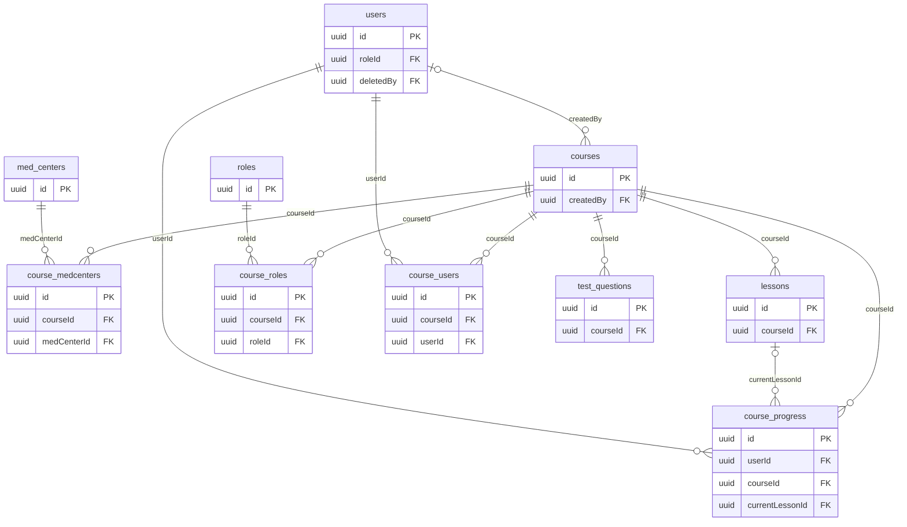

### 1.5. Канбан

Доски, задачи и права доступа к ним.

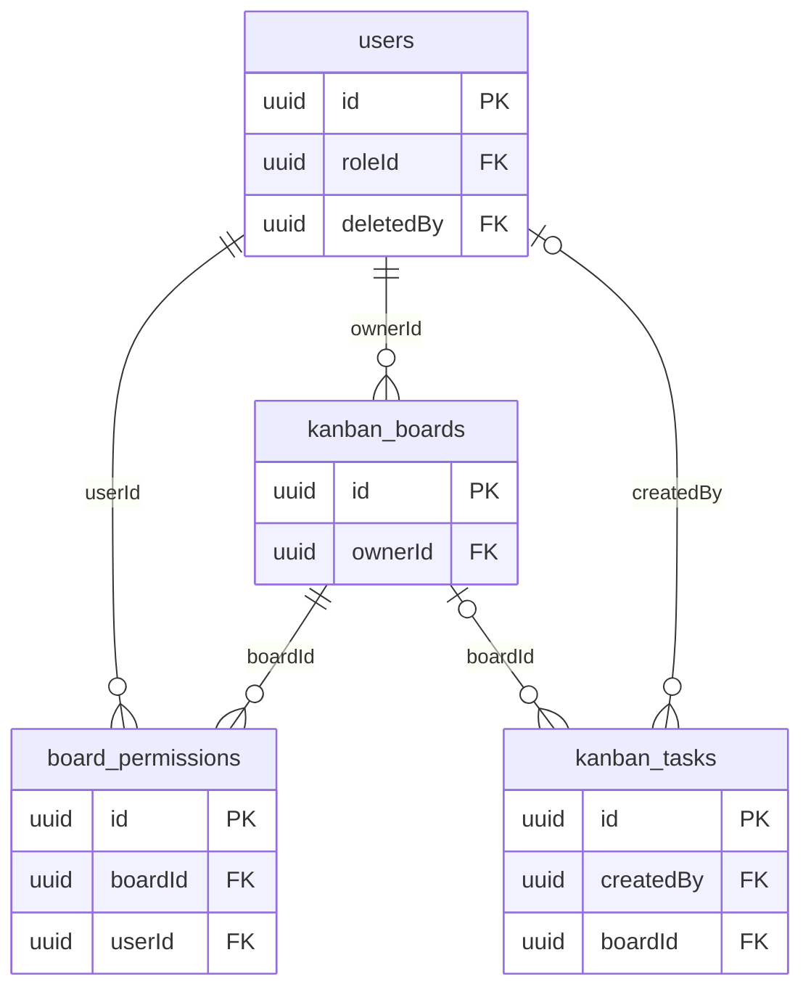

### 1.6. Отзывы

Сбор, синхронизация и обработка отзывов из внешних источников.

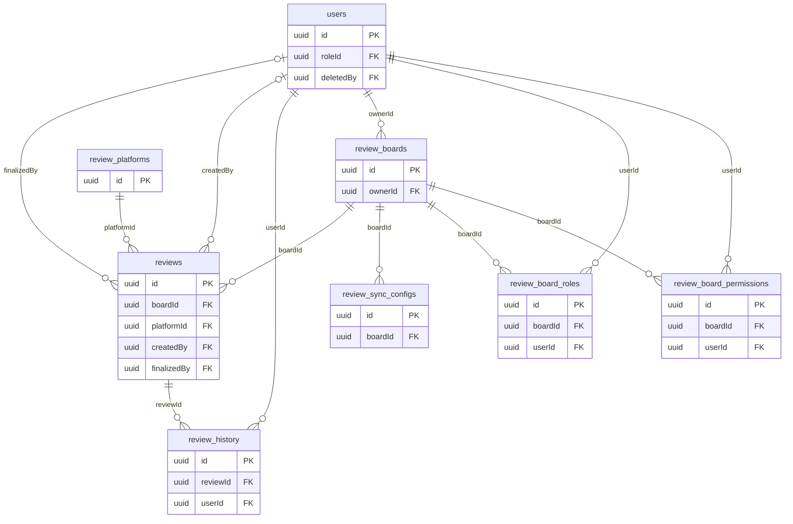

### 1.7. МИС и медицинские справочники

Данные МИС, услуги, анализы, врачи, аккредитации и медицинская номенклатура.

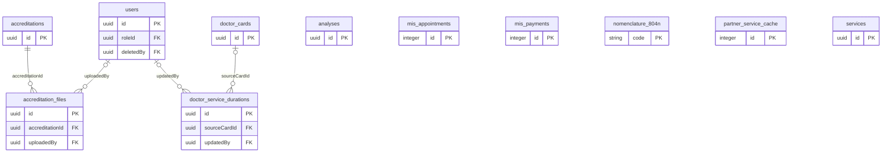

### 1.8. Зарплата и реферальные бонусы

Начисления, выплаты, расходники, отчёты и настройки расчёта.

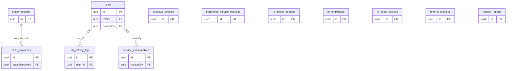

### 1.9. Расписания и нормы

Расписания врачей, нормы времени, табели, кабинеты и праздники.

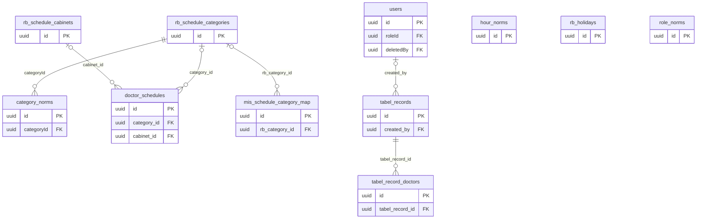

### 1.10. Сравнение цен

Источники конкурентов, география, услуги, цены и сопоставления.

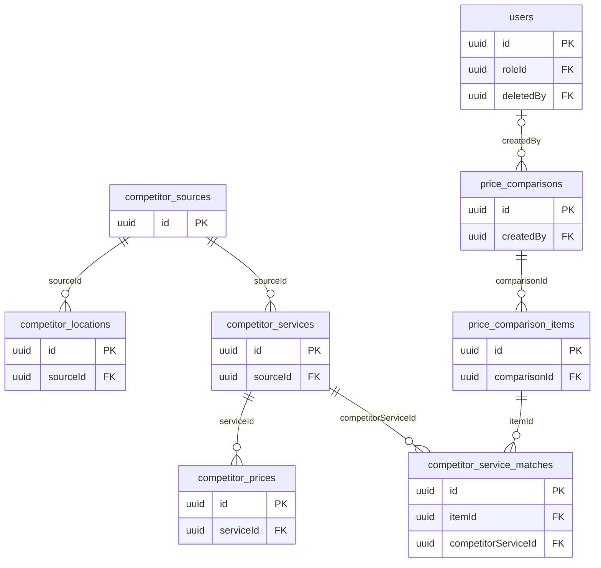

### 1.11. Публичный API и формы

API-клиенты, аудит запросов, формы и доставка результатов.

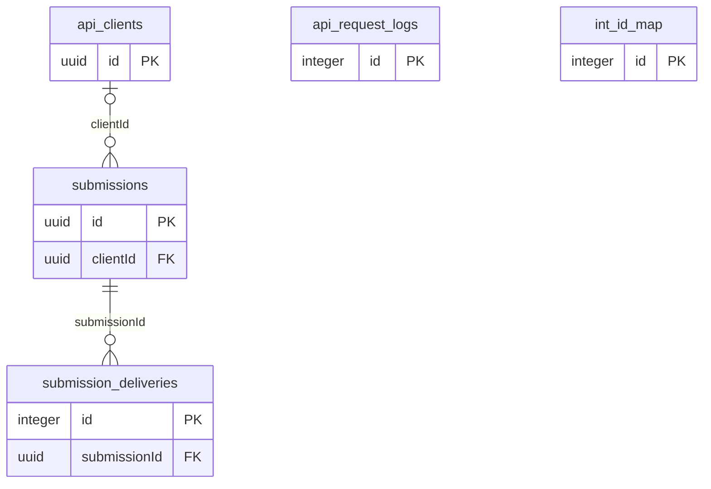

### 1.12. Email

Шаблоны, журнал рассылок и пользовательское избранное.

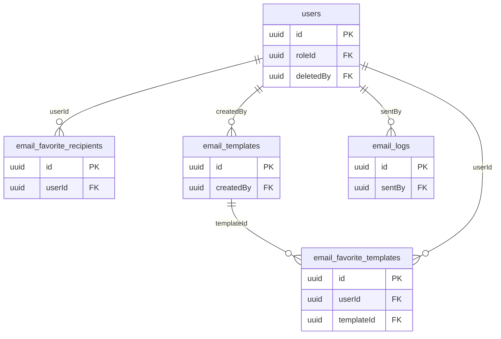

### 1.13. Реестры и отчёты

Операционные журналы, реестры и специализированные медицинские отчёты.

```mermaid
erDiagram
    ambulance_report_entries {
      uuid id PK
    }
    certificate_registry_entries {
      uuid id PK
    }
    discount_report_entries {
      uuid id PK
    }
    doctor_day_report_entries {
      uuid id PK
    }
    gynecology_report_entries {
      uuid id PK
    }
    operations_report_entries {
      uuid id PK
    }
    surgery_report_entries {
      uuid id PK
    }
    therapy_report_entries {
      uuid id PK
    }
```

### 1.14. Прочее и системные данные

Календарь, акции, транспорт, карта, настройки и учёт миграций.

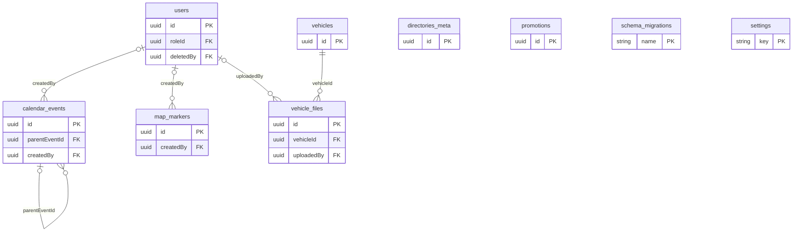

## 2. Каталог таблиц

В каталоге приведено краткое назначение каждой таблицы. Название таблицы ведёт к её полному словарю полей ниже в этом же документе.

### 2.1. Пользователи и доступ

Учётные записи, роли, сессии, устройства и разграничение доступа.

| Таблица | Назначение | Полей | PK | FK |
|---|---|---:|---|---:|
| [`users`](#table-users) | Учётные записи, профиль и индивидуальные разрешения пользователей. | 37 | `id` | 2 |
| [`roles`](#table-roles) | Роли пользователей и наборы разрешений. | 7 | `id` | 0 |
| [`user_roles`](#table-user_roles) | Связь пользователей с назначенными ролями. | 5 | `id` | 2 |
| [`user_med_centers`](#table-user_med_centers) | Связь пользователей с доступными медицинскими центрами. | 5 | `id` | 2 |
| [`med_centers`](#table-med_centers) | Справочник медицинских центров. | 6 | `id` | 0 |
| [`user_sessions`](#table-user_sessions) | Сессии входа и refresh-токены пользователей. | 12 | `id` | 1 |
| [`user_devices`](#table-user_devices) | Устройства пользователей и push-токены. | 12 | `id` | 1 |
| [`structural_divisions`](#table-structural_divisions) | Справочник структурных подразделений. | 7 | `id` | 1 |
| [`division_access`](#table-division_access) | Доступ пользователей к структурным подразделениям. | 6 | `id` | 2 |
| [`rb_user_permissions`](#table-rb_user_permissions) | Специализированные права пользователя в зарплатном модуле. | 20 | `id` | 0 |

### 2.2. Wiki и контент

Страницы базы знаний, структура меню, файлы, поиск и журнал изменений.

| Таблица | Назначение | Полей | PK | FK |
|---|---|---:|---|---:|
| [`folders`](#table-folders) | Иерархия папок базы знаний. | 11 | `id` | 2 |
| [`pages`](#table-pages) | Страницы базы знаний и их содержимое. | 22 | `id` | 4 |
| [`page_history`](#table-page_history) | Журнал изменений страниц wiki | 7 | `id` | 2 |
| [`media`](#table-media) | Метаданные загруженных файлов и изображений. | 12 | `id` | 1 |
| [`user_favorites`](#table-user_favorites) | Избранные wiki-страницы пользователей. | 6 | `id` | 2 |
| [`sidebar_items`](#table-sidebar_items) | Элементы меню навигации. Разделители больше не используются - они автоматически рендерятся после папок на фронтенде | 14 | `id` | 3 |
| [`search_index`](#table-search_index) | Материализованные данные для полнотекстового поиска. | 10 | `id` | 0 |
| [`announcements`](#table-announcements) | Объявления, показываемые пользователям системы. | 10 | `id` | 1 |
| [`release_notes`](#table-release_notes) | Заметки об изменениях версий приложения. | 12 | `id` | 0 |
| [`release_note_reads`](#table-release_note_reads) | Факты прочтения заметок о релизах пользователями. | 6 | `id` | 1 |
| [`analysis_page_notes`](#table-analysis_page_notes) | Примечания к анализам в контексте отдельных wiki-страниц. | 6 | `id` | 1 |
| [`service_page_notes`](#table-service_page_notes) | Примечания к услугам в контексте отдельных wiki-страниц. | 6 | `id` | 1 |

### 2.3. Чаты и боты

Чаты, сообщения, реакции, подписчики и интеграции ботов.

| Таблица | Назначение | Полей | PK | FK |
|---|---|---:|---|---:|
| [`chats`](#table-chats) | Диалоги, групповые чаты и служебные каналы. | 9 | `id` | 0 |
| [`chat_members`](#table-chat_members) | Участники чатов, их роли и персональные настройки. | 12 | `id` | 2 |
| [`messages`](#table-messages) | Сообщения чатов, вложения, пересылки и опросы. | 15 | `id` | 3 |
| [`message_reactions`](#table-message_reactions) | Реакции пользователей на сообщения в чате | 6 | `id` | 2 |
| [`bot_tokens`](#table-bot_tokens) | Токены и настройки подключённых ботов. | 16 | `id` | 1 |
| [`bot_updates`](#table-bot_updates) | Очередь и журнал входящих обновлений от ботов. | 7 | `id` | 1 |
| [`bot_subscribers`](#table-bot_subscribers) | Подписчики внутренних ботов и параметры доставки уведомлений. | 16 | `id` | 0 |
| [`telegram_subscribers`](#table-telegram_subscribers) | Подписчики Telegram-уведомлений. | 12 | `id` | 0 |
| [`form_subscriptions`](#table-form_subscriptions) | Подписки чатов и пользователей на события публичных форм. | 9 | `id` | 2 |

### 2.4. Курсы

Учебные курсы, уроки, вопросы, прогресс и правила доступа.

| Таблица | Назначение | Полей | PK | FK |
|---|---|---:|---|---:|
| [`courses`](#table-courses) | Учебные курсы и параметры их публикации. | 9 | `id` | 1 |
| [`lessons`](#table-lessons) | Уроки, входящие в учебные курсы. | 7 | `id` | 1 |
| [`test_questions`](#table-test_questions) | Контрольные вопросы учебных курсов. | 8 | `id` | 1 |
| [`course_progress`](#table-course_progress) | Прогресс пользователей по урокам и курсам. | 10 | `id` | 3 |
| [`course_roles`](#table-course_roles) | Связь курсов с ролями для контроля доступа. Если таблица пустая для курса - доступен всем. | 5 | `id` | 2 |
| [`course_medcenters`](#table-course_medcenters) | Связь курсов с медцентрами для контроля доступа. Если таблица пустая для курса - доступен всем. | 5 | `id` | 2 |
| [`course_users`](#table-course_users) | Индивидуальные разрешения пользователей на доступ к курсам. | 5 | `id` | 2 |

### 2.5. Канбан

Доски, задачи и права доступа к ним.

| Таблица | Назначение | Полей | PK | FK |
|---|---|---:|---|---:|
| [`kanban_boards`](#table-kanban_boards) | Канбан-доски медицинских центров. | 7 | `id` | 1 |
| [`kanban_tasks`](#table-kanban_tasks) | Задачи на Канбан-доске медицинского центра | 19 | `id` | 2 |
| [`board_permissions`](#table-board_permissions) | Права пользователей на канбан-доски. | 6 | `id` | 2 |

### 2.6. Отзывы

Сбор, синхронизация и обработка отзывов из внешних источников.

| Таблица | Назначение | Полей | PK | FK |
|---|---|---:|---|---:|
| [`review_boards`](#table-review_boards) | Доски для группировки и обработки отзывов. | 11 | `id` | 1 |
| [`reviews`](#table-reviews) | Отзывы клиентов и состояние их обработки. | 30 | `id` | 4 |
| [`review_platforms`](#table-review_platforms) | Внешние площадки, с которых собираются отзывы. | 6 | `id` | 0 |
| [`review_history`](#table-review_history) | История изменения статусов и содержимого отзывов. | 9 | `id` | 2 |
| [`review_board_permissions`](#table-review_board_permissions) | Индивидуальные права пользователей на доски отзывов. | 6 | `id` | 2 |
| [`review_board_roles`](#table-review_board_roles) | Права ролей на доски отзывов. | 6 | `id` | 2 |
| [`review_sync_configs`](#table-review_sync_configs) | Настройки автоматической синхронизации отзывов. | 11 | `id` | 1 |

### 2.7. МИС и медицинские справочники

Данные МИС, услуги, анализы, врачи, аккредитации и медицинская номенклатура.

| Таблица | Назначение | Полей | PK | FK |
|---|---|---:|---|---:|
| [`mis_appointments`](#table-mis_appointments) | Записи пациентов на приём, импортированные из МИС. | 14 | `id` | 0 |
| [`mis_payments`](#table-mis_payments) | Платежи и оплаты, импортированные из МИС. | 21 | `id` | 0 |
| [`analyses`](#table-analyses) | Справочник лабораторных анализов и связанных wiki-страниц. | 12 | `id` | 0 |
| [`services`](#table-services) | Медицинские услуги, привязанные к страницам wiki | 13 | `id` | 0 |
| [`nomenclature_804n`](#table-nomenclature_804n) | Медицинская номенклатура по приказу №804н. | 6 | `code` | 0 |
| [`partner_service_cache`](#table-partner_service_cache) | Кэш услуг и цен внешних партнёров. | 16 | `id` | 0 |
| [`doctor_cards`](#table-doctor_cards) | Карточки врачей для публикации и внутренних процессов. | 13 | `id` | 0 |
| [`doctor_service_durations`](#table-doctor_service_durations) | Продолжительность услуг для конкретных врачей и клиник. | 9 | `id` | 2 |
| [`accreditations`](#table-accreditations) | Реестр аккредитаций медицинских работников. | 19 | `id` | 0 |
| [`accreditation_files`](#table-accreditation_files) | Файлы, прикрепленные к аккредитациям | 10 | `id` | 2 |

### 2.8. Зарплата и реферальные бонусы

Начисления, выплаты, расходники, отчёты и настройки расчёта.

| Таблица | Назначение | Полей | PK | FK |
|---|---|---:|---|---:|
| [`referral_bonuses`](#table-referral_bonuses) | Начисления реферальных бонусов врачам и клиникам. | 11 | `id` | 0 |
| [`performed_service_bonuses`](#table-performed_service_bonuses) | Бонусные начисления за оказанные услуги. | 12 | `id` | 0 |
| [`service_consumables`](#table-service_consumables) | Расходные материалы и себестоимость медицинских услуг. | 11 | `id` | 1 |
| [`referral_reports`](#table-referral_reports) | Сформированные отчёты по реферальным бонусам. | 12 | `id` | 0 |
| [`salary_records`](#table-salary_records) | Расчётные строки заработной платы. | 11 | `id` | 0 |
| [`cash_payments`](#table-cash_payments) | Денежные выплаты, связанные с зарплатными начислениями. | 13 | `id` | 1 |
| [`executor_settings`](#table-executor_settings) | Персональные настройки исполнителей для расчётов и отчётов. | 7 | `id` | 0 |
| [`rb_employees`](#table-rb_employees) | Сотрудники, участвующие в расчётах реферальных бонусов. | 13 | `id` | 0 |
| [`rb_activity_log`](#table-rb_activity_log) | Аудит действий в модуле реферальных бонусов и зарплаты. | 12 | `id` | 1 |
| [`rb_excel_sources`](#table-rb_excel_sources) | Excel-источники для автоподгрузки при формировании зарплатных отчётов | 9 | `id` | 0 |
| [`rb_doctor_headers`](#table-rb_doctor_headers) | Пользовательские заголовки и группировка врачей в отчётах. | 5 | `id` | 0 |

### 2.9. Расписания и нормы

Расписания врачей, нормы времени, табели, кабинеты и праздники.

| Таблица | Назначение | Полей | PK | FK |
|---|---|---:|---|---:|
| [`doctor_schedules`](#table-doctor_schedules) | Рабочие смены и интервалы расписания врачей. | 17 | `id` | 2 |
| [`rb_schedule_categories`](#table-rb_schedule_categories) | Категории смен и записей расписания. | 5 | `id` | 0 |
| [`rb_schedule_cabinets`](#table-rb_schedule_cabinets) | Кабинеты, используемые в расписаниях. | 5 | `id` | 0 |
| [`mis_schedule_category_map`](#table-mis_schedule_category_map) | Сопоставление категорий расписания с обозначениями МИС. | 5 | `id` | 1 |
| [`rb_holidays`](#table-rb_holidays) | Праздничные и нерабочие дни для расчёта расписаний. | 5 | `id` | 0 |
| [`hour_norms`](#table-hour_norms) | Месячные и периодические нормы рабочих часов. | 8 | `id` | 0 |
| [`role_norms`](#table-role_norms) | Нормы рабочего времени для ролей сотрудников. | 8 | `id` | 0 |
| [`category_norms`](#table-category_norms) | Нормы рабочего времени по категориям расписания. | 8 | `id` | 1 |
| [`tabel_records`](#table-tabel_records) | Строки табеля рабочего времени. | 11 | `id` | 1 |
| [`tabel_record_doctors`](#table-tabel_record_doctors) | Связь строк табеля с врачами. | 8 | `id` | 1 |

### 2.10. Сравнение цен

Источники конкурентов, география, услуги, цены и сопоставления.

| Таблица | Назначение | Полей | PK | FK |
|---|---|---:|---|---:|
| [`price_comparisons`](#table-price_comparisons) | Сохранённые наборы сравнения цен. | 11 | `id` | 1 |
| [`price_comparison_items`](#table-price_comparison_items) | Строки и показатели одного сравнения цен. | 13 | `id` | 1 |
| [`competitor_sources`](#table-competitor_sources) | Источники данных о ценах и услугах конкурентов. | 19 | `id` | 0 |
| [`competitor_locations`](#table-competitor_locations) | Филиалы и географические точки медицинских организаций-конкурентов. | 15 | `id` | 1 |
| [`competitor_services`](#table-competitor_services) | Нормализованный каталог услуг конкурентов. | 15 | `id` | 1 |
| [`competitor_prices`](#table-competitor_prices) | Полученные цены конкурентов на медицинские услуги. | 12 | `id` | 1 |
| [`competitor_service_matches`](#table-competitor_service_matches) | Сопоставления услуг конкурентов с внутренним справочником. | 10 | `id` | 2 |

### 2.11. Публичный API и формы

API-клиенты, аудит запросов, формы и доставка результатов.

| Таблица | Назначение | Полей | PK | FK |
|---|---|---:|---|---:|
| [`api_clients`](#table-api_clients) | Клиенты публичного API и их параметры доступа. | 15 | `id` | 0 |
| [`api_request_logs`](#table-api_request_logs) | Технический журнал обращений к публичному API. | 9 | `id` | 0 |
| [`submissions`](#table-submissions) | Полученные через публичный API данные форм. | 16 | `id` | 1 |
| [`submission_deliveries`](#table-submission_deliveries) | Попытки доставки данных формы конечным получателям. | 11 | `id` | 1 |
| [`int_id_map`](#table-int_id_map) | Соответствие внешних целочисленных идентификаторов внутренним UUID. | 4 | `id` | 0 |

### 2.12. Email

Шаблоны, журнал рассылок и пользовательское избранное.

| Таблица | Назначение | Полей | PK | FK |
|---|---|---:|---|---:|
| [`email_templates`](#table-email_templates) | Шаблоны email-рассылок | 8 | `id` | 1 |
| [`email_logs`](#table-email_logs) | История отправленных email-рассылок | 11 | `id` | 1 |
| [`email_favorite_templates`](#table-email_favorite_templates) | Избранные шаблоны email для каждого пользователя | 5 | `id` | 2 |
| [`email_favorite_recipients`](#table-email_favorite_recipients) | Избранные получатели email для каждого пользователя | 6 | `id` | 1 |

### 2.13. Реестры и отчёты

Операционные журналы, реестры и специализированные медицинские отчёты.

| Таблица | Назначение | Полей | PK | FK |
|---|---|---:|---|---:|
| [`ambulance_report_entries`](#table-ambulance_report_entries) | Строки отчёта по работе скорой медицинской помощи. | 12 | `id` | 0 |
| [`certificate_registry_entries`](#table-certificate_registry_entries) | Реестр выданных сертификатов. | 9 | `id` | 0 |
| [`doctor_day_report_entries`](#table-doctor_day_report_entries) | Строки ежедневного отчёта врача. | 8 | `id` | 0 |
| [`operations_report_entries`](#table-operations_report_entries) | Строки отчёта о проведённых операциях. | 7 | `id` | 0 |
| [`gynecology_report_entries`](#table-gynecology_report_entries) | Строки гинекологического отчёта. | 7 | `id` | 0 |
| [`therapy_report_entries`](#table-therapy_report_entries) | Строки терапевтического отчёта. | 7 | `id` | 0 |
| [`surgery_report_entries`](#table-surgery_report_entries) | Строки отчёта о хирургических вмешательствах. | 7 | `id` | 0 |
| [`discount_report_entries`](#table-discount_report_entries) | Строки отчёта по предоставленным скидкам. | 7 | `id` | 0 |

### 2.14. Прочее и системные данные

Календарь, акции, транспорт, карта, настройки и учёт миграций.

| Таблица | Назначение | Полей | PK | FK |
|---|---|---:|---|---:|
| [`calendar_events`](#table-calendar_events) | События общего и персонального календаря. | 26 | `id` | 2 |
| [`promotions`](#table-promotions) | Маркетинговые акции и сроки их действия. | 9 | `id` | 0 |
| [`vehicles`](#table-vehicles) | Реестр транспортных средств. | 17 | `id` | 0 |
| [`vehicle_files`](#table-vehicle_files) | Файлы, прикрепленные к записям о транспортных средствах | 10 | `id` | 2 |
| [`map_markers`](#table-map_markers) | Метки и объекты, отображаемые на карте. | 11 | `id` | 1 |
| [`directories_meta`](#table-directories_meta) | Метаданные справочников и время их обновления. | 6 | `id` | 0 |
| [`settings`](#table-settings) | Глобальные настройки приложения в формате ключ–значение. | 5 | `key` | 0 |
| [`schema_migrations`](#table-schema_migrations) | Технический журнал применённых миграций БД. | 3 | `name` | 0 |

## 3. Словарь полей

Для каждого поля указаны фактические тип PostgreSQL, допустимость `NULL`, значение по умолчанию, ключевые ограничения и описание.

### 3.1. Пользователи и доступ

#### 3.1.1. users

Учётные записи, профиль и индивидуальные разрешения пользователей.

| Поле | Тип PostgreSQL | Допускает NULL | Default | Ключ | Описание |
|---|---|:---:|---|:---:|---|
| `id` | `uuid` | Нет | — | PK | Уникальный идентификатор записи. |
| `username` | `character varying(50)` | Нет | — | UQ | Имя пользователя для входа. |
| `password` | `character varying(255)` | Нет | — | — | Хеш пароля пользователя. |
| `displayName` | `character varying(100)` | Да | — | — | Отображаемое имя. |
| `email` | `character varying(255)` | Да | — | — | Адрес электронной почты. |
| `avatar` | `character varying(500)` | Да | — | — | Путь или URL изображения профиля. |
| `isActive` | `boolean` | Да | `true` | — | Признак активной записи. |
| `isAdmin` | `boolean` | Да | `false` | — | Признак администратора. |
| `lastLogin` | `timestamp with time zone` | Да | — | — | Дата и время события «last login». |
| `settings` | `jsonb` | Да | `'{}'::jsonb` | — | Структурированные настройки записи. |
| `createdAt` | `timestamp with time zone` | Нет | — | — | Дата и время создания записи. |
| `updatedAt` | `timestamp with time zone` | Нет | — | — | Дата и время последнего изменения записи. |
| `roleId` | `uuid` | Да | — | FK | Ссылка на `roles.id`. |
| `twoFactorEnabled` | `boolean` | Да | `false` | — | Включена ли 2FA для этого пользователя |
| `twoFactorCode` | `character varying(6)` | Да | — | — | Временный код для 2FA |
| `twoFactorCodeExpires` | `timestamp with time zone` | Да | — | — | Время истечения кода 2FA |
| `twoFactorAttempts` | `integer` | Да | `0` | — | Количество неудачных попыток ввода кода |
| `adminAccess` | `jsonb` | Да | `'{"media": false, "pages": false, "roles": false, "users": false, "backup": false, "courses": false, "sidebar": false, "settings": false}'::jsonb` | — | Гранулярный доступ к админ-разделам |
| `canEditDoctorCards` | `boolean` | Да | `false` | — | Разрешение на создание, редактирование и удаление карточек врачей |
| `isBot` | `boolean` | Нет | `false` | — | Признак учётной записи бота. |
| `lastSeen` | `timestamp with time zone` | Да | — | — | Дата и время последней активности. |
| `canEditAnalyses` | `boolean` | Нет | `false` | — | Разрешение редактировать анализы. |
| `canEditServices` | `boolean` | Нет | `false` | — | Разрешение редактировать услуги. |
| `canAccessSalary` | `boolean` | Нет | `false` | — | Разрешение доступа к зарплатному модулю. |
| `canManagePromotions` | `boolean` | Нет | `false` | — | Разрешение управлять акциями. |
| `phone` | `character varying(50)` | Да | — | — | Номер телефона. |
| `position` | `character varying(100)` | Да | — | — | Позиция или должность — в зависимости от контекста таблицы. |
| `bio` | `text` | Да | — | — | Краткая биографическая информация. |
| `specialty` | `character varying(200)` | Да | — | — | Медицинская специальность. |
| `gender` | `character varying(10)` | Да | — | — | Пол. |
| `birth_date` | `date` | Да | — | — | Дата события «birth». |
| `deletedAt` | `timestamp with time zone` | Да | — | — | Дата и время мягкого удаления записи. |
| `deletedBy` | `uuid` | Да | — | FK | Ссылка на `users.id`. |
| `canAccessStatistics` | `boolean` | Нет | `false` | — | Разрешение доступа к статистике. |
| `canAccessTopSalary` | `boolean` | Нет | `false` | — | Разрешение просмотра рейтинга зарплат. |
| `misUserId` | `character varying(50)` | Да | — | — | ID сотрудника в МИС для персональных разделов врача |
| `chatBadge` | `jsonb` | Да | — | — | Администраторская метка в чате: { type, value, color, label } |

#### 3.1.2. roles

Роли пользователей и наборы разрешений.

| Поле | Тип PostgreSQL | Допускает NULL | Default | Ключ | Описание |
|---|---|:---:|---|:---:|---|
| `id` | `uuid` | Нет | — | PK | Уникальный идентификатор записи. |
| `name` | `character varying(100)` | Нет | — | UQ | Наименование. |
| `description` | `text` | Да | — | — | Текстовое описание. |
| `permissions` | `jsonb` | Да | `'{"pages": {"read": true, "admin": false, "write": false, "delete": false}}'::jsonb` | — | Набор разрешений. |
| `isSystem` | `boolean` | Да | `false` | — | Признак системной записи. |
| `createdAt` | `timestamp with time zone` | Нет | — | — | Дата и время создания записи. |
| `updatedAt` | `timestamp with time zone` | Нет | — | — | Дата и время последнего изменения записи. |

#### 3.1.3. user_roles

Связь пользователей с назначенными ролями.

| Поле | Тип PostgreSQL | Допускает NULL | Default | Ключ | Описание |
|---|---|:---:|---|:---:|---|
| `id` | `uuid` | Нет | — | PK | Уникальный идентификатор записи. |
| `userId` | `uuid` | Нет | — | FK, UQ* | Ссылка на `users.id`. |
| `roleId` | `uuid` | Нет | — | FK, UQ* | Ссылка на `roles.id`. |
| `createdAt` | `timestamp with time zone` | Нет | — | — | Дата и время создания записи. |
| `updatedAt` | `timestamp with time zone` | Нет | — | — | Дата и время последнего изменения записи. |

#### 3.1.4. user_med_centers

Связь пользователей с доступными медицинскими центрами.

| Поле | Тип PostgreSQL | Допускает NULL | Default | Ключ | Описание |
|---|---|:---:|---|:---:|---|
| `id` | `uuid` | Нет | — | PK | Уникальный идентификатор записи. |
| `userId` | `uuid` | Нет | — | FK, UQ* | Ссылка на `users.id`. |
| `medCenterId` | `uuid` | Нет | — | FK, UQ* | Ссылка на `med_centers.id`. |
| `createdAt` | `timestamp with time zone` | Нет | — | — | Дата и время создания записи. |
| `updatedAt` | `timestamp with time zone` | Нет | — | — | Дата и время последнего изменения записи. |

#### 3.1.5. med_centers

Справочник медицинских центров.

| Поле | Тип PostgreSQL | Допускает NULL | Default | Ключ | Описание |
|---|---|:---:|---|:---:|---|
| `id` | `uuid` | Нет | — | PK | Уникальный идентификатор записи. |
| `name` | `enum_med_centers_name` | Нет | — | UQ | Название медицинского центра |
| `displayName` | `character varying(100)` | Да | — | — | Полное название для отображения |
| `description` | `text` | Да | — | — | Текстовое описание. |
| `createdAt` | `timestamp with time zone` | Нет | — | — | Дата и время создания записи. |
| `updatedAt` | `timestamp with time zone` | Нет | — | — | Дата и время последнего изменения записи. |

#### 3.1.6. user_sessions

Сессии входа и refresh-токены пользователей.

| Поле | Тип PostgreSQL | Допускает NULL | Default | Ключ | Описание |
|---|---|:---:|---|:---:|---|
| `id` | `uuid` | Нет | `gen_random_uuid()` | PK | Уникальный идентификатор записи. |
| `userId` | `uuid` | Нет | — | FK | Ссылка на `users.id`. |
| `platform` | `character varying(10)` | Нет | `'web'::character varying` | — | Значение поля «platform». |
| `deviceName` | `character varying(200)` | Да | — | — | Значение поля «device name». |
| `ip` | `character varying(64)` | Да | — | — | IP-адрес источника запроса. |
| `userAgent` | `character varying(512)` | Да | — | — | Значение HTTP-заголовка User-Agent. |
| `lastActivityAt` | `timestamp with time zone` | Да | — | — | Дата и время события «last activity». |
| `expiresAt` | `timestamp with time zone` | Нет | — | — | Дата и время окончания срока действия. |
| `revokedAt` | `timestamp with time zone` | Да | — | — | Дата и время события «revoked». |
| `revokedReason` | `character varying(20)` | Да | — | — | Значение поля «revoked reason». |
| `createdAt` | `timestamp with time zone` | Нет | `now()` | — | Дата и время создания записи. |
| `updatedAt` | `timestamp with time zone` | Нет | `now()` | — | Дата и время последнего изменения записи. |

#### 3.1.7. user_devices

Устройства пользователей и push-токены.

| Поле | Тип PostgreSQL | Допускает NULL | Default | Ключ | Описание |
|---|---|:---:|---|:---:|---|
| `id` | `uuid` | Нет | `gen_random_uuid()` | PK | Уникальный идентификатор записи. |
| `userId` | `uuid` | Нет | — | FK | Ссылка на `users.id`. |
| `token` | `character varying(512)` | Нет | — | — | Технический токен идентификации или доступа. |
| `platform` | `character varying(10)` | Нет | — | — | Значение поля «platform». |
| `provider` | `character varying(10)` | Нет | `'fcm'::character varying` | — | Значение поля «provider». |
| `appVersion` | `character varying(50)` | Да | — | — | Значение поля «app version». |
| `deviceName` | `character varying(120)` | Да | — | — | Значение поля «device name». |
| `isActive` | `boolean` | Нет | `true` | — | Признак активной записи. |
| `lastSeenAt` | `timestamp with time zone` | Да | — | — | Дата и время события «last seen». |
| `failureCount` | `integer` | Нет | `0` | — | Числовое значение «failure count». |
| `createdAt` | `timestamp with time zone` | Нет | `now()` | — | Дата и время создания записи. |
| `updatedAt` | `timestamp with time zone` | Нет | `now()` | — | Дата и время последнего изменения записи. |

#### 3.1.8. structural_divisions

Справочник структурных подразделений.

| Поле | Тип PostgreSQL | Допускает NULL | Default | Ключ | Описание |
|---|---|:---:|---|:---:|---|
| `id` | `uuid` | Нет | `gen_random_uuid()` | PK | Уникальный идентификатор записи. |
| `name` | `character varying(255)` | Нет | — | — | Наименование. |
| `doctor_ids` | `jsonb` | Нет | `'[]'::jsonb` | — | Структурированные данные «doctor ids» в JSON. |
| `created_at` | `timestamp with time zone` | Нет | `now()` | — | Дата и время создания записи. |
| `updated_at` | `timestamp with time zone` | Нет | `now()` | — | Дата и время последнего изменения записи. |
| `created_by` | `uuid` | Да | — | FK | Ссылка на `users.id`. |
| `rates` | `jsonb` | Нет | `'[]'::jsonb` | — | Структурированные данные «rates» в JSON. |

#### 3.1.9. division_access

Доступ пользователей к структурным подразделениям.

| Поле | Тип PostgreSQL | Допускает NULL | Default | Ключ | Описание |
|---|---|:---:|---|:---:|---|
| `id` | `uuid` | Нет | `gen_random_uuid()` | PK | Уникальный идентификатор записи. |
| `division_id` | `uuid` | Нет | — | FK, UQ* | Ссылка на `structural_divisions.id`. |
| `user_id` | `uuid` | Нет | — | UQ*, FK | Ссылка на `users.id`. |
| `permission` | `character varying(10)` | Нет | `'read'::character varying` | — | Значение поля «permission». |
| `created_at` | `timestamp with time zone` | Нет | `now()` | — | Дата и время создания записи. |
| `updated_at` | `timestamp with time zone` | Нет | `now()` | — | Дата и время последнего изменения записи. |

#### 3.1.10. rb_user_permissions

Специализированные права пользователя в зарплатном модуле.

| Поле | Тип PostgreSQL | Допускает NULL | Default | Ключ | Описание |
|---|---|:---:|---|:---:|---|
| `id` | `uuid` | Нет | `gen_random_uuid()` | PK | Уникальный идентификатор записи. |
| `userId` | `uuid` | Нет | — | UQ | Идентификатор связанной сущности «user». |
| `clinics` | `text[]` | Нет | `'{}'::text[]` | — | Список значений «clinics». |
| `tab1` | `character varying(10)` | Нет | `'edit'::character varying` | — | Значение поля «tab1». |
| `tab2` | `character varying(10)` | Нет | `'edit'::character varying` | — | Значение поля «tab2». |
| `tab3` | `character varying(10)` | Нет | `'edit'::character varying` | — | Значение поля «tab3». |
| `tab4` | `character varying(10)` | Нет | `'edit'::character varying` | — | Значение поля «tab4». |
| `tabArchive` | `character varying(10)` | Нет | `'edit'::character varying` | — | Значение поля «tab archive». |
| `createdAt` | `timestamp without time zone` | Нет | `CURRENT_TIMESTAMP` | — | Дата и время создания записи. |
| `updatedAt` | `timestamp without time zone` | Нет | `CURRENT_TIMESTAMP` | — | Дата и время последнего изменения записи. |
| `tabSummary` | `character varying(10)` | Нет | `'edit'::character varying` | — | Значение поля «tab summary». |
| `tabHourNorms` | `character varying(10)` | Нет | `'edit'::character varying` | — | Значение поля «tab hour norms». |
| `tabWorkTime` | `character varying(10)` | Нет | `'edit'::character varying` | — | Значение поля «tab work time». |
| `tabSchedule` | `character varying(10)` | Нет | `'edit'::character varying` | — | Значение поля «tab schedule». |
| `tabArchiveHistory` | `character varying(10)` | Нет | `'edit'::character varying` | — | Значение поля «tab archive history». |
| `tabArchiveKassa` | `character varying(10)` | Нет | `'edit'::character varying` | — | Значение поля «tab archive kassa». |
| `tabArchiveTabel` | `character varying(10)` | Нет | `'edit'::character varying` | — | Значение поля «tab archive tabel». |
| `tabKpi` | `character varying(10)` | Нет | `'edit'::character varying` | — | Значение поля «tab kpi». |
| `bypassPeriodLock` | `boolean` | Нет | `false` | — | Разрешение обходить блокировку расчётного периода. |
| `defaultClinic` | `character varying(16)` | Да | — | — | Значение поля «default clinic». |

### 3.2. Wiki и контент

#### 3.2.1. folders

Иерархия папок базы знаний.

| Поле | Тип PostgreSQL | Допускает NULL | Default | Ключ | Описание |
|---|---|:---:|---|:---:|---|
| `id` | `uuid` | Нет | — | PK | Уникальный идентификатор записи. |
| `title` | `character varying(255)` | Нет | — | — | Заголовок или название. |
| `icon` | `character varying(50)` | Да | `'folder'::character varying` | — | Идентификатор или путь к иконке. |
| `parentId` | `uuid` | Да | — | FK | Ссылка на `folders.id`. |
| `sortOrder` | `integer` | Да | `0` | — | Порядок отображения. |
| `description` | `text` | Да | — | — | Текстовое описание. |
| `createdBy` | `uuid` | Да | — | FK | Ссылка на `users.id`. |
| `createdAt` | `timestamp with time zone` | Нет | — | — | Дата и время создания записи. |
| `updatedAt` | `timestamp with time zone` | Нет | — | — | Дата и время последнего изменения записи. |
| `allowedRoles` | `uuid[]` | Да | `'{}'::uuid[]` | — | Массив ID ролей, которым разрешен доступ к папке. Пустой массив означает доступ для всех |
| `slug` | `character varying(255)` | Да | — | — | Человекочитаемый идентификатор для URL. |

#### 3.2.2. pages

Страницы базы знаний и их содержимое.

| Поле | Тип PostgreSQL | Допускает NULL | Default | Ключ | Описание |
|---|---|:---:|---|:---:|---|
| `id` | `uuid` | Нет | — | PK | Уникальный идентификатор записи. |
| `slug` | `character varying(255)` | Нет | — | UQ | Человекочитаемый идентификатор для URL. |
| `title` | `character varying(500)` | Нет | — | — | Заголовок или название. |
| `content` | `text` | Да | — | — | Основное содержимое записи. |
| `contentType` | `"enum_pages_contentType"` | Да | `'wysiwyg'::"enum_pages_contentType"` | — | Значение поля «content type». |
| `description` | `text` | Да | — | — | Текстовое описание. |
| `keywords` | `character varying(255)[]` | Да | `(ARRAY[]::character varying[])::character varying(255)[]` | — | Список значений «keywords». |
| `searchContent` | `text` | Да | — | — | Значение поля «search content». |
| `icon` | `character varying(50)` | Да | — | — | Идентификатор или путь к иконке. |
| `folderId` | `uuid` | Да | — | FK | Ссылка на `folders.id`. |
| `sortOrder` | `integer` | Да | `0` | — | Порядок отображения. |
| `isPublished` | `boolean` | Да | `false` | — | Признак публикации. |
| `isFavorite` | `boolean` | Да | `false` | — | Признак добавления в избранное. |
| `allowedRoles` | `uuid[]` | Да | `ARRAY[]::uuid[]` | — | Список значений «allowed roles». |
| `customCss` | `text` | Да | — | — | Значение поля «custom css». |
| `customJs` | `text` | Да | — | — | Значение поля «custom js». |
| `metadata` | `jsonb` | Да | `'{}'::jsonb` | — | Дополнительные структурированные метаданные. |
| `createdBy` | `uuid` | Да | — | FK | Ссылка на `users.id`. |
| `updatedBy` | `uuid` | Да | — | FK | Ссылка на `users.id`. |
| `createdAt` | `timestamp with time zone` | Нет | — | — | Дата и время создания записи. |
| `updatedAt` | `timestamp with time zone` | Нет | — | — | Дата и время последнего изменения записи. |
| `mediaId` | `uuid` | Да | — | FK | Ссылка на `media.id`. |

#### 3.2.3. page_history

Журнал изменений страниц wiki

| Поле | Тип PostgreSQL | Допускает NULL | Default | Ключ | Описание |
|---|---|:---:|---|:---:|---|
| `id` | `uuid` | Нет | `gen_random_uuid()` | PK | UUID записи истории |
| `pageId` | `uuid` | Да | — | FK | ID страницы |
| `userId` | `uuid` | Нет | — | FK | ID пользователя, внесшего изменения |
| `action` | `character varying(20)` | Нет | — | — | Тип действия: created - создание, updated - редактирование, published/unpublished - изменение статуса публикации |
| `changesSummary` | `text` | Да | — | — | Краткое описание изменений |
| `metadata` | `jsonb` | Да | `'{}'::jsonb` | — | Дополнительные данные: измененные поля, старые/новые значения |
| `createdAt` | `timestamp with time zone` | Нет | `CURRENT_TIMESTAMP` | — | Дата и время изменения |

#### 3.2.4. media

Метаданные загруженных файлов и изображений.

| Поле | Тип PostgreSQL | Допускает NULL | Default | Ключ | Описание |
|---|---|:---:|---|:---:|---|
| `id` | `uuid` | Нет | — | PK | Уникальный идентификатор записи. |
| `filename` | `character varying(255)` | Нет | — | — | Имя файла в хранилище. |
| `originalName` | `character varying(255)` | Да | — | — | Исходное имя загруженного файла. |
| `mimeType` | `character varying(100)` | Да | — | — | MIME-тип файла. |
| `size` | `bigint` | Да | — | — | Размер файла в байтах. |
| `path` | `character varying(1000)` | Нет | — | — | Путь к ресурсу в хранилище. |
| `thumbnailPath` | `character varying(1000)` | Да | — | — | Значение поля «thumbnail path». |
| `alt` | `character varying(500)` | Да | — | — | Значение поля «alt». |
| `description` | `text` | Да | — | — | Текстовое описание. |
| `uploadedBy` | `uuid` | Да | — | FK | Ссылка на `users.id`. |
| `createdAt` | `timestamp with time zone` | Нет | — | — | Дата и время создания записи. |
| `updatedAt` | `timestamp with time zone` | Нет | — | — | Дата и время последнего изменения записи. |

#### 3.2.5. user_favorites

Избранные wiki-страницы пользователей.

| Поле | Тип PostgreSQL | Допускает NULL | Default | Ключ | Описание |
|---|---|:---:|---|:---:|---|
| `id` | `uuid` | Нет | — | PK | Уникальный идентификатор записи. |
| `userId` | `uuid` | Нет | — | FK | Ссылка на `users.id`. |
| `pageId` | `uuid` | Нет | — | FK | Ссылка на `pages.id`. |
| `sortOrder` | `integer` | Да | `0` | — | Порядок отображения. |
| `createdAt` | `timestamp with time zone` | Нет | — | — | Дата и время создания записи. |
| `updatedAt` | `timestamp with time zone` | Нет | — | — | Дата и время последнего изменения записи. |

#### 3.2.6. sidebar_items

Элементы меню навигации. Разделители больше не используются - они автоматически рендерятся после папок на фронтенде

| Поле | Тип PostgreSQL | Допускает NULL | Default | Ключ | Описание |
|---|---|:---:|---|:---:|---|
| `id` | `uuid` | Нет | — | PK | Уникальный идентификатор записи. |
| `type` | `enum_sidebar_items_type` | Да | `'page'::enum_sidebar_items_type` | — | Тип или категория записи. |
| `title` | `character varying(255)` | Да | — | — | Заголовок или название. |
| `icon` | `character varying(50)` | Да | — | — | Идентификатор или путь к иконке. |
| `pageId` | `uuid` | Да | — | FK | Ссылка на `pages.id`. |
| `folderId` | `uuid` | Да | — | FK | Ссылка на `folders.id`. |
| `externalUrl` | `character varying(1000)` | Да | — | — | Значение поля «external url». |
| `parentId` | `uuid` | Да | — | FK | Ссылка на `sidebar_items.id`. |
| `sortOrder` | `integer` | Да | `0` | — | Порядок отображения. |
| `isExpanded` | `boolean` | Да | `true` | — | Признак развёрнутого состояния в интерфейсе. |
| `allowedRoles` | `uuid[]` | Да | `ARRAY[]::uuid[]` | — | Список значений «allowed roles». |
| `isVisible` | `boolean` | Да | `true` | — | Признак отображения записи. |
| `createdAt` | `timestamp with time zone` | Нет | — | — | Дата и время создания записи. |
| `updatedAt` | `timestamp with time zone` | Нет | — | — | Дата и время последнего изменения записи. |

#### 3.2.7. search_index

Материализованные данные для полнотекстового поиска.

| Поле | Тип PostgreSQL | Допускает NULL | Default | Ключ | Описание |
|---|---|:---:|---|:---:|---|
| `id` | `uuid` | Нет | — | PK | Уникальный идентификатор записи. |
| `entityType` | `character varying(50)` | Нет | — | — | Значение поля «entity type». |
| `entityId` | `uuid` | Нет | — | — | Идентификатор связанной сущности «entity». |
| `title` | `character varying(500)` | Да | — | — | Заголовок или название. |
| `content` | `text` | Да | — | — | Основное содержимое записи. |
| `keywords` | `character varying(255)[]` | Да | `(ARRAY[]::character varying[])::character varying(255)[]` | — | Список значений «keywords». |
| `url` | `character varying(1000)` | Да | — | — | URL внешнего или внутреннего ресурса. |
| `metadata` | `jsonb` | Да | `'{}'::jsonb` | — | Дополнительные структурированные метаданные. |
| `createdAt` | `timestamp with time zone` | Нет | — | — | Дата и время создания записи. |
| `updatedAt` | `timestamp with time zone` | Нет | — | — | Дата и время последнего изменения записи. |

#### 3.2.8. announcements

Объявления, показываемые пользователям системы.

| Поле | Тип PostgreSQL | Допускает NULL | Default | Ключ | Описание |
|---|---|:---:|---|:---:|---|
| `id` | `uuid` | Нет | `gen_random_uuid()` | PK | Уникальный идентификатор записи. |
| `title` | `character varying(255)` | Нет | — | — | Заголовок или название. |
| `body` | `text` | Нет | — | — | Значение поля «body». |
| `authorId` | `uuid` | Нет | — | FK | Ссылка на `users.id`. |
| `pinned` | `boolean` | Нет | `false` | — | Признак закреплённой записи. |
| `targetRoles` | `jsonb` | Нет | `'[]'::jsonb` | — | Структурированные данные «target roles» в JSON. |
| `targetMedCenterIds` | `jsonb` | Нет | `'[]'::jsonb` | — | Структурированные данные «target med center ids» в JSON. |
| `targetUserIds` | `jsonb` | Нет | `'[]'::jsonb` | — | Структурированные данные «target user ids» в JSON. |
| `createdAt` | `timestamp with time zone` | Нет | `now()` | — | Дата и время создания записи. |
| `updatedAt` | `timestamp with time zone` | Нет | `now()` | — | Дата и время последнего изменения записи. |

#### 3.2.9. release_notes

Заметки об изменениях версий приложения.

| Поле | Тип PostgreSQL | Допускает NULL | Default | Ключ | Описание |
|---|---|:---:|---|:---:|---|
| `id` | `uuid` | Нет | `gen_random_uuid()` | PK | Уникальный идентификатор записи. |
| `title` | `character varying(255)` | Нет | — | — | Заголовок или название. |
| `content` | `text` | Нет | `''::text` | — | Основное содержимое записи. |
| `version` | `character varying(50)` | Да | — | — | Значение поля «version». |
| `severity` | `character varying(20)` | Нет | `'info'::character varying` | — | Значение поля «severity». |
| `targetRoleIds` | `jsonb` | Нет | `'[]'::jsonb` | — | Структурированные данные «target role ids» в JSON. |
| `targetMedCenterIds` | `jsonb` | Нет | `'[]'::jsonb` | — | Структурированные данные «target med center ids» в JSON. |
| `isPublished` | `boolean` | Нет | `false` | — | Признак публикации. |
| `publishedAt` | `timestamp with time zone` | Да | — | — | Дата и время публикации. |
| `createdBy` | `uuid` | Да | — | — | Идентификатор пользователя, создавшего запись. |
| `createdAt` | `timestamp with time zone` | Нет | `now()` | — | Дата и время создания записи. |
| `updatedAt` | `timestamp with time zone` | Нет | `now()` | — | Дата и время последнего изменения записи. |

#### 3.2.10. release_note_reads

Факты прочтения заметок о релизах пользователями.

| Поле | Тип PostgreSQL | Допускает NULL | Default | Ключ | Описание |
|---|---|:---:|---|:---:|---|
| `id` | `uuid` | Нет | `gen_random_uuid()` | PK | Уникальный идентификатор записи. |
| `releaseNoteId` | `uuid` | Нет | — | FK | Ссылка на `release_notes.id`. |
| `userId` | `uuid` | Нет | — | — | Идентификатор связанной сущности «user». |
| `readAt` | `timestamp with time zone` | Нет | `now()` | — | Дата и время события «read». |
| `createdAt` | `timestamp with time zone` | Нет | `now()` | — | Дата и время создания записи. |
| `updatedAt` | `timestamp with time zone` | Нет | `now()` | — | Дата и время последнего изменения записи. |

#### 3.2.11. analysis_page_notes

Примечания к анализам в контексте отдельных wiki-страниц.

| Поле | Тип PostgreSQL | Допускает NULL | Default | Ключ | Описание |
|---|---|:---:|---|:---:|---|
| `id` | `uuid` | Нет | `gen_random_uuid()` | PK | Уникальный идентификатор записи. |
| `pageSlug` | `character varying(255)` | Нет | — | UQ | Значение поля «page slug». |
| `notes` | `text` | Да | — | — | Дополнительные примечания. |
| `updatedBy` | `uuid` | Да | — | FK | Ссылка на `users.id`. |
| `createdAt` | `timestamp with time zone` | Нет | `now()` | — | Дата и время создания записи. |
| `updatedAt` | `timestamp with time zone` | Нет | `now()` | — | Дата и время последнего изменения записи. |

#### 3.2.12. service_page_notes

Примечания к услугам в контексте отдельных wiki-страниц.

| Поле | Тип PostgreSQL | Допускает NULL | Default | Ключ | Описание |
|---|---|:---:|---|:---:|---|
| `id` | `uuid` | Нет | `gen_random_uuid()` | PK | Уникальный идентификатор записи. |
| `pageSlug` | `character varying(255)` | Нет | — | UQ | Значение поля «page slug». |
| `notes` | `text` | Да | — | — | Дополнительные примечания. |
| `updatedBy` | `uuid` | Да | — | FK | Ссылка на `users.id`. |
| `createdAt` | `timestamp with time zone` | Нет | `now()` | — | Дата и время создания записи. |
| `updatedAt` | `timestamp with time zone` | Нет | `now()` | — | Дата и время последнего изменения записи. |

### 3.3. Чаты и боты

#### 3.3.1. chats

Диалоги, групповые чаты и служебные каналы.

| Поле | Тип PostgreSQL | Допускает NULL | Default | Ключ | Описание |
|---|---|:---:|---|:---:|---|
| `id` | `uuid` | Нет | — | PK | Уникальный идентификатор записи. |
| `name` | `character varying(255)` | Да | — | — | Наименование. |
| `type` | `enum_chats_type` | Да | `'private'::enum_chats_type` | — | Тип или категория записи. |
| `avatar` | `character varying(500)` | Да | — | — | Путь или URL изображения профиля. |
| `lastMessage` | `text` | Да | — | — | Значение поля «last message». |
| `lastMessageAt` | `timestamp with time zone` | Да | — | — | Дата и время события «last message». |
| `createdBy` | `uuid` | Да | — | — | Идентификатор пользователя, создавшего запись. |
| `createdAt` | `timestamp with time zone` | Нет | — | — | Дата и время создания записи. |
| `updatedAt` | `timestamp with time zone` | Нет | — | — | Дата и время последнего изменения записи. |

#### 3.3.2. chat_members

Участники чатов, их роли и персональные настройки.

| Поле | Тип PostgreSQL | Допускает NULL | Default | Ключ | Описание |
|---|---|:---:|---|:---:|---|
| `id` | `uuid` | Нет | — | PK | Уникальный идентификатор записи. |
| `chatId` | `uuid` | Нет | — | FK | Ссылка на `chats.id`. |
| `userId` | `uuid` | Нет | — | FK | Ссылка на `users.id`. |
| `role` | `enum_chat_members_role` | Да | `'member'::enum_chat_members_role` | — | Роль в рамках данной сущности. |
| `lastReadAt` | `timestamp with time zone` | Да | — | — | Дата и время события «last read». |
| `isNotificationMuted` | `boolean` | Да | `false` | — | Признак отключённых уведомлений. |
| `createdAt` | `timestamp with time zone` | Нет | — | — | Дата и время создания записи. |
| `updatedAt` | `timestamp with time zone` | Нет | — | — | Дата и время последнего изменения записи. |
| `isHidden` | `boolean` | Да | `false` | — | Чат скрыт у пользователя (видит только этот пользователь) |
| `isPinned` | `boolean` | Нет | `false` | — | Признак закреплённой записи. |
| `pinnedOrder` | `integer` | Да | — | — | Числовое значение «pinned order». |
| `isReadOnly` | `boolean` | Нет | `false` | — | Признак режима только для чтения. |

#### 3.3.3. messages

Сообщения чатов, вложения, пересылки и опросы.

| Поле | Тип PostgreSQL | Допускает NULL | Default | Ключ | Описание |
|---|---|:---:|---|:---:|---|
| `id` | `uuid` | Нет | — | PK | Уникальный идентификатор записи. |
| `chatId` | `uuid` | Нет | — | FK | Ссылка на `chats.id`. |
| `senderId` | `uuid` | Нет | — | FK | Ссылка на `users.id`. |
| `content` | `text` | Нет | — | — | Основное содержимое записи. |
| `type` | `enum_messages_type` | Да | `'text'::enum_messages_type` | — | Тип или категория записи. |
| `attachments` | `jsonb` | Да | `'[]'::jsonb` | — | Структурированные данные «attachments» в JSON. |
| `isEdited` | `boolean` | Да | `false` | — | Признак редактирования записи. |
| `replyToId` | `uuid` | Да | — | FK | Ссылка на `messages.id`. |
| `createdAt` | `timestamp with time zone` | Нет | — | — | Дата и время создания записи. |
| `updatedAt` | `timestamp with time zone` | Нет | — | — | Дата и время последнего изменения записи. |
| `forwardedFrom` | `jsonb` | Да | — | — | Структурированные данные «forwarded from» в JSON. |
| `telegramMsgId` | `bigint` | Да | — | — | Идентификатор связанной сущности «telegram msg». |
| `actions` | `jsonb` | Нет | `'[]'::jsonb` | — | Структурированные данные «actions» в JSON. |
| `mentions` | `jsonb` | Нет | `'[]'::jsonb` | — | Снимок адресатов упоминания: targetId, label, userIds |
| `poll` | `jsonb` | Да | — | — | Опрос: вопрос, варианты, настройки и карта голосов |

#### 3.3.4. message_reactions

Реакции пользователей на сообщения в чате

| Поле | Тип PostgreSQL | Допускает NULL | Default | Ключ | Описание |
|---|---|:---:|---|:---:|---|
| `id` | `uuid` | Нет | `gen_random_uuid()` | PK | Уникальный идентификатор реакции |
| `messageId` | `uuid` | Нет | — | FK, UQ* | ID сообщения, на которое поставлена реакция |
| `userId` | `uuid` | Нет | — | FK, UQ* | ID пользователя, который поставил реакцию |
| `emoji` | `character varying(10)` | Нет | — | — | Эмодзи реакции: 👍 👎 ❤️ 😂 😮 🎉 🔥 |
| `createdAt` | `timestamp with time zone` | Нет | `now()` | — | Дата и время создания реакции |
| `updatedAt` | `timestamp with time zone` | Нет | `now()` | — | Дата и время последнего обновления реакции |

#### 3.3.5. bot_tokens

Токены и настройки подключённых ботов.

| Поле | Тип PostgreSQL | Допускает NULL | Default | Ключ | Описание |
|---|---|:---:|---|:---:|---|
| `id` | `uuid` | Нет | `gen_random_uuid()` | PK | Уникальный идентификатор записи. |
| `token` | `character varying(150)` | Нет | — | UQ | Технический токен идентификации или доступа. |
| `name` | `character varying(100)` | Нет | — | — | Наименование. |
| `username` | `character varying(100)` | Нет | — | UQ | Имя пользователя для входа. |
| `description` | `text` | Нет | `''::text` | — | Текстовое описание. |
| `userId` | `uuid` | Нет | — | FK | Ссылка на `users.id`. |
| `webhookUrl` | `text` | Да | — | — | Значение поля «webhook url». |
| `webhookSecretToken` | `character varying(256)` | Да | — | — | Значение поля «webhook secret token». |
| `allowedUpdates` | `text[]` | Нет | `'{}'::text[]` | — | Список значений «allowed updates». |
| `maxConnections` | `integer` | Нет | `40` | — | Значение поля «max connections». |
| `commands` | `jsonb` | Нет | `'[]'::jsonb` | — | Структурированные данные «commands» в JSON. |
| `isActive` | `boolean` | Нет | `true` | — | Признак активной записи. |
| `lastUpdateId` | `bigint` | Нет | `0` | — | Идентификатор связанной сущности «last update». |
| `createdAt` | `timestamp with time zone` | Нет | `now()` | — | Дата и время создания записи. |
| `updatedAt` | `timestamp with time zone` | Нет | `now()` | — | Дата и время последнего изменения записи. |
| `servesForms` | `jsonb` | Нет | `'[]'::jsonb` | — | Типы форм публичного API, которые доставляет этот бот, напр. ["patient-registration"] |

#### 3.3.6. bot_updates

Очередь и журнал входящих обновлений от ботов.

| Поле | Тип PostgreSQL | Допускает NULL | Default | Ключ | Описание |
|---|---|:---:|---|:---:|---|
| `id` | `bigint` | Нет | `nextval('bot_updates_id_seq'::regclass)` | PK | Уникальный идентификатор записи. |
| `botId` | `uuid` | Нет | — | FK | Ссылка на `bot_tokens.id`. |
| `updateType` | `character varying(50)` | Нет | — | — | Значение поля «update type». |
| `updateData` | `jsonb` | Нет | `'{}'::jsonb` | — | Структурированные данные «update data» в JSON. |
| `processed` | `boolean` | Нет | `false` | — | Признак завершённой обработки. |
| `createdAt` | `timestamp with time zone` | Нет | `now()` | — | Дата и время создания записи. |
| `updatedAt` | `timestamp with time zone` | Нет | `now()` | — | Дата и время последнего изменения записи. |

#### 3.3.7. bot_subscribers

Подписчики внутренних ботов и параметры доставки уведомлений.

| Поле | Тип PostgreSQL | Допускает NULL | Default | Ключ | Описание |
|---|---|:---:|---|:---:|---|
| `id` | `uuid` | Нет | `gen_random_uuid()` | PK | Уникальный идентификатор записи. |
| `platform` | `character varying(20)` | Нет | — | — | Значение поля «platform». |
| `organization` | `character varying(50)` | Нет | — | — | Значение поля «organization». |
| `externalUserId` | `character varying(50)` | Нет | — | — | Идентификатор связанной сущности «external user». |
| `username` | `character varying(100)` | Да | — | — | Имя пользователя для входа. |
| `firstName` | `character varying(100)` | Да | — | — | Имя. |
| `lastName` | `character varying(100)` | Да | — | — | Фамилия. |
| `phone` | `character varying(30)` | Да | — | — | Номер телефона. |
| `patientIds` | `jsonb` | Нет | `'[]'::jsonb` | — | Структурированные данные «patient ids» в JSON. |
| `status` | `character varying(20)` | Нет | `'started'::character varying` | — | Текущий статус записи. |
| `source` | `character varying(20)` | Нет | `'bot'::character varying` | — | Источник получения данных. |
| `startedAt` | `timestamp with time zone` | Да | — | — | Дата и время события «started». |
| `identifiedAt` | `timestamp with time zone` | Да | — | — | Дата и время события «identified». |
| `taggedAt` | `timestamp with time zone` | Да | — | — | Дата и время события «tagged». |
| `createdAt` | `timestamp with time zone` | Нет | `now()` | — | Дата и время создания записи. |
| `updatedAt` | `timestamp with time zone` | Нет | `now()` | — | Дата и время последнего изменения записи. |

#### 3.3.8. telegram_subscribers

Подписчики Telegram-уведомлений.

| Поле | Тип PostgreSQL | Допускает NULL | Default | Ключ | Описание |
|---|---|:---:|---|:---:|---|
| `id` | `uuid` | Нет | — | PK | Уникальный идентификатор записи. |
| `chatId` | `character varying(50)` | Нет | — | UQ | Идентификатор связанной сущности «chat». |
| `username` | `character varying(100)` | Да | — | — | Имя пользователя для входа. |
| `firstName` | `character varying(100)` | Да | — | — | Имя. |
| `lastName` | `character varying(100)` | Да | — | — | Фамилия. |
| `isActive` | `boolean` | Да | `true` | — | Признак активной записи. |
| `subscribedToAccreditations` | `boolean` | Да | `true` | — | Признак подписки на события аккредитаций. |
| `subscribedToVehicles` | `boolean` | Да | `true` | — | Признак подписки на события транспорта. |
| `createdAt` | `timestamp with time zone` | Нет | — | — | Дата и время создания записи. |
| `updatedAt` | `timestamp with time zone` | Нет | — | — | Дата и время последнего изменения записи. |
| `subscribeAccreditations` | `boolean` | Да | `true` | — | Настройка подписки на события аккредитаций. |
| `subscribeVehicles` | `boolean` | Да | `true` | — | Настройка подписки на события транспорта. |

#### 3.3.9. form_subscriptions

Подписки чатов и пользователей на события публичных форм.

| Поле | Тип PostgreSQL | Допускает NULL | Default | Ключ | Описание |
|---|---|:---:|---|:---:|---|
| `id` | `uuid` | Нет | `gen_random_uuid()` | PK | Уникальный идентификатор записи. |
| `botId` | `uuid` | Нет | — | FK | Ссылка на `bot_tokens.id`. |
| `chatId` | `uuid` | Нет | — | FK | Ссылка на `chats.id`. |
| `formType` | `character varying(50)` | Нет | — | — | Значение поля «form type». |
| `filters` | `jsonb` | Нет | `'{}'::jsonb` | — | Структурированные данные «filters» в JSON. |
| `isActive` | `boolean` | Нет | `true` | — | Признак активной записи. |
| `createdBy` | `uuid` | Да | — | — | Идентификатор пользователя, создавшего запись. |
| `createdAt` | `timestamp with time zone` | Нет | `now()` | — | Дата и время создания записи. |
| `updatedAt` | `timestamp with time zone` | Нет | `now()` | — | Дата и время последнего изменения записи. |

### 3.4. Курсы

#### 3.4.1. courses

Учебные курсы и параметры их публикации.

| Поле | Тип PostgreSQL | Допускает NULL | Default | Ключ | Описание |
|---|---|:---:|---|:---:|---|
| `id` | `uuid` | Нет | `gen_random_uuid()` | PK | Уникальный идентификатор записи. |
| `title` | `character varying(255)` | Нет | — | — | Заголовок или название. |
| `description` | `text` | Да | — | — | Текстовое описание. |
| `icon` | `character varying(50)` | Да | `'book-open'::character varying` | — | Идентификатор или путь к иконке. |
| `estimatedDuration` | `integer` | Да | — | — | Числовое значение «estimated duration». |
| `createdBy` | `uuid` | Да | — | FK | Ссылка на `users.id`. |
| `isPublished` | `boolean` | Да | `false` | — | Признак публикации. |
| `createdAt` | `timestamp with time zone` | Нет | `now()` | — | Дата и время создания записи. |
| `updatedAt` | `timestamp with time zone` | Нет | `now()` | — | Дата и время последнего изменения записи. |

#### 3.4.2. lessons

Уроки, входящие в учебные курсы.

| Поле | Тип PostgreSQL | Допускает NULL | Default | Ключ | Описание |
|---|---|:---:|---|:---:|---|
| `id` | `uuid` | Нет | `gen_random_uuid()` | PK | Уникальный идентификатор записи. |
| `courseId` | `uuid` | Нет | — | FK | Ссылка на `courses.id`. |
| `title` | `character varying(255)` | Нет | — | — | Заголовок или название. |
| `content` | `text` | Да | — | — | Основное содержимое записи. |
| `sortOrder` | `integer` | Да | `0` | — | Порядок отображения. |
| `createdAt` | `timestamp with time zone` | Нет | `now()` | — | Дата и время создания записи. |
| `updatedAt` | `timestamp with time zone` | Нет | `now()` | — | Дата и время последнего изменения записи. |

#### 3.4.3. test_questions

Контрольные вопросы учебных курсов.

| Поле | Тип PostgreSQL | Допускает NULL | Default | Ключ | Описание |
|---|---|:---:|---|:---:|---|
| `id` | `uuid` | Нет | `gen_random_uuid()` | PK | Уникальный идентификатор записи. |
| `courseId` | `uuid` | Нет | — | FK | Ссылка на `courses.id`. |
| `question` | `text` | Нет | — | — | Значение поля «question». |
| `options` | `jsonb` | Нет | — | — | Структурированные данные «options» в JSON. |
| `correctAnswer` | `integer` | Нет | — | — | Значение поля «correct answer». |
| `sortOrder` | `integer` | Да | `0` | — | Порядок отображения. |
| `createdAt` | `timestamp with time zone` | Нет | `now()` | — | Дата и время создания записи. |
| `updatedAt` | `timestamp with time zone` | Нет | `now()` | — | Дата и время последнего изменения записи. |

#### 3.4.4. course_progress

Прогресс пользователей по урокам и курсам.

| Поле | Тип PostgreSQL | Допускает NULL | Default | Ключ | Описание |
|---|---|:---:|---|:---:|---|
| `id` | `uuid` | Нет | `gen_random_uuid()` | PK | Уникальный идентификатор записи. |
| `userId` | `uuid` | Нет | — | UQ*, FK | Ссылка на `users.id`. |
| `courseId` | `uuid` | Нет | — | FK, UQ* | Ссылка на `courses.id`. |
| `completedLessons` | `jsonb` | Да | `'[]'::jsonb` | — | Структурированные данные «completed lessons» в JSON. |
| `currentLessonId` | `uuid` | Да | — | FK | Ссылка на `lessons.id`. |
| `testScore` | `integer` | Да | — | — | Значение поля «test score». |
| `testAttempts` | `integer` | Да | `0` | — | Числовое значение «test attempts». |
| `completedAt` | `timestamp with time zone` | Да | — | — | Дата и время завершения. |
| `createdAt` | `timestamp with time zone` | Нет | `now()` | — | Дата и время создания записи. |
| `updatedAt` | `timestamp with time zone` | Нет | `now()` | — | Дата и время последнего изменения записи. |

#### 3.4.5. course_roles

Связь курсов с ролями для контроля доступа. Если таблица пустая для курса - доступен всем.

| Поле | Тип PostgreSQL | Допускает NULL | Default | Ключ | Описание |
|---|---|:---:|---|:---:|---|
| `id` | `uuid` | Нет | `gen_random_uuid()` | PK | Уникальный идентификатор записи. |
| `courseId` | `uuid` | Нет | — | FK, UQ* | ID курса |
| `roleId` | `uuid` | Нет | — | UQ*, FK | ID роли, которая имеет доступ к курсу |
| `createdAt` | `timestamp with time zone` | Да | `CURRENT_TIMESTAMP` | — | Дата и время создания записи. |
| `updatedAt` | `timestamp with time zone` | Да | `CURRENT_TIMESTAMP` | — | Дата и время последнего изменения записи. |

#### 3.4.6. course_medcenters

Связь курсов с медцентрами для контроля доступа. Если таблица пустая для курса - доступен всем.

| Поле | Тип PostgreSQL | Допускает NULL | Default | Ключ | Описание |
|---|---|:---:|---|:---:|---|
| `id` | `uuid` | Нет | `gen_random_uuid()` | PK | Уникальный идентификатор записи. |
| `courseId` | `uuid` | Нет | — | FK, UQ* | ID курса |
| `medCenterId` | `uuid` | Нет | — | UQ*, FK | ID медцентра, пользователи которого имеют доступ к курсу |
| `createdAt` | `timestamp with time zone` | Да | `CURRENT_TIMESTAMP` | — | Дата и время создания записи. |
| `updatedAt` | `timestamp with time zone` | Да | `CURRENT_TIMESTAMP` | — | Дата и время последнего изменения записи. |

#### 3.4.7. course_users

Индивидуальные разрешения пользователей на доступ к курсам.

| Поле | Тип PostgreSQL | Допускает NULL | Default | Ключ | Описание |
|---|---|:---:|---|:---:|---|
| `id` | `uuid` | Нет | `gen_random_uuid()` | PK | Уникальный идентификатор записи. |
| `courseId` | `uuid` | Нет | — | FK, UQ* | Ссылка на `courses.id`. |
| `userId` | `uuid` | Нет | — | UQ*, FK | Ссылка на `users.id`. |
| `createdAt` | `timestamp with time zone` | Нет | `now()` | — | Дата и время создания записи. |
| `updatedAt` | `timestamp with time zone` | Нет | `now()` | — | Дата и время последнего изменения записи. |

### 3.5. Канбан

#### 3.5.1. kanban_boards

Канбан-доски медицинских центров.

| Поле | Тип PostgreSQL | Допускает NULL | Default | Ключ | Описание |
|---|---|:---:|---|:---:|---|
| `id` | `uuid` | Нет | `gen_random_uuid()` | PK | Уникальный идентификатор записи. |
| `name` | `character varying(255)` | Нет | — | — | Наименование. |
| `description` | `text` | Да | — | — | Текстовое описание. |
| `ownerId` | `uuid` | Нет | — | FK | Ссылка на `users.id`. |
| `archived` | `boolean` | Да | `false` | — | Признак нахождения записи в архиве. |
| `createdAt` | `timestamp with time zone` | Да | `CURRENT_TIMESTAMP` | — | Дата и время создания записи. |
| `updatedAt` | `timestamp with time zone` | Да | `CURRENT_TIMESTAMP` | — | Дата и время последнего изменения записи. |

#### 3.5.2. kanban_tasks

Задачи на Канбан-доске медицинского центра

| Поле | Тип PostgreSQL | Допускает NULL | Default | Ключ | Описание |
|---|---|:---:|---|:---:|---|
| `id` | `uuid` | Нет | `gen_random_uuid()` | PK | Уникальный идентификатор записи. |
| `title` | `character varying(500)` | Нет | — | — | Заголовок или название. |
| `description` | `text` | Да | — | — | Текстовое описание. |
| `status` | `character varying(50)` | Нет | `'backlog'::character varying` | — | Статус задачи: backlog, todo, in_progress, review, done |
| `priority` | `character varying(20)` | Да | `'medium'::character varying` | — | Приоритет: low, medium, high, urgent |
| `createdBy` | `uuid` | Да | — | FK | Ссылка на `users.id`. |
| `tags` | `jsonb` | Да | `'[]'::jsonb` | — | Теги задачи в формате массива строк |
| `dueDate` | `timestamp with time zone` | Да | — | — | Дата и время события «due date». |
| `sortOrder` | `integer` | Да | `0` | — | Порядок сортировки внутри колонки |
| `metadata` | `jsonb` | Да | `'{}'::jsonb` | — | Дополнительные данные задачи |
| `createdAt` | `timestamp with time zone` | Да | `now()` | — | Дата и время создания записи. |
| `updatedAt` | `timestamp with time zone` | Да | `now()` | — | Дата и время последнего изменения записи. |
| `assigneeIds` | `jsonb` | Да | `'[]'::jsonb` | — | Структурированные данные «assignee ids» в JSON. |
| `attachments` | `jsonb` | Да | `'[]'::jsonb` | — | Структурированные данные «attachments» в JSON. |
| `archived` | `boolean` | Да | `false` | — | Признак нахождения записи в архиве. |
| `archivedAt` | `timestamp with time zone` | Да | — | — | Дата и время события «archived». |
| `completedAt` | `timestamp with time zone` | Да | — | — | Дата и время завершения. |
| `boardId` | `uuid` | Да | — | FK | Ссылка на `kanban_boards.id`. |
| `subtasks` | `jsonb` | Да | `'[]'::jsonb` | — | Array of subtasks: [{id: UUID, text: string, completed: boolean}] |

#### 3.5.3. board_permissions

Права пользователей на канбан-доски.

| Поле | Тип PostgreSQL | Допускает NULL | Default | Ключ | Описание |
|---|---|:---:|---|:---:|---|
| `id` | `uuid` | Нет | `gen_random_uuid()` | PK | Уникальный идентификатор записи. |
| `boardId` | `uuid` | Нет | — | FK, UQ* | Ссылка на `kanban_boards.id`. |
| `userId` | `uuid` | Нет | — | UQ*, FK | Ссылка на `users.id`. |
| `role` | `character varying(20)` | Нет | — | — | Роль в рамках данной сущности. |
| `createdAt` | `timestamp with time zone` | Да | `CURRENT_TIMESTAMP` | — | Дата и время создания записи. |
| `updatedAt` | `timestamp with time zone` | Да | `CURRENT_TIMESTAMP` | — | Дата и время последнего изменения записи. |

### 3.6. Отзывы

#### 3.6.1. review_boards

Доски для группировки и обработки отзывов.

| Поле | Тип PostgreSQL | Допускает NULL | Default | Ключ | Описание |
|---|---|:---:|---|:---:|---|
| `id` | `uuid` | Нет | `gen_random_uuid()` | PK | Уникальный идентификатор записи. |
| `name` | `character varying(255)` | Нет | — | — | Наименование. |
| `description` | `text` | Да | — | — | Текстовое описание. |
| `ownerId` | `uuid` | Нет | — | FK | Ссылка на `users.id`. |
| `archived` | `boolean` | Да | `false` | — | Признак нахождения записи в архиве. |
| `notificationSettings` | `jsonb` | Да | `'{"newReview": {"roles": ["creator"], "users": []}, "assignment": {"roles": [], "users": []}, "statusChange": {"roles": ["creator", "negative_handler"], "users": []}}'::jsonb` | — | Структурированные данные «notification settings» в JSON. |
| `createdAt` | `timestamp with time zone` | Да | `CURRENT_TIMESTAMP` | — | Дата и время создания записи. |
| `updatedAt` | `timestamp with time zone` | Да | `CURRENT_TIMESTAMP` | — | Дата и время последнего изменения записи. |
| `workflowConfig` | `jsonb` | Да | `'{"edges": [], "nodes": []}'::jsonb` | — | Структурированные данные «workflow config» в JSON. |
| `columnNames` | `jsonb` | Да | `'{}'::jsonb` | — | Структурированные данные «column names» в JSON. |
| `columnSettings` | `jsonb` | Нет | `'{}'::jsonb` | — | Структурированные данные «column settings» в JSON. |

#### 3.6.2. reviews

Отзывы клиентов и состояние их обработки.

| Поле | Тип PostgreSQL | Допускает NULL | Default | Ключ | Описание |
|---|---|:---:|---|:---:|---|
| `id` | `uuid` | Нет | `gen_random_uuid()` | PK | Уникальный идентификатор записи. |
| `boardId` | `uuid` | Нет | — | FK | Ссылка на `review_boards.id`. |
| `patientName` | `character varying(255)` | Нет | — | — | ФИО пациента. |
| `reviewDate` | `date` | Нет | — | — | Дата события «review». |
| `platformId` | `uuid` | Нет | — | FK | Ссылка на `review_platforms.id`. |
| `doctorName` | `character varying(255)` | Да | — | — | ФИО врача. |
| `rating` | `integer` | Нет | — | — | Значение поля «rating». |
| `reviewText` | `text` | Нет | — | — | Значение поля «review text». |
| `additionalInfo` | `text` | Да | — | — | Значение поля «additional info». |
| `status` | `character varying(50)` | Нет | `'new'::character varying` | — | Текущий статус записи. |
| `attachments` | `jsonb` | Да | `'[]'::jsonb` | — | Структурированные данные «attachments» в JSON. |
| `createdBy` | `uuid` | Да | — | FK | Ссылка на `users.id`. |
| `assigneeIds` | `jsonb` | Да | `'[]'::jsonb` | — | Структурированные данные «assignee ids» в JSON. |
| `sortOrder` | `integer` | Да | `0` | — | Порядок отображения. |
| `archived` | `boolean` | Да | `false` | — | Признак нахождения записи в архиве. |
| `archivedAt` | `timestamp with time zone` | Да | — | — | Дата и время события «archived». |
| `decisionCategory` | `character varying(50)` | Да | — | — | Значение поля «decision category». |
| `decisionDescription` | `text` | Да | — | — | Значение поля «decision description». |
| `finalizedAt` | `timestamp with time zone` | Да | — | — | Дата и время события «finalized». |
| `finalizedBy` | `uuid` | Да | — | FK | Ссылка на `users.id`. |
| `reportPdfPath` | `character varying(1000)` | Да | — | — | Значение поля «report pdf path». |
| `createdAt` | `timestamp with time zone` | Да | `CURRENT_TIMESTAMP` | — | Дата и время создания записи. |
| `updatedAt` | `timestamp with time zone` | Да | `CURRENT_TIMESTAMP` | — | Дата и время последнего изменения записи. |
| `externalId` | `character varying(500)` | Да | — | — | Идентификатор связанной сущности «external». |
| `externalUrl` | `text` | Да | — | — | Значение поля «external url». |
| `isAutoImported` | `boolean` | Нет | `false` | — | Признак автоматического импорта. |
| `syncedAt` | `timestamp with time zone` | Да | — | — | Дата и время события «synced». |
| `importSource` | `character varying(50)` | Да | — | — | Значение поля «import source». |
| `deletedAt` | `timestamp with time zone` | Да | — | — | Дата и время мягкого удаления записи. |
| `syncMeta` | `jsonb` | Нет | `'{}'::jsonb` | — | Структурированные данные «sync meta» в JSON. |

#### 3.6.3. review_platforms

Внешние площадки, с которых собираются отзывы.

| Поле | Тип PostgreSQL | Допускает NULL | Default | Ключ | Описание |
|---|---|:---:|---|:---:|---|
| `id` | `uuid` | Нет | `gen_random_uuid()` | PK | Уникальный идентификатор записи. |
| `name` | `character varying(100)` | Нет | — | UQ | Наименование. |
| `isActive` | `boolean` | Да | `true` | — | Признак активной записи. |
| `sortOrder` | `integer` | Да | `0` | — | Порядок отображения. |
| `createdAt` | `timestamp with time zone` | Да | `CURRENT_TIMESTAMP` | — | Дата и время создания записи. |
| `updatedAt` | `timestamp with time zone` | Да | `CURRENT_TIMESTAMP` | — | Дата и время последнего изменения записи. |

#### 3.6.4. review_history

История изменения статусов и содержимого отзывов.

| Поле | Тип PostgreSQL | Допускает NULL | Default | Ключ | Описание |
|---|---|:---:|---|:---:|---|
| `id` | `uuid` | Нет | `gen_random_uuid()` | PK | Уникальный идентификатор записи. |
| `reviewId` | `uuid` | Нет | — | FK | Ссылка на `reviews.id`. |
| `userId` | `uuid` | Нет | — | FK | Ссылка на `users.id`. |
| `action` | `character varying(50)` | Нет | — | — | Значение поля «action». |
| `oldValue` | `text` | Да | — | — | Значение поля «old value». |
| `newValue` | `text` | Да | — | — | Значение поля «new value». |
| `comment` | `text` | Да | — | — | Комментарий. |
| `attachments` | `jsonb` | Да | `'[]'::jsonb` | — | Структурированные данные «attachments» в JSON. |
| `createdAt` | `timestamp with time zone` | Да | `CURRENT_TIMESTAMP` | — | Дата и время создания записи. |

#### 3.6.5. review_board_permissions

Индивидуальные права пользователей на доски отзывов.

| Поле | Тип PostgreSQL | Допускает NULL | Default | Ключ | Описание |
|---|---|:---:|---|:---:|---|
| `id` | `uuid` | Нет | `gen_random_uuid()` | PK | Уникальный идентификатор записи. |
| `boardId` | `uuid` | Нет | — | FK, UQ* | Ссылка на `review_boards.id`. |
| `userId` | `uuid` | Нет | — | UQ*, FK | Ссылка на `users.id`. |
| `role` | `character varying(20)` | Нет | — | — | Роль в рамках данной сущности. |
| `createdAt` | `timestamp with time zone` | Да | `CURRENT_TIMESTAMP` | — | Дата и время создания записи. |
| `updatedAt` | `timestamp with time zone` | Да | `CURRENT_TIMESTAMP` | — | Дата и время последнего изменения записи. |

#### 3.6.6. review_board_roles

Права ролей на доски отзывов.

| Поле | Тип PostgreSQL | Допускает NULL | Default | Ключ | Описание |
|---|---|:---:|---|:---:|---|
| `id` | `uuid` | Нет | `gen_random_uuid()` | PK | Уникальный идентификатор записи. |
| `boardId` | `uuid` | Нет | — | FK, UQ* | Ссылка на `review_boards.id`. |
| `roleName` | `character varying(50)` | Нет | — | UQ* | Значение поля «role name». |
| `userId` | `uuid` | Нет | — | UQ*, FK | Ссылка на `users.id`. |
| `createdAt` | `timestamp with time zone` | Да | `CURRENT_TIMESTAMP` | — | Дата и время создания записи. |
| `updatedAt` | `timestamp with time zone` | Да | `CURRENT_TIMESTAMP` | — | Дата и время последнего изменения записи. |

#### 3.6.7. review_sync_configs

Настройки автоматической синхронизации отзывов.

| Поле | Тип PostgreSQL | Допускает NULL | Default | Ключ | Описание |
|---|---|:---:|---|:---:|---|
| `id` | `uuid` | Нет | `gen_random_uuid()` | PK | Уникальный идентификатор записи. |
| `boardId` | `uuid` | Нет | — | FK, UQ* | Ссылка на `review_boards.id`. |
| `provider` | `character varying(50)` | Нет | — | UQ* | Значение поля «provider». |
| `isEnabled` | `boolean` | Нет | `false` | — | Признак включённой записи или функции. |
| `credentials` | `jsonb` | Нет | `'{}'::jsonb` | — | Структурированные данные «credentials» в JSON. |
| `lastSyncAt` | `timestamp with time zone` | Да | — | — | Дата и время события «last sync». |
| `lastSyncStatus` | `character varying(20)` | Да | — | — | Значение поля «last sync status». |
| `lastSyncError` | `text` | Да | — | — | Значение поля «last sync error». |
| `lastSyncCount` | `integer` | Да | `0` | — | Числовое значение «last sync count». |
| `createdAt` | `timestamp with time zone` | Нет | `now()` | — | Дата и время создания записи. |
| `updatedAt` | `timestamp with time zone` | Нет | `now()` | — | Дата и время последнего изменения записи. |

### 3.7. МИС и медицинские справочники

#### 3.7.1. mis_appointments

Записи пациентов на приём, импортированные из МИС.

| Поле | Тип PostgreSQL | Допускает NULL | Default | Ключ | Описание |
|---|---|:---:|---|:---:|---|
| `id` | `integer` | Нет | `nextval('mis_appointments_id_seq'::regclass)` | PK | Уникальный идентификатор записи. |
| `appt_id` | `integer` | Нет | — | — | Идентификатор связанной сущности «appt». |
| `clinic_id` | `smallint` | Да | — | — | Идентификатор связанной сущности «clinic». |
| `room` | `character varying(100)` | Да | — | — | Значение поля «room». |
| `doctor_id` | `integer` | Да | — | — | Идентификатор связанной сущности «doctor». |
| `patient_id` | `integer` | Да | — | — | Идентификатор связанной сущности «patient». |
| `time_start` | `timestamp with time zone` | Да | — | — | Дата и время события «time start». |
| `time_end` | `timestamp with time zone` | Да | — | — | Дата и время события «time end». |
| `status_id` | `smallint` | Да | — | — | Идентификатор связанной сущности «status». |
| `status` | `character varying(20)` | Да | — | — | Текущий статус записи. |
| `date_created` | `timestamp with time zone` | Да | — | — | Дата и время события «date created». |
| `date_updated` | `timestamp with time zone` | Да | — | — | Дата и время события «date updated». |
| `data` | `jsonb` | Нет | `'{}'::jsonb` | — | Структурированные данные «data» в JSON. |
| `synced_at` | `timestamp with time zone` | Нет | `now()` | — | Дата и время события «synced». |

#### 3.7.2. mis_payments

Платежи и оплаты, импортированные из МИС.

| Поле | Тип PostgreSQL | Допускает NULL | Default | Ключ | Описание |
|---|---|:---:|---|:---:|---|
| `id` | `integer` | Нет | `nextval('mis_payments_id_seq'::regclass)` | PK | Уникальный идентификатор записи. |
| `op_date` | `timestamp with time zone` | Да | — | — | Дата и время события «op date». |
| `value` | `numeric(14,2)` | Да | — | — | Значение поля «value». |
| `type` | `smallint` | Да | — | — | Тип или категория записи. |
| `type_name` | `character varying(255)` | Да | — | — | Значение поля «type name». |
| `is_refund` | `boolean` | Нет | `false` | — | Признак возвратной операции. |
| `income_type` | `smallint` | Да | — | — | Значение поля «income type». |
| `income_type_name` | `character varying(255)` | Да | — | — | Значение поля «income type name». |
| `invoice_number` | `character varying(100)` | Да | — | — | Значение поля «invoice number». |
| `title` | `character varying(500)` | Да | — | — | Заголовок или название. |
| `patient_id` | `integer` | Да | — | — | Идентификатор связанной сущности «patient». |
| `patient` | `character varying(500)` | Да | — | — | Значение поля «patient». |
| `clinic_id` | `smallint` | Да | — | — | Идентификатор связанной сущности «clinic». |
| `clinic_name` | `character varying(255)` | Да | — | — | Значение поля «clinic name». |
| `is_company` | `boolean` | Нет | `false` | — | Признак юридического лица. |
| `author_id` | `integer` | Да | — | — | Идентификатор связанной сущности «author». |
| `author_name` | `character varying(255)` | Да | — | — | Значение поля «author name». |
| `device` | `character varying(100)` | Да | — | — | Значение поля «device». |
| `is_deleted` | `boolean` | Нет | `false` | — | Признак удаления записи. |
| `data` | `jsonb` | Нет | `'{}'::jsonb` | — | Структурированные данные «data» в JSON. |
| `synced_at` | `timestamp with time zone` | Нет | `now()` | — | Дата и время события «synced». |

#### 3.7.3. analyses

Справочник лабораторных анализов и связанных wiki-страниц.

| Поле | Тип PostgreSQL | Допускает NULL | Default | Ключ | Описание |
|---|---|:---:|---|:---:|---|
| `id` | `uuid` | Нет | `gen_random_uuid()` | PK | Уникальный идентификатор записи. |
| `lab` | `character varying(50)` | Нет | — | — | Значение поля «lab». |
| `serviceCode` | `character varying(100)` | Нет | — | — | Код медицинской услуги. |
| `serviceName` | `character varying(500)` | Нет | — | — | Наименование медицинской услуги. |
| `price` | `numeric(10,2)` | Нет | — | — | Цена. |
| `isStopped` | `boolean` | Да | `false` | — | Признак остановленного процесса. |
| `preparationLink` | `character varying(1000)` | Да | — | — | Значение поля «preparation link». |
| `comment` | `text` | Да | — | — | Комментарий. |
| `misServiceId` | `character varying(50)` | Да | — | — | Идентификатор связанной сущности «mis service». |
| `lastPriceUpdate` | `timestamp with time zone` | Да | — | — | Дата и время события «last price update». |
| `createdAt` | `timestamp with time zone` | Нет | `now()` | — | Дата и время создания записи. |
| `updatedAt` | `timestamp with time zone` | Нет | `now()` | — | Дата и время последнего изменения записи. |

#### 3.7.4. services

Медицинские услуги, привязанные к страницам wiki

| Поле | Тип PostgreSQL | Допускает NULL | Default | Ключ | Описание |
|---|---|:---:|---|:---:|---|
| `id` | `uuid` | Нет | `gen_random_uuid()` | PK | Уникальный идентификатор записи. |
| `pageSlug` | `character varying(255)` | Нет | — | — | Slug страницы wiki, к которой привязаны услуги |
| `medCenter` | `character varying(50)` | Нет | — | — | Медицинский центр (Альфа, Кидс, Проф, Линия, Смайл, 3К) |
| `serviceCode` | `character varying(100)` | Нет | — | — | Код услуги из МИС |
| `serviceName` | `character varying(500)` | Нет | — | — | Название услуги |
| `price` | `numeric(10,2)` | Нет | — | — | Стоимость услуги |
| `isStopped` | `boolean` | Да | `false` | — | Услуга временно не выполняется |
| `preparationLink` | `character varying(1000)` | Да | — | — | Ссылка на файл с подготовкой к услуге |
| `comment` | `text` | Да | — | — | Дополнительный комментарий |
| `misServiceId` | `character varying(50)` | Да | — | — | ID услуги в МИС для обновления цен |
| `lastPriceUpdate` | `timestamp with time zone` | Да | — | — | Время последнего обновления цены из МИС |
| `createdAt` | `timestamp with time zone` | Да | `CURRENT_TIMESTAMP` | — | Дата и время создания записи. |
| `updatedAt` | `timestamp with time zone` | Да | `CURRENT_TIMESTAMP` | — | Дата и время последнего изменения записи. |

#### 3.7.5. nomenclature_804n

Медицинская номенклатура по приказу №804н.

| Поле | Тип PostgreSQL | Допускает NULL | Default | Ключ | Описание |
|---|---|:---:|---|:---:|---|
| `code` | `character varying(100)` | Нет | — | PK | Код записи во внутреннем или внешнем справочнике. |
| `name` | `character varying(500)` | Нет | — | — | Наименование. |
| `nameAlt` | `character varying(500)` | Да | — | — | Значение поля «name alt». |
| `deprecated` | `boolean` | Нет | `false` | — | Признак устаревшей записи. |
| `edition` | `character varying(20)` | Нет | `'2.10'::character varying` | — | Значение поля «edition». |
| `updatedAt` | `timestamp with time zone` | Нет | `now()` | — | Дата и время последнего изменения записи. |

#### 3.7.6. partner_service_cache

Кэш услуг и цен внешних партнёров.

| Поле | Тип PostgreSQL | Допускает NULL | Default | Ключ | Описание |
|---|---|:---:|---|:---:|---|
| `id` | `integer` | Нет | `nextval('partner_service_cache_id_seq'::regclass)` | PK | Уникальный идентификатор записи. |
| `clinicId` | `integer` | Нет | — | — | Идентификатор связанной сущности «clinic». |
| `serviceId` | `integer` | Нет | — | — | Идентификатор связанной сущности «service». |
| `code` | `character varying(100)` | Да | — | — | Код записи во внутреннем или внешнем справочнике. |
| `subCode` | `character varying(100)` | Да | — | — | Значение поля «sub code». |
| `title` | `character varying(500)` | Нет | — | — | Заголовок или название. |
| `categoryId` | `integer` | Да | — | — | Идентификатор связанной сущности «category». |
| `categoryTitle` | `character varying(500)` | Да | — | — | Значение поля «category title». |
| `categoryPath` | `text` | Да | — | — | Значение поля «category path». |
| `price` | `numeric(10,2)` | Да | — | — | Цена. |
| `duration` | `integer` | Да | — | — | Значение поля «duration». |
| `lab` | `character varying(255)` | Да | — | — | Значение поля «lab». |
| `isHidden` | `boolean` | Нет | `false` | — | Признак скрытой записи. |
| `isDeleted` | `boolean` | Нет | `false` | — | Признак удаления записи. |
| `syncedAt` | `timestamp with time zone` | Да | — | — | Дата и время события «synced». |
| `costPrice` | `numeric(10,2)` | Да | — | — | Себестоимость. |

#### 3.7.7. doctor_cards

Карточки врачей для публикации и внутренних процессов.

| Поле | Тип PostgreSQL | Допускает NULL | Default | Ключ | Описание |
|---|---|:---:|---|:---:|---|
| `id` | `uuid` | Нет | — | PK | Уникальный идентификатор записи. |
| `pageSlug` | `character varying(255)` | Нет | — | — | Slug страницы wiki, к которой привязаны карточки |
| `fullName` | `character varying(255)` | Нет | — | — | Полное имя человека. |
| `specialty` | `character varying(255)` | Да | — | — | Медицинская специальность. |
| `experience` | `character varying(100)` | Да | — | — | Значение поля «experience». |
| `profileUrl` | `character varying(1000)` | Да | — | — | Ссылка на страницу врача (wiki или внешняя) |
| `photo` | `character varying(1000)` | Да | — | — | Значение поля «photo». |
| `description` | `text` | Да | — | — | Текстовое описание. |
| `phones` | `jsonb` | Да | `'[]'::jsonb` | — | Массив телефонов: [{type: "internal", number: "123"}] |
| `sortOrder` | `integer` | Да | `0` | — | Порядок отображения. |
| `metadata` | `jsonb` | Да | `'{}'::jsonb` | — | Дополнительные структурированные метаданные. |
| `createdAt` | `timestamp with time zone` | Нет | — | — | Дата и время создания записи. |
| `updatedAt` | `timestamp with time zone` | Нет | — | — | Дата и время последнего изменения записи. |

#### 3.7.8. doctor_service_durations

Продолжительность услуг для конкретных врачей и клиник.

| Поле | Тип PostgreSQL | Допускает NULL | Default | Ключ | Описание |
|---|---|:---:|---|:---:|---|
| `id` | `uuid` | Нет | `gen_random_uuid()` | PK | Уникальный идентификатор записи. |
| `misUserId` | `character varying(50)` | Нет | — | — | Идентификатор связанной сущности «mis user». |
| `clinicId` | `character varying(50)` | Нет | — | — | Идентификатор связанной сущности «clinic». |
| `serviceId` | `character varying(50)` | Нет | — | — | Идентификатор связанной сущности «service». |
| `durationMinutes` | `integer` | Нет | — | — | Числовое значение «duration minutes». |
| `sourceCardId` | `uuid` | Да | — | FK | Ссылка на `doctor_cards.id`. |
| `updatedBy` | `uuid` | Да | — | FK | Ссылка на `users.id`. |
| `createdAt` | `timestamp with time zone` | Нет | `now()` | — | Дата и время создания записи. |
| `updatedAt` | `timestamp with time zone` | Нет | `now()` | — | Дата и время последнего изменения записи. |

#### 3.7.9. accreditations

Реестр аккредитаций медицинских работников.

| Поле | Тип PostgreSQL | Допускает NULL | Default | Ключ | Описание |
|---|---|:---:|---|:---:|---|
| `id` | `uuid` | Нет | — | PK | Уникальный идентификатор записи. |
| `medCenter` | `"enum_accreditations_medCenter"` | Нет | — | — | Значение поля «med center». |
| `fullName` | `character varying(255)` | Нет | — | — | Полное имя человека. |
| `specialty` | `character varying(255)` | Нет | — | — | Медицинская специальность. |
| `expirationDate` | `date` | Нет | — | — | Дата события «expiration». |
| `comment` | `text` | Да | — | — | Комментарий. |
| `reminded90` | `boolean` | Да | `false` | — | Признак отправки напоминания за 90 дней. |
| `reminded60` | `boolean` | Да | `false` | — | Признак отправки напоминания за 60 дней. |
| `reminded30` | `boolean` | Да | `false` | — | Признак отправки напоминания за 30 дней. |
| `reminded14` | `boolean` | Да | `false` | — | Признак отправки напоминания за 14 дней. |
| `reminded7` | `boolean` | Да | `false` | — | Признак отправки напоминания за 7 дней. |
| `createdAt` | `timestamp with time zone` | Нет | — | — | Дата и время создания записи. |
| `updatedAt` | `timestamp with time zone` | Нет | — | — | Дата и время последнего изменения записи. |
| `isArchived` | `boolean` | Да | `false` | — | Запись перенесена в архив |
| `medCenters` | `jsonb` | Да | — | — | Медцентры, на которые распространяется аккредитация (массив) |
| `misUserId` | `integer` | Да | — | — | ID сотрудника в МИС (источник ФИО/специальности/клиник) |
| `supersededById` | `uuid` | Да | — | — | ID новой версии аккредитации, заменившей эту (для архива/истории) |
| `series` | `character varying(50)` | Да | — | — | Серия аккредитации (буквы/цифры, необязательно) |
| `number` | `character varying(50)` | Да | — | — | Номер аккредитации (буквы/цифры, необязательно) |

#### 3.7.10. accreditation_files

Файлы, прикрепленные к аккредитациям

| Поле | Тип PostgreSQL | Допускает NULL | Default | Ключ | Описание |
|---|---|:---:|---|:---:|---|
| `id` | `uuid` | Нет | `gen_random_uuid()` | PK | Уникальный идентификатор файла |
| `accreditationId` | `uuid` | Нет | — | FK | ID аккредитации, к которой прикреплен файл |
| `filename` | `character varying(255)` | Нет | — | — | Имя файла на сервере |
| `originalName` | `character varying(255)` | Нет | — | — | Оригинальное имя файла |
| `mimeType` | `character varying(100)` | Да | — | — | MIME тип файла |
| `size` | `bigint` | Да | — | — | Размер файла в байтах |
| `path` | `character varying(1000)` | Нет | — | — | Путь к файлу на сервере |
| `uploadedBy` | `uuid` | Да | — | FK | ID пользователя, загрузившего файл |
| `createdAt` | `timestamp with time zone` | Нет | `now()` | — | Дата и время создания записи. |
| `updatedAt` | `timestamp with time zone` | Нет | `now()` | — | Дата и время последнего изменения записи. |

### 3.8. Зарплата и реферальные бонусы

#### 3.8.1. referral_bonuses

Начисления реферальных бонусов врачам и клиникам.

| Поле | Тип PostgreSQL | Допускает NULL | Default | Ключ | Описание |
|---|---|:---:|---|:---:|---|
| `id` | `uuid` | Нет | `gen_random_uuid()` | PK | Уникальный идентификатор записи. |
| `misUserId` | `character varying(50)` | Нет | — | UQ* | Идентификатор связанной сущности «mis user». |
| `doctorName` | `character varying(255)` | Нет | `''::character varying` | — | ФИО врача. |
| `serviceCode` | `character varying(100)` | Нет | — | UQ* | Код медицинской услуги. |
| `serviceName` | `character varying(500)` | Нет | — | — | Наименование медицинской услуги. |
| `bonusPercent` | `numeric(10,2)` | Да | — | — | Значение поля «bonus percent». |
| `bonusRub` | `numeric(10,2)` | Да | — | — | Значение поля «bonus rub». |
| `createdBy` | `uuid` | Да | — | — | Идентификатор пользователя, создавшего запись. |
| `createdAt` | `timestamp with time zone` | Нет | `now()` | — | Дата и время создания записи. |
| `updatedAt` | `timestamp with time zone` | Нет | `now()` | — | Дата и время последнего изменения записи. |
| `clinicId` | `character varying(50)` | Нет | `''::character varying` | UQ* | Идентификатор связанной сущности «clinic». |

#### 3.8.2. performed_service_bonuses

Бонусные начисления за оказанные услуги.

| Поле | Тип PostgreSQL | Допускает NULL | Default | Ключ | Описание |
|---|---|:---:|---|:---:|---|
| `id` | `uuid` | Нет | `gen_random_uuid()` | PK | Уникальный идентификатор записи. |
| `misUserId` | `character varying(50)` | Нет | — | UQ* | Идентификатор связанной сущности «mis user». |
| `doctorName` | `character varying(255)` | Да | — | — | ФИО врача. |
| `serviceCode` | `character varying(255)` | Нет | — | UQ* | Код медицинской услуги. |
| `serviceName` | `character varying(500)` | Да | — | — | Наименование медицинской услуги. |
| `bonusPercent` | `numeric(10,4)` | Да | — | — | Значение поля «bonus percent». |
| `bonusRub` | `numeric(10,2)` | Да | — | — | Значение поля «bonus rub». |
| `createdBy` | `uuid` | Да | — | — | Идентификатор пользователя, создавшего запись. |
| `createdAt` | `timestamp with time zone` | Нет | `CURRENT_TIMESTAMP` | — | Дата и время создания записи. |
| `updatedAt` | `timestamp with time zone` | Нет | `CURRENT_TIMESTAMP` | — | Дата и время последнего изменения записи. |
| `clinicId` | `character varying(50)` | Нет | `''::character varying` | UQ* | Идентификатор связанной сущности «clinic». |
| `cabinetId` | `character varying(100)` | Нет | `''::character varying` | UQ* | Идентификатор связанной сущности «cabinet». |

#### 3.8.3. service_consumables

Расходные материалы и себестоимость медицинских услуг.

| Поле | Тип PostgreSQL | Допускает NULL | Default | Ключ | Описание |
|---|---|:---:|---|:---:|---|
| `id` | `uuid` | Нет | `gen_random_uuid()` | PK | Уникальный идентификатор записи. |
| `misUserId` | `character varying(50)` | Нет | — | — | Идентификатор связанной сущности «mis user». |
| `doctorName` | `character varying(255)` | Нет | `''::character varying` | — | ФИО врача. |
| `serviceCode` | `character varying(100)` | Нет | — | — | Код медицинской услуги. |
| `serviceName` | `character varying(500)` | Нет | `''::character varying` | — | Наименование медицинской услуги. |
| `name` | `character varying(255)` | Нет | — | — | Наименование. |
| `quantity` | `numeric(10,3)` | Нет | `1` | — | Количество единиц. |
| `costPerUnit` | `numeric(10,2)` | Нет | `0` | — | Значение поля «cost per unit». |
| `createdBy` | `uuid` | Да | — | FK | Ссылка на `users.id`. |
| `createdAt` | `timestamp with time zone` | Нет | `now()` | — | Дата и время создания записи. |
| `updatedAt` | `timestamp with time zone` | Нет | `now()` | — | Дата и время последнего изменения записи. |

#### 3.8.4. referral_reports

Сформированные отчёты по реферальным бонусам.

| Поле | Тип PostgreSQL | Допускает NULL | Default | Ключ | Описание |
|---|---|:---:|---|:---:|---|
| `id` | `uuid` | Нет | `gen_random_uuid()` | PK | Уникальный идентификатор записи. |
| `reportType` | `character varying(10)` | Нет | `'single'::character varying` | — | Значение поля «report type». |
| `title` | `character varying(500)` | Нет | — | — | Заголовок или название. |
| `doctorName` | `character varying(255)` | Да | — | — | ФИО врача. |
| `misUserId` | `character varying(50)` | Да | — | — | Идентификатор связанной сущности «mis user». |
| `dateFrom` | `date` | Да | — | — | Дата события «date from». |
| `dateTo` | `date` | Да | — | — | Дата события «date to». |
| `totalAmount` | `numeric(12,2)` | Да | — | — | Значение поля «total amount». |
| `reportData` | `jsonb` | Нет | — | — | Структурированные данные «report data» в JSON. |
| `createdBy` | `uuid` | Да | — | — | Идентификатор пользователя, создавшего запись. |
| `createdAt` | `timestamp with time zone` | Нет | `now()` | — | Дата и время создания записи. |
| `updatedAt` | `timestamp with time zone` | Нет | `now()` | — | Дата и время последнего изменения записи. |

#### 3.8.5. salary_records

Расчётные строки заработной платы.

| Поле | Тип PostgreSQL | Допускает NULL | Default | Ключ | Описание |
|---|---|:---:|---|:---:|---|
| `id` | `uuid` | Нет | `gen_random_uuid()` | PK | Уникальный идентификатор записи. |
| `misUserId` | `character varying(50)` | Нет | — | — | Идентификатор связанной сущности «mis user». |
| `doctorName` | `character varying(255)` | Нет | — | — | ФИО врача. |
| `dateFrom` | `date` | Да | — | — | Дата события «date from». |
| `dateTo` | `date` | Да | — | — | Дата события «date to». |
| `periodLabel` | `character varying(100)` | Да | — | — | Значение поля «period label». |
| `reportData` | `jsonb` | Да | — | — | Структурированные данные «report data» в JSON. |
| `createdBy` | `uuid` | Да | — | — | Идентификатор пользователя, создавшего запись. |
| `createdAt` | `timestamp with time zone` | Да | `now()` | — | Дата и время создания записи. |
| `updatedAt` | `timestamp with time zone` | Да | `now()` | — | Дата и время последнего изменения записи. |
| `excelData` | `text` | Да | — | — | Значение поля «excel data». |

#### 3.8.6. cash_payments

Денежные выплаты, связанные с зарплатными начислениями.

| Поле | Тип PostgreSQL | Допускает NULL | Default | Ключ | Описание |
|---|---|:---:|---|:---:|---|
| `id` | `uuid` | Нет | `gen_random_uuid()` | PK | Уникальный идентификатор записи. |
| `salaryRecordId` | `uuid` | Да | — | FK | Ссылка на `salary_records.id`. |
| `misUserId` | `character varying(50)` | Нет | — | — | Идентификатор связанной сущности «mis user». |
| `doctorName` | `character varying(255)` | Нет | — | — | ФИО врача. |
| `periodLabel` | `character varying(100)` | Да | — | — | Значение поля «period label». |
| `amount` | `numeric(10,2)` | Нет | — | — | Денежная сумма или количественное значение. |
| `issuedAt` | `timestamp with time zone` | Нет | `now()` | — | Дата и время события «issued». |
| `issuedByUserId` | `uuid` | Да | — | — | Идентификатор связанной сущности «issued by user». |
| `financistName` | `character varying(100)` | Да | — | — | Значение поля «financist name». |
| `note` | `text` | Да | — | — | Значение поля «note». |
| `createdAt` | `timestamp with time zone` | Да | `now()` | — | Дата и время создания записи. |
| `updatedAt` | `timestamp with time zone` | Да | `now()` | — | Дата и время последнего изменения записи. |
| `editHistory` | `jsonb` | Да | `'[]'::jsonb` | — | Структурированные данные «edit history» в JSON. |

#### 3.8.7. executor_settings

Персональные настройки исполнителей для расчётов и отчётов.

| Поле | Тип PostgreSQL | Допускает NULL | Default | Ключ | Описание |
|---|---|:---:|---|:---:|---|
| `id` | `uuid` | Нет | `gen_random_uuid()` | PK | Уникальный идентификатор записи. |
| `misUserId` | `character varying(50)` | Нет | — | UQ | Идентификатор связанной сущности «mis user». |
| `doctorName` | `character varying(255)` | Да | — | — | ФИО врача. |
| `settings` | `jsonb` | Нет | `'{}'::jsonb` | — | Структурированные настройки записи. |
| `updatedBy` | `uuid` | Да | — | — | Идентификатор пользователя, последним изменившего запись. |
| `createdAt` | `timestamp with time zone` | Нет | `CURRENT_TIMESTAMP` | — | Дата и время создания записи. |
| `updatedAt` | `timestamp with time zone` | Нет | `CURRENT_TIMESTAMP` | — | Дата и время последнего изменения записи. |

#### 3.8.8. rb_employees

Сотрудники, участвующие в расчётах реферальных бонусов.

| Поле | Тип PostgreSQL | Допускает NULL | Default | Ключ | Описание |
|---|---|:---:|---|:---:|---|
| `id` | `uuid` | Нет | `gen_random_uuid()` | PK | Уникальный идентификатор записи. |
| `misUserId` | `character varying(50)` | Нет | — | UQ | Идентификатор связанной сущности «mis user». |
| `name` | `character varying(255)` | Да | — | — | Наименование. |
| `professions` | `jsonb` | Да | `'[]'::jsonb` | — | Структурированные данные «professions» в JSON. |
| `roles` | `jsonb` | Да | `'[]'::jsonb` | — | Структурированные данные «roles» в JSON. |
| `clinics` | `jsonb` | Да | `'[]'::jsonb` | — | Структурированные данные «clinics» в JSON. |
| `status` | `character varying(10)` | Нет | `'active'::character varying` | — | Текущий статус записи. |
| `seededBaseline` | `boolean` | Нет | `false` | — | Признак автоматически созданного базового значения. |
| `firstSeenAt` | `timestamp with time zone` | Да | — | — | Дата и время события «first seen». |
| `lastSeenAt` | `timestamp with time zone` | Да | — | — | Дата и время события «last seen». |
| `archivedAt` | `timestamp with time zone` | Да | — | — | Дата и время события «archived». |
| `createdAt` | `timestamp with time zone` | Нет | `now()` | — | Дата и время создания записи. |
| `updatedAt` | `timestamp with time zone` | Нет | `now()` | — | Дата и время последнего изменения записи. |

#### 3.8.9. rb_activity_log

Аудит действий в модуле реферальных бонусов и зарплаты.

| Поле | Тип PostgreSQL | Допускает NULL | Default | Ключ | Описание |
|---|---|:---:|---|:---:|---|
| `id` | `uuid` | Нет | `gen_random_uuid()` | PK | Уникальный идентификатор записи. |
| `user_id` | `uuid` | Да | — | FK | Ссылка на `users.id`. |
| `tab` | `character varying(50)` | Нет | — | — | Значение поля «tab». |
| `action` | `character varying(50)` | Нет | — | — | Значение поля «action». |
| `entity_type` | `character varying(100)` | Да | — | — | Значение поля «entity type». |
| `entity_id` | `character varying(255)` | Да | — | — | Идентификатор связанной сущности «entity». |
| `doctor_name` | `character varying(255)` | Да | — | — | ФИО врача. |
| `mis_user_id` | `character varying(100)` | Да | — | — | Идентификатор связанной сущности «mis user». |
| `clinic_id` | `character varying(100)` | Да | — | — | Идентификатор связанной сущности «clinic». |
| `summary` | `text` | Нет | — | — | Значение поля «summary». |
| `diff` | `jsonb` | Да | — | — | Структурированные данные «diff» в JSON. |
| `created_at` | `timestamp with time zone` | Да | `now()` | — | Дата и время создания записи. |

#### 3.8.10. rb_excel_sources

Excel-источники для автоподгрузки при формировании зарплатных отчётов

| Поле | Тип PostgreSQL | Допускает NULL | Default | Ключ | Описание |
|---|---|:---:|---|:---:|---|
| `id` | `uuid` | Нет | `gen_random_uuid()` | PK | Уникальный идентификатор записи. |
| `dateFrom` | `date` | Нет | — | — | Начало периода, которому соответствует файл |
| `dateTo` | `date` | Нет | — | — | Конец периода, которому соответствует файл |
| `periodLabel` | `character varying(255)` | Да | — | — | Человекочитаемое название периода (напр. «Январь 2026») |
| `fileName` | `character varying(500)` | Нет | — | — | Оригинальное имя файла для скачивания |
| `fileData` | `text` | Нет | — | — | Содержимое файла в формате base64 |
| `uploadedBy` | `character varying(255)` | Да | — | — | Имя пользователя, загрузившего файл |
| `createdAt` | `timestamp with time zone` | Да | `CURRENT_TIMESTAMP` | — | Дата и время создания записи. |
| `updatedAt` | `timestamp with time zone` | Да | `CURRENT_TIMESTAMP` | — | Дата и время последнего изменения записи. |

#### 3.8.11. rb_doctor_headers

Пользовательские заголовки и группировка врачей в отчётах.

| Поле | Тип PostgreSQL | Допускает NULL | Default | Ключ | Описание |
|---|---|:---:|---|:---:|---|
| `id` | `uuid` | Нет | `gen_random_uuid()` | PK | Уникальный идентификатор записи. |
| `mis_user_id` | `character varying(100)` | Нет | — | UQ | Идентификатор связанной сущности «mis user». |
| `tabel_number` | `character varying(50)` | Да | — | — | Значение поля «tabel number». |
| `created_at` | `timestamp with time zone` | Нет | `now()` | — | Дата и время создания записи. |
| `updated_at` | `timestamp with time zone` | Нет | `now()` | — | Дата и время последнего изменения записи. |

### 3.9. Расписания и нормы

#### 3.9.1. doctor_schedules

Рабочие смены и интервалы расписания врачей.

| Поле | Тип PostgreSQL | Допускает NULL | Default | Ключ | Описание |
|---|---|:---:|---|:---:|---|
| `id` | `uuid` | Нет | `gen_random_uuid()` | PK | Уникальный идентификатор записи. |
| `misUserId` | `character varying(100)` | Нет | — | — | Идентификатор связанной сущности «mis user». |
| `clinicId` | `character varying(50)` | Нет | — | — | Идентификатор связанной сущности «clinic». |
| `dateFrom` | `date` | Нет | — | — | Дата события «date from». |
| `dateTo` | `date` | Нет | — | — | Дата события «date to». |
| `pattern` | `jsonb` | Нет | `'{}'::jsonb` | — | Структурированные данные «pattern» в JSON. |
| `timeFrom` | `character varying(5)` | Нет | `'09:00'::character varying` | — | Значение поля «time from». |
| `timeTo` | `character varying(5)` | Нет | `'18:00'::character varying` | — | Значение поля «time to». |
| `exceptions` | `jsonb` | Нет | `'[]'::jsonb` | — | Структурированные данные «exceptions» в JSON. |
| `createdBy` | `uuid` | Да | — | — | Идентификатор пользователя, создавшего запись. |
| `createdAt` | `timestamp with time zone` | Нет | `now()` | — | Дата и время создания записи. |
| `updatedAt` | `timestamp with time zone` | Нет | `now()` | — | Дата и время последнего изменения записи. |
| `category_id` | `uuid` | Да | — | FK | Ссылка на `rb_schedule_categories.id`. |
| `cabinet_id` | `uuid` | Да | — | FK | Ссылка на `rb_schedule_cabinets.id`. |
| `role_title` | `character varying(200)` | Да | — | — | Значение поля «role title». |
| `source` | `character varying(20)` | Нет | `'manual'::character varying` | — | Источник получения данных. |
| `mis_data` | `jsonb` | Да | — | — | Структурированные данные «mis data» в JSON. |

#### 3.9.2. rb_schedule_categories

Категории смен и записей расписания.

| Поле | Тип PostgreSQL | Допускает NULL | Default | Ключ | Описание |
|---|---|:---:|---|:---:|---|
| `id` | `uuid` | Нет | `gen_random_uuid()` | PK | Уникальный идентификатор записи. |
| `name` | `character varying(100)` | Нет | — | — | Наименование. |
| `color` | `character varying(20)` | Нет | `'#94a3b8'::character varying` | — | Цвет для отображения в интерфейсе. |
| `createdAt` | `timestamp with time zone` | Нет | `now()` | — | Дата и время создания записи. |
| `updatedAt` | `timestamp with time zone` | Нет | `now()` | — | Дата и время последнего изменения записи. |

#### 3.9.3. rb_schedule_cabinets

Кабинеты, используемые в расписаниях.

| Поле | Тип PostgreSQL | Допускает NULL | Default | Ключ | Описание |
|---|---|:---:|---|:---:|---|
| `id` | `uuid` | Нет | `gen_random_uuid()` | PK | Уникальный идентификатор записи. |
| `name` | `character varying(100)` | Нет | — | — | Наименование. |
| `clinic_id` | `character varying(50)` | Нет | — | — | Идентификатор связанной сущности «clinic». |
| `createdAt` | `timestamp with time zone` | Нет | `now()` | — | Дата и время создания записи. |
| `updatedAt` | `timestamp with time zone` | Нет | `now()` | — | Дата и время последнего изменения записи. |

#### 3.9.4. mis_schedule_category_map

Сопоставление категорий расписания с обозначениями МИС.

| Поле | Тип PostgreSQL | Допускает NULL | Default | Ключ | Описание |
|---|---|:---:|---|:---:|---|
| `id` | `uuid` | Нет | `gen_random_uuid()` | PK | Уникальный идентификатор записи. |
| `mis_category_id` | `integer` | Нет | — | UQ | Идентификатор связанной сущности «mis category». |
| `rb_category_id` | `uuid` | Да | — | FK | Ссылка на `rb_schedule_categories.id`. |
| `created_at` | `timestamp with time zone` | Да | `now()` | — | Дата и время создания записи. |
| `updated_at` | `timestamp with time zone` | Да | `now()` | — | Дата и время последнего изменения записи. |

#### 3.9.5. rb_holidays

Праздничные и нерабочие дни для расчёта расписаний.

| Поле | Тип PostgreSQL | Допускает NULL | Default | Ключ | Описание |
|---|---|:---:|---|:---:|---|
| `id` | `uuid` | Нет | `gen_random_uuid()` | PK | Уникальный идентификатор записи. |
| `date` | `date` | Нет | — | UQ | Календарная дата записи. |
| `name` | `character varying(200)` | Да | — | — | Наименование. |
| `created_at` | `timestamp with time zone` | Нет | `now()` | — | Дата и время создания записи. |
| `updated_at` | `timestamp with time zone` | Нет | `now()` | — | Дата и время последнего изменения записи. |

#### 3.9.6. hour_norms

Месячные и периодические нормы рабочих часов.

| Поле | Тип PostgreSQL | Допускает NULL | Default | Ключ | Описание |
|---|---|:---:|---|:---:|---|
| `id` | `uuid` | Нет | `gen_random_uuid()` | PK | Уникальный идентификатор записи. |
| `professionTitle` | `character varying(255)` | Нет | — | UQ* | Значение поля «profession title». |
| `year` | `integer` | Нет | — | UQ* | Год, к которому относится запись. |
| `month` | `integer` | Нет | — | UQ* | Месяц, к которому относится запись. |
| `normHours` | `numeric(10,2)` | Да | — | — | Числовое значение «norm hours». |
| `createdBy` | `uuid` | Да | — | — | Идентификатор пользователя, создавшего запись. |
| `createdAt` | `timestamp with time zone` | Нет | `now()` | — | Дата и время создания записи. |
| `updatedAt` | `timestamp with time zone` | Нет | `now()` | — | Дата и время последнего изменения записи. |

#### 3.9.7. role_norms

Нормы рабочего времени для ролей сотрудников.

| Поле | Тип PostgreSQL | Допускает NULL | Default | Ключ | Описание |
|---|---|:---:|---|:---:|---|
| `id` | `uuid` | Нет | `gen_random_uuid()` | PK | Уникальный идентификатор записи. |
| `roleTitle` | `character varying(255)` | Нет | — | UQ* | Значение поля «role title». |
| `year` | `integer` | Нет | — | UQ* | Год, к которому относится запись. |
| `month` | `integer` | Нет | — | UQ* | Месяц, к которому относится запись. |
| `normHours` | `numeric(10,2)` | Да | — | — | Числовое значение «norm hours». |
| `createdBy` | `uuid` | Да | — | — | Идентификатор пользователя, создавшего запись. |
| `createdAt` | `timestamp with time zone` | Нет | `now()` | — | Дата и время создания записи. |
| `updatedAt` | `timestamp with time zone` | Нет | `now()` | — | Дата и время последнего изменения записи. |

#### 3.9.8. category_norms

Нормы рабочего времени по категориям расписания.

| Поле | Тип PostgreSQL | Допускает NULL | Default | Ключ | Описание |
|---|---|:---:|---|:---:|---|
| `id` | `uuid` | Нет | `gen_random_uuid()` | PK | Уникальный идентификатор записи. |
| `categoryId` | `uuid` | Нет | — | FK, UQ* | Ссылка на `rb_schedule_categories.id`. |
| `year` | `integer` | Нет | — | UQ* | Год, к которому относится запись. |
| `month` | `integer` | Нет | — | UQ* | Месяц, к которому относится запись. |
| `normHours` | `numeric(10,2)` | Да | — | — | Числовое значение «norm hours». |
| `createdBy` | `uuid` | Да | — | — | Идентификатор пользователя, создавшего запись. |
| `createdAt` | `timestamp with time zone` | Нет | `now()` | — | Дата и время создания записи. |
| `updatedAt` | `timestamp with time zone` | Нет | `now()` | — | Дата и время последнего изменения записи. |

#### 3.9.9. tabel_records

Строки табеля рабочего времени.

| Поле | Тип PostgreSQL | Допускает NULL | Default | Ключ | Описание |
|---|---|:---:|---|:---:|---|
| `id` | `uuid` | Нет | `gen_random_uuid()` | PK | Уникальный идентификатор записи. |
| `month` | `smallint` | Нет | — | — | Месяц, к которому относится запись. |
| `year` | `smallint` | Нет | — | — | Год, к которому относится запись. |
| `org_name` | `character varying(255)` | Да | — | — | Значение поля «org name». |
| `subdivision` | `character varying(255)` | Да | — | — | Значение поля «subdivision». |
| `doc_number` | `character varying(50)` | Да | — | — | Значение поля «doc number». |
| `created_by` | `uuid` | Да | — | FK | Ссылка на `users.id`. |
| `created_at` | `timestamp with time zone` | Нет | `now()` | — | Дата и время создания записи. |
| `updated_at` | `timestamp with time zone` | Нет | `now()` | — | Дата и время последнего изменения записи. |
| `user_name` | `character varying(255)` | Да | — | — | Значение поля «user name». |
| `tabel_type` | `character varying(20)` | Нет | `'standard'::character varying` | — | Значение поля «tabel type». |

#### 3.9.10. tabel_record_doctors

Связь строк табеля с врачами.

| Поле | Тип PostgreSQL | Допускает NULL | Default | Ключ | Описание |
|---|---|:---:|---|:---:|---|
| `id` | `uuid` | Нет | `gen_random_uuid()` | PK | Уникальный идентификатор записи. |
| `tabel_record_id` | `uuid` | Нет | — | FK | Ссылка на `tabel_records.id`. |
| `mis_user_id` | `character varying(100)` | Нет | — | — | Идентификатор связанной сущности «mis user». |
| `doctor_name` | `character varying(255)` | Да | — | — | ФИО врача. |
| `entries` | `jsonb` | Нет | `'{}'::jsonb` | — | Структурированные данные «entries» в JSON. |
| `pay_data` | `jsonb` | Нет | `'{}'::jsonb` | — | Структурированные данные «pay data» в JSON. |
| `created_at` | `timestamp with time zone` | Нет | `now()` | — | Дата и время создания записи. |
| `updated_at` | `timestamp with time zone` | Нет | `now()` | — | Дата и время последнего изменения записи. |

### 3.10. Сравнение цен

#### 3.10.1. price_comparisons

Сохранённые наборы сравнения цен.

| Поле | Тип PostgreSQL | Допускает NULL | Default | Ключ | Описание |
|---|---|:---:|---|:---:|---|
| `id` | `uuid` | Нет | `gen_random_uuid()` | PK | Уникальный идентификатор записи. |
| `name` | `character varying(255)` | Нет | — | — | Наименование. |
| `description` | `text` | Да | — | — | Текстовое описание. |
| `createdBy` | `uuid` | Да | — | FK | Ссылка на `users.id`. |
| `competitors` | `jsonb` | Нет | `'[]'::jsonb` | — | Структурированные данные «competitors» в JSON. |
| `ownMedCenters` | `jsonb` | Нет | `'[]'::jsonb` | — | Структурированные данные «own med centers» в JSON. |
| `createdAt` | `timestamp with time zone` | Нет | `CURRENT_TIMESTAMP` | — | Дата и время создания записи. |
| `updatedAt` | `timestamp with time zone` | Нет | `CURRENT_TIMESTAMP` | — | Дата и время последнего изменения записи. |
| `comparisonType` | `character varying(20)` | Нет | `'external'::character varying` | — | Значение поля «comparison type». |
| `competitorBindings` | `jsonb` | Нет | `'{}'::jsonb` | — | Структурированные данные «competitor bindings» в JSON. |
| `columnOrder` | `jsonb` | Нет | `'[]'::jsonb` | — | Порядок колонок в таблице; пустой массив — порядок по умолчанию |

#### 3.10.2. price_comparison_items

Строки и показатели одного сравнения цен.

| Поле | Тип PostgreSQL | Допускает NULL | Default | Ключ | Описание |
|---|---|:---:|---|:---:|---|
| `id` | `uuid` | Нет | `gen_random_uuid()` | PK | Уникальный идентификатор записи. |
| `comparisonId` | `uuid` | Нет | — | FK | Ссылка на `price_comparisons.id`. |
| `serviceCode` | `character varying(100)` | Нет | — | — | Код медицинской услуги. |
| `serviceName` | `character varying(500)` | Нет | — | — | Наименование медицинской услуги. |
| `misServiceId` | `character varying(50)` | Да | — | — | Идентификатор связанной сущности «mis service». |
| `prices` | `jsonb` | Нет | `'{}'::jsonb` | — | Структурированные данные «prices» в JSON. |
| `sortOrder` | `integer` | Нет | `0` | — | Порядок отображения. |
| `createdAt` | `timestamp with time zone` | Нет | `CURRENT_TIMESTAMP` | — | Дата и время создания записи. |
| `updatedAt` | `timestamp with time zone` | Нет | `CURRENT_TIMESTAMP` | — | Дата и время последнего изменения записи. |
| `priceHistory` | `jsonb` | Нет | `'{}'::jsonb` | — | Структурированные данные «price history» в JSON. |
| `costPrices` | `jsonb` | Нет | `'{}'::jsonb` | — | Структурированные данные «cost prices» в JSON. |
| `lab` | `character varying(255)` | Нет | `''::character varying` | — | Значение поля «lab». |
| `priceSources` | `jsonb` | Нет | `'{}'::jsonb` | — | Структурированные данные «price sources» в JSON. |

#### 3.10.3. competitor_sources

Источники данных о ценах и услугах конкурентов.

| Поле | Тип PostgreSQL | Допускает NULL | Default | Ключ | Описание |
|---|---|:---:|---|:---:|---|
| `id` | `uuid` | Нет | `gen_random_uuid()` | PK | Уникальный идентификатор записи. |
| `parserSourceId` | `integer` | Нет | — | — | Идентификатор связанной сущности «parser source». |
| `name` | `character varying(255)` | Нет | — | — | Наименование. |
| `baseUrl` | `text` | Нет | — | — | Значение поля «base url». |
| `city` | `character varying(150)` | Да | — | — | Значение поля «city». |
| `servicesTotal` | `integer` | Нет | `0` | — | Значение поля «services total». |
| `lastRunAt` | `timestamp with time zone` | Да | — | — | Дата и время события «last run». |
| `lastRunStatus` | `character varying(16)` | Да | — | — | Значение поля «last run status». |
| `syncedAt` | `timestamp with time zone` | Да | — | — | Дата и время события «synced». |
| `syncStatus` | `character varying(16)` | Нет | `'pending'::character varying` | — | Значение поля «sync status». |
| `syncError` | `text` | Да | — | — | Значение поля «sync error». |
| `createdAt` | `timestamp with time zone` | Нет | `now()` | — | Дата и время создания записи. |
| `updatedAt` | `timestamp with time zone` | Нет | `now()` | — | Дата и время последнего изменения записи. |
| `competitorLabel` | `character varying(255)` | Да | — | — | Значение поля «competitor label». |
| `displayName` | `character varying(255)` | Да | — | — | Отображаемое имя. |
| `logoUrl` | `text` | Да | — | — | Значение поля «logo url». |
| `logoData` | `bytea` | Да | — | — | Значение поля «logo data». |
| `logoContentType` | `character varying(100)` | Да | — | — | Значение поля «logo content type». |
| `logoIsCustom` | `boolean` | Нет | `false` | — | Логотип загружен человеком — автосбор с сайта его не трогает |

#### 3.10.4. competitor_locations

Филиалы и географические точки медицинских организаций-конкурентов.

| Поле | Тип PostgreSQL | Допускает NULL | Default | Ключ | Описание |
|---|---|:---:|---|:---:|---|
| `id` | `uuid` | Нет | `gen_random_uuid()` | PK | Уникальный идентификатор записи. |
| `sourceId` | `uuid` | Нет | — | FK | Ссылка на `competitor_sources.id`. |
| `parserLocationId` | `integer` | Нет | — | — | Идентификатор связанной сущности «parser location». |
| `name` | `character varying(255)` | Да | — | — | Наименование. |
| `address` | `text` | Нет | — | — | Значение поля «address». |
| `city` | `character varying(150)` | Да | — | — | Значение поля «city». |
| `origin` | `character varying(16)` | Нет | `'text'::character varying` | — | Значение поля «origin». |
| `parserFilialId` | `integer` | Да | — | — | Идентификатор связанной сущности «parser filial». |
| `createdAt` | `timestamp with time zone` | Нет | `now()` | — | Дата и время создания записи. |
| `updatedAt` | `timestamp with time zone` | Нет | `now()` | — | Дата и время последнего изменения записи. |
| `lat` | `numeric(9,6)` | Да | — | — | Географическая широта. |
| `lon` | `numeric(9,6)` | Да | — | — | Географическая долгота. |
| `geoOrigin` | `character varying(16)` | Да | — | — | nominatim \| manual — выправленное мышью автопрогон не трогает |
| `geocodedAt` | `timestamp with time zone` | Да | — | — | Дата и время события «geocoded». |
| `filialIdManual` | `integer` | Да | — | — | Филиал прайса, указанный человеком; перекрывает parserFilialId |

#### 3.10.5. competitor_services

Нормализованный каталог услуг конкурентов.

| Поле | Тип PostgreSQL | Допускает NULL | Default | Ключ | Описание |
|---|---|:---:|---|:---:|---|
| `id` | `uuid` | Нет | `gen_random_uuid()` | PK | Уникальный идентификатор записи. |
| `sourceId` | `uuid` | Нет | — | FK | Ссылка на `competitor_sources.id`. |
| `parserServiceId` | `integer` | Нет | — | — | Идентификатор связанной сущности «parser service». |
| `externalId` | `character varying(255)` | Да | — | — | Идентификатор связанной сущности «external». |
| `name` | `text` | Нет | — | — | Наименование. |
| `url` | `text` | Да | — | — | URL внешнего или внутреннего ресурса. |
| `category` | `text` | Да | — | — | Категория записи. |
| `categoryPath` | `jsonb` | Нет | `'[]'::jsonb` | — | Структурированные данные «category path» в JSON. |
| `turnaround` | `character varying(255)` | Да | — | — | Значение поля «turnaround». |
| `codes` | `jsonb` | Нет | `'[]'::jsonb` | — | Структурированные данные «codes» в JSON. |
| `isActive` | `boolean` | Нет | `true` | — | Признак активной записи. |
| `lastSeenAt` | `timestamp with time zone` | Да | — | — | Дата и время события «last seen». |
| `createdAt` | `timestamp with time zone` | Нет | `now()` | — | Дата и время создания записи. |
| `updatedAt` | `timestamp with time zone` | Нет | `now()` | — | Дата и время последнего изменения записи. |
| `nameNormalized` | `text` | Да | — | — | Значение поля «name normalized». |

#### 3.10.6. competitor_prices

Полученные цены конкурентов на медицинские услуги.

| Поле | Тип PostgreSQL | Допускает NULL | Default | Ключ | Описание |
|---|---|:---:|---|:---:|---|
| `id` | `uuid` | Нет | `gen_random_uuid()` | PK | Уникальный идентификатор записи. |
| `serviceId` | `uuid` | Нет | — | FK | Ссылка на `competitor_services.id`. |
| `filialId` | `integer` | Да | — | — | Идентификатор связанной сущности «filial». |
| `filialName` | `character varying(255)` | Да | — | — | Значение поля «filial name». |
| `price` | `numeric(12,2)` | Да | — | — | Цена. |
| `priceMin` | `numeric(12,2)` | Да | — | — | Значение поля «price min». |
| `priceMax` | `numeric(12,2)` | Да | — | — | Значение поля «price max». |
| `priceDiscount` | `numeric(12,2)` | Да | — | — | Значение поля «price discount». |
| `currency` | `character varying(3)` | Нет | `'RUB'::character varying` | — | Значение поля «currency». |
| `observedAt` | `timestamp with time zone` | Да | — | — | Дата и время события «observed». |
| `createdAt` | `timestamp with time zone` | Нет | `now()` | — | Дата и время создания записи. |
| `updatedAt` | `timestamp with time zone` | Нет | `now()` | — | Дата и время последнего изменения записи. |

#### 3.10.7. competitor_service_matches

Сопоставления услуг конкурентов с внутренним справочником.

| Поле | Тип PostgreSQL | Допускает NULL | Default | Ключ | Описание |
|---|---|:---:|---|:---:|---|
| `id` | `uuid` | Нет | `gen_random_uuid()` | PK | Уникальный идентификатор записи. |
| `itemId` | `uuid` | Нет | — | FK | Ссылка на `price_comparison_items.id`. |
| `competitorServiceId` | `uuid` | Нет | — | FK | Ссылка на `competitor_services.id`. |
| `status` | `character varying(16)` | Нет | `'suggested'::character varying` | — | Текущий статус записи. |
| `method` | `character varying(16)` | Нет | `'name'::character varying` | — | Значение поля «method». |
| `score` | `numeric(4,3)` | Да | — | — | Значение поля «score». |
| `confirmedBy` | `uuid` | Да | — | — | Значение поля «confirmed by». |
| `confirmedAt` | `timestamp with time zone` | Да | — | — | Дата и время события «confirmed». |
| `createdAt` | `timestamp with time zone` | Нет | `now()` | — | Дата и время создания записи. |
| `updatedAt` | `timestamp with time zone` | Нет | `now()` | — | Дата и время последнего изменения записи. |

### 3.11. Публичный API и формы

#### 3.11.1. api_clients

Клиенты публичного API и их параметры доступа.

| Поле | Тип PostgreSQL | Допускает NULL | Default | Ключ | Описание |
|---|---|:---:|---|:---:|---|
| `id` | `uuid` | Нет | `gen_random_uuid()` | PK | Уникальный идентификатор записи. |
| `name` | `character varying(150)` | Нет | — | — | Наименование. |
| `keyType` | `character varying(10)` | Нет | `'secret'::character varying` | — | Значение поля «key type». |
| `keyPrefix` | `character varying(32)` | Нет | — | — | Значение поля «key prefix». |
| `keyHash` | `character varying(64)` | Нет | — | — | Значение поля «key hash». |
| `scopes` | `jsonb` | Нет | `'[]'::jsonb` | — | Структурированные данные «scopes» в JSON. |
| `allowedOrigins` | `jsonb` | Нет | `'[]'::jsonb` | — | Структурированные данные «allowed origins» в JSON. |
| `allowedIps` | `jsonb` | Нет | `'[]'::jsonb` | — | Структурированные данные «allowed ips» в JSON. |
| `rateLimitPerMin` | `integer` | Нет | `60` | — | Значение поля «rate limit per min». |
| `isActive` | `boolean` | Нет | `true` | — | Признак активной записи. |
| `lastUsedAt` | `timestamp with time zone` | Да | — | — | Дата и время события «last used». |
| `createdBy` | `uuid` | Да | — | — | Идентификатор пользователя, создавшего запись. |
| `createdAt` | `timestamp with time zone` | Нет | `now()` | — | Дата и время создания записи. |
| `updatedAt` | `timestamp with time zone` | Нет | `now()` | — | Дата и время последнего изменения записи. |
| `updatedBy` | `uuid` | Да | — | — | Кто последним менял права ключа |

#### 3.11.2. api_request_logs

Технический журнал обращений к публичному API.

| Поле | Тип PostgreSQL | Допускает NULL | Default | Ключ | Описание |
|---|---|:---:|---|:---:|---|
| `id` | `bigint` | Нет | `nextval('api_request_logs_id_seq'::regclass)` | PK | Уникальный идентификатор записи. |
| `clientId` | `uuid` | Да | — | — | Идентификатор связанной сущности «client». |
| `method` | `character varying(10)` | Нет | — | — | Значение поля «method». |
| `path` | `text` | Нет | — | — | Путь к ресурсу в хранилище. |
| `statusCode` | `integer` | Нет | — | — | Значение поля «status code». |
| `errorCode` | `character varying(50)` | Да | — | — | Значение поля «error code». |
| `durationMs` | `integer` | Да | — | — | Значение поля «duration ms». |
| `ip` | `character varying(64)` | Да | — | — | IP-адрес источника запроса. |
| `createdAt` | `timestamp with time zone` | Нет | `now()` | — | Дата и время создания записи. |

#### 3.11.3. submissions

Полученные через публичный API данные форм.

| Поле | Тип PostgreSQL | Допускает NULL | Default | Ключ | Описание |
|---|---|:---:|---|:---:|---|
| `id` | `uuid` | Нет | `gen_random_uuid()` | PK | Уникальный идентификатор записи. |
| `formType` | `character varying(50)` | Нет | — | — | Значение поля «form type». |
| `clientId` | `uuid` | Да | — | FK | Ссылка на `api_clients.id`. |
| `payload` | `jsonb` | Нет | `'{}'::jsonb` | — | Структурированное содержимое события или запроса. |
| `status` | `character varying(20)` | Нет | `'new'::character varying` | — | Текущий статус записи. |
| `deliveryStatus` | `character varying(20)` | Нет | `'pending'::character varying` | — | Значение поля «delivery status». |
| `deliveryAttempts` | `integer` | Нет | `0` | — | Числовое значение «delivery attempts». |
| `deliveryError` | `text` | Да | — | — | Значение поля «delivery error». |
| `deliveredMsgId` | `bigint` | Да | — | — | Идентификатор связанной сущности «delivered msg». |
| `deliveredAt` | `timestamp with time zone` | Да | — | — | Дата и время события «delivered». |
| `assignedUserId` | `uuid` | Да | — | — | Идентификатор связанной сущности «assigned user». |
| `sourceIp` | `character varying(64)` | Да | — | — | Значение поля «source ip». |
| `userAgent` | `text` | Да | — | — | Значение HTTP-заголовка User-Agent. |
| `idempotencyKey` | `character varying(100)` | Да | — | — | Значение поля «idempotency key». |
| `createdAt` | `timestamp with time zone` | Нет | `now()` | — | Дата и время создания записи. |
| `updatedAt` | `timestamp with time zone` | Нет | `now()` | — | Дата и время последнего изменения записи. |

#### 3.11.4. submission_deliveries

Попытки доставки данных формы конечным получателям.

| Поле | Тип PostgreSQL | Допускает NULL | Default | Ключ | Описание |
|---|---|:---:|---|:---:|---|
| `id` | `bigint` | Нет | `nextval('submission_deliveries_id_seq'::regclass)` | PK | Уникальный идентификатор записи. |
| `submissionId` | `uuid` | Нет | — | FK | Ссылка на `submissions.id`. |
| `chatId` | `uuid` | Нет | — | — | Идентификатор связанной сущности «chat». |
| `botId` | `uuid` | Да | — | — | Идентификатор связанной сущности «bot». |
| `status` | `character varying(20)` | Нет | `'pending'::character varying` | — | Текущий статус записи. |
| `attempts` | `integer` | Нет | `0` | — | Значение поля «attempts». |
| `error` | `text` | Да | — | — | Описание возникшей ошибки. |
| `messageId` | `bigint` | Да | — | — | Идентификатор связанной сущности «message». |
| `deliveredAt` | `timestamp with time zone` | Да | — | — | Дата и время события «delivered». |
| `createdAt` | `timestamp with time zone` | Нет | `now()` | — | Дата и время создания записи. |
| `updatedAt` | `timestamp with time zone` | Нет | `now()` | — | Дата и время последнего изменения записи. |

#### 3.11.5. int_id_map

Соответствие внешних целочисленных идентификаторов внутренним UUID.

| Поле | Тип PostgreSQL | Допускает NULL | Default | Ключ | Описание |
|---|---|:---:|---|:---:|---|
| `id` | `bigint` | Нет | `nextval('int_id_map_id_seq'::regclass)` | PK | Уникальный идентификатор записи. |
| `uuid` | `uuid` | Нет | — | UQ | Значение поля «uuid». |
| `entityType` | `character varying(20)` | Нет | — | — | Значение поля «entity type». |
| `createdAt` | `timestamp with time zone` | Нет | `now()` | — | Дата и время создания записи. |

### 3.12. Email

#### 3.12.1. email_templates

Шаблоны email-рассылок

| Поле | Тип PostgreSQL | Допускает NULL | Default | Ключ | Описание |
|---|---|:---:|---|:---:|---|
| `id` | `uuid` | Нет | `gen_random_uuid()` | PK | Уникальный идентификатор записи. |
| `name` | `character varying(200)` | Нет | — | — | Название шаблона письма |
| `subject` | `character varying(500)` | Нет | — | — | Тема письма |
| `htmlContent` | `text` | Нет | — | — | HTML содержимое письма |
| `createdBy` | `uuid` | Нет | — | FK | ID пользователя-создателя шаблона |
| `isPublic` | `boolean` | Да | `true` | — | Публичный шаблон (доступен всем) или личный |
| `createdAt` | `timestamp with time zone` | Да | `CURRENT_TIMESTAMP` | — | Дата и время создания записи. |
| `updatedAt` | `timestamp with time zone` | Да | `CURRENT_TIMESTAMP` | — | Дата и время последнего изменения записи. |

#### 3.12.2. email_logs

История отправленных email-рассылок

| Поле | Тип PostgreSQL | Допускает NULL | Default | Ключ | Описание |
|---|---|:---:|---|:---:|---|
| `id` | `uuid` | Нет | `gen_random_uuid()` | PK | Уникальный идентификатор записи. |
| `subject` | `character varying(500)` | Нет | — | — | Тема письма |
| `htmlContent` | `text` | Нет | — | — | HTML содержимое письма |
| `recipients` | `jsonb` | Нет | — | — | Массив получателей: [{email, userId, displayName}] |
| `attachments` | `jsonb` | Да | `'[]'::jsonb` | — | Массив вложений: [{name, path, size, mimeType}] |
| `sentBy` | `uuid` | Нет | — | FK | ID пользователя, отправившего рассылку |
| `sentAt` | `timestamp with time zone` | Да | `CURRENT_TIMESTAMP` | — | Время отправки |
| `status` | `character varying(50)` | Да | `'sent'::character varying` | — | Статус отправки: sent (успешно), failed (ошибка), partial (частично) |
| `errorDetails` | `text` | Да | — | — | JSON с деталями ошибок отправки |
| `createdAt` | `timestamp with time zone` | Да | `CURRENT_TIMESTAMP` | — | Дата и время создания записи. |
| `updatedAt` | `timestamp with time zone` | Да | `CURRENT_TIMESTAMP` | — | Дата и время последнего изменения записи. |

#### 3.12.3. email_favorite_templates

Избранные шаблоны email для каждого пользователя

| Поле | Тип PostgreSQL | Допускает NULL | Default | Ключ | Описание |
|---|---|:---:|---|:---:|---|
| `id` | `uuid` | Нет | `gen_random_uuid()` | PK | Уникальный идентификатор записи. |
| `userId` | `uuid` | Нет | — | FK, UQ* | Ссылка на `users.id`. |
| `templateId` | `uuid` | Нет | — | FK, UQ* | Ссылка на `email_templates.id`. |
| `createdAt` | `timestamp with time zone` | Да | `CURRENT_TIMESTAMP` | — | Дата и время создания записи. |
| `updatedAt` | `timestamp with time zone` | Да | `CURRENT_TIMESTAMP` | — | Дата и время последнего изменения записи. |

#### 3.12.4. email_favorite_recipients

Избранные получатели email для каждого пользователя

| Поле | Тип PostgreSQL | Допускает NULL | Default | Ключ | Описание |
|---|---|:---:|---|:---:|---|
| `id` | `uuid` | Нет | `gen_random_uuid()` | PK | Уникальный идентификатор записи. |
| `userId` | `uuid` | Нет | — | UQ*, FK | Ссылка на `users.id`. |
| `email` | `character varying(255)` | Нет | — | UQ* | Адрес электронной почты. |
| `displayName` | `character varying(200)` | Да | — | — | Отображаемое имя. |
| `createdAt` | `timestamp with time zone` | Да | `CURRENT_TIMESTAMP` | — | Дата и время создания записи. |
| `updatedAt` | `timestamp with time zone` | Да | `CURRENT_TIMESTAMP` | — | Дата и время последнего изменения записи. |

### 3.13. Реестры и отчёты

#### 3.13.1. ambulance_report_entries

Строки отчёта по работе скорой медицинской помощи.

| Поле | Тип PostgreSQL | Допускает NULL | Default | Ключ | Описание |
|---|---|:---:|---|:---:|---|
| `id` | `uuid` | Нет | `gen_random_uuid()` | PK | Уникальный идентификатор записи. |
| `entryType` | `ambulance_report_entry_type` | Нет | — | — | Значение поля «entry type». |
| `seqNumber` | `integer` | Да | — | — | Числовое значение «seq number». |
| `entryDate` | `date` | Да | — | — | Дата события «entry». |
| `entryTime` | `character varying(5)` | Да | — | — | Значение поля «entry time». |
| `patientName` | `character varying(255)` | Да | — | — | ФИО пациента. |
| `sourceCallId` | `uuid` | Да | — | — | Идентификатор связанной сущности «source call». |
| `searchText` | `text` | Да | — | — | Нормализованный текст для поиска. |
| `data` | `jsonb` | Нет | `'{}'::jsonb` | — | Структурированные данные «data» в JSON. |
| `createdBy` | `uuid` | Да | — | — | Идентификатор пользователя, создавшего запись. |
| `createdAt` | `timestamp with time zone` | Нет | `now()` | — | Дата и время создания записи. |
| `updatedAt` | `timestamp with time zone` | Нет | `now()` | — | Дата и время последнего изменения записи. |

#### 3.13.2. certificate_registry_entries

Реестр выданных сертификатов.

| Поле | Тип PostgreSQL | Допускает NULL | Default | Ключ | Описание |
|---|---|:---:|---|:---:|---|
| `id` | `uuid` | Нет | `gen_random_uuid()` | PK | Уникальный идентификатор записи. |
| `org` | `certificate_registry_org` | Нет | — | — | Значение поля «org». |
| `seqNumber` | `integer` | Да | — | — | Числовое значение «seq number». |
| `searchText` | `text` | Да | — | — | Нормализованный текст для поиска. |
| `data` | `jsonb` | Нет | `'{}'::jsonb` | — | Структурированные данные «data» в JSON. |
| `createdBy` | `uuid` | Да | — | — | Идентификатор пользователя, создавшего запись. |
| `createdAt` | `timestamp with time zone` | Нет | `now()` | — | Дата и время создания записи. |
| `updatedAt` | `timestamp with time zone` | Нет | `now()` | — | Дата и время последнего изменения записи. |
| `year` | `integer` | Да | — | — | Год, к которому относится запись. |

#### 3.13.3. doctor_day_report_entries

Строки ежедневного отчёта врача.

| Поле | Тип PostgreSQL | Допускает NULL | Default | Ключ | Описание |
|---|---|:---:|---|:---:|---|
| `id` | `uuid` | Нет | `gen_random_uuid()` | PK | Уникальный идентификатор записи. |
| `year` | `integer` | Нет | — | — | Год, к которому относится запись. |
| `month` | `integer` | Нет | — | — | Месяц, к которому относится запись. |
| `doctorName` | `text` | Нет | — | — | ФИО врача. |
| `days` | `jsonb` | Нет | `'{}'::jsonb` | — | Структурированные данные «days» в JSON. |
| `createdBy` | `uuid` | Да | — | — | Идентификатор пользователя, создавшего запись. |
| `createdAt` | `timestamp with time zone` | Нет | `now()` | — | Дата и время создания записи. |
| `updatedAt` | `timestamp with time zone` | Нет | `now()` | — | Дата и время последнего изменения записи. |

#### 3.13.4. operations_report_entries

Строки отчёта о проведённых операциях.

| Поле | Тип PostgreSQL | Допускает NULL | Default | Ключ | Описание |
|---|---|:---:|---|:---:|---|
| `id` | `uuid` | Нет | `gen_random_uuid()` | PK | Уникальный идентификатор записи. |
| `entryDate` | `date` | Да | — | — | Дата события «entry». |
| `searchText` | `text` | Да | — | — | Нормализованный текст для поиска. |
| `data` | `jsonb` | Нет | `'{}'::jsonb` | — | Структурированные данные «data» в JSON. |
| `createdBy` | `uuid` | Да | — | — | Идентификатор пользователя, создавшего запись. |
| `createdAt` | `timestamp with time zone` | Нет | `now()` | — | Дата и время создания записи. |
| `updatedAt` | `timestamp with time zone` | Нет | `now()` | — | Дата и время последнего изменения записи. |

#### 3.13.5. gynecology_report_entries

Строки гинекологического отчёта.

| Поле | Тип PostgreSQL | Допускает NULL | Default | Ключ | Описание |
|---|---|:---:|---|:---:|---|
| `id` | `uuid` | Нет | `gen_random_uuid()` | PK | Уникальный идентификатор записи. |
| `entryDate` | `date` | Да | — | — | Дата события «entry». |
| `searchText` | `text` | Да | — | — | Нормализованный текст для поиска. |
| `data` | `jsonb` | Нет | `'{}'::jsonb` | — | Структурированные данные «data» в JSON. |
| `createdBy` | `uuid` | Да | — | — | Идентификатор пользователя, создавшего запись. |
| `createdAt` | `timestamp with time zone` | Нет | `now()` | — | Дата и время создания записи. |
| `updatedAt` | `timestamp with time zone` | Нет | `now()` | — | Дата и время последнего изменения записи. |

#### 3.13.6. therapy_report_entries

Строки терапевтического отчёта.

| Поле | Тип PostgreSQL | Допускает NULL | Default | Ключ | Описание |
|---|---|:---:|---|:---:|---|
| `id` | `uuid` | Нет | `gen_random_uuid()` | PK | Уникальный идентификатор записи. |
| `entryDate` | `date` | Да | — | — | Дата события «entry». |
| `searchText` | `text` | Да | — | — | Нормализованный текст для поиска. |
| `data` | `jsonb` | Нет | `'{}'::jsonb` | — | Структурированные данные «data» в JSON. |
| `createdBy` | `uuid` | Да | — | — | Идентификатор пользователя, создавшего запись. |
| `createdAt` | `timestamp with time zone` | Нет | `now()` | — | Дата и время создания записи. |
| `updatedAt` | `timestamp with time zone` | Нет | `now()` | — | Дата и время последнего изменения записи. |

#### 3.13.7. surgery_report_entries

Строки отчёта о хирургических вмешательствах.

| Поле | Тип PostgreSQL | Допускает NULL | Default | Ключ | Описание |
|---|---|:---:|---|:---:|---|
| `id` | `uuid` | Нет | `gen_random_uuid()` | PK | Уникальный идентификатор записи. |
| `entryDate` | `date` | Да | — | — | Дата события «entry». |
| `searchText` | `text` | Да | — | — | Нормализованный текст для поиска. |
| `data` | `jsonb` | Нет | `'{}'::jsonb` | — | Структурированные данные «data» в JSON. |
| `createdBy` | `uuid` | Да | — | — | Идентификатор пользователя, создавшего запись. |
| `createdAt` | `timestamp with time zone` | Нет | `now()` | — | Дата и время создания записи. |
| `updatedAt` | `timestamp with time zone` | Нет | `now()` | — | Дата и время последнего изменения записи. |

#### 3.13.8. discount_report_entries

Строки отчёта по предоставленным скидкам.

| Поле | Тип PostgreSQL | Допускает NULL | Default | Ключ | Описание |
|---|---|:---:|---|:---:|---|
| `id` | `uuid` | Нет | `gen_random_uuid()` | PK | Уникальный идентификатор записи. |
| `entryDate` | `date` | Да | — | — | Дата события «entry». |
| `searchText` | `text` | Да | — | — | Нормализованный текст для поиска. |
| `data` | `jsonb` | Нет | `'{}'::jsonb` | — | Структурированные данные «data» в JSON. |
| `createdBy` | `uuid` | Да | — | — | Идентификатор пользователя, создавшего запись. |
| `createdAt` | `timestamp with time zone` | Нет | `now()` | — | Дата и время создания записи. |
| `updatedAt` | `timestamp with time zone` | Нет | `now()` | — | Дата и время последнего изменения записи. |

### 3.14. Прочее и системные данные

#### 3.14.1. calendar_events

События общего и персонального календаря.

| Поле | Тип PostgreSQL | Допускает NULL | Default | Ключ | Описание |
|---|---|:---:|---|:---:|---|
| `id` | `uuid` | Нет | `gen_random_uuid()` | PK | Уникальный идентификатор записи. |
| `title` | `character varying(255)` | Нет | — | — | Заголовок или название. |
| `description` | `text` | Да | — | — | Текстовое описание. |
| `startTime` | `timestamp with time zone` | Нет | — | — | Время начала. |
| `endTime` | `timestamp with time zone` | Нет | — | — | Время окончания. |
| `allDay` | `boolean` | Да | `false` | — | Признак события на весь день. |
| `eventType` | `character varying(50)` | Нет | `'personal'::character varying` | — | Значение поля «event type». |
| `priority` | `character varying(20)` | Да | `'medium'::character varying` | — | Значение поля «priority». |
| `status` | `character varying(20)` | Да | `'planned'::character varying` | — | Текущий статус записи. |
| `color` | `character varying(20)` | Да | `'#4a90e2'::character varying` | — | Цвет для отображения в интерфейсе. |
| `location` | `character varying(500)` | Да | — | — | Значение поля «location». |
| `isRecurring` | `boolean` | Да | `false` | — | Признак повторяющегося события. |
| `recurrenceRule` | `jsonb` | Да | — | — | Структурированные данные «recurrence rule» в JSON. |
| `parentEventId` | `uuid` | Да | — | FK | Ссылка на `calendar_events.id`. |
| `participants` | `jsonb` | Да | `'[]'::jsonb` | — | Структурированные данные «participants» в JSON. |
| `reminders` | `jsonb` | Да | `'[]'::jsonb` | — | Структурированные данные «reminders» в JSON. |
| `linkedEntityType` | `character varying(50)` | Да | — | — | Значение поля «linked entity type». |
| `linkedEntityId` | `uuid` | Да | — | — | Идентификатор связанной сущности «linked entity». |
| `createdBy` | `uuid` | Да | — | FK | Ссылка на `users.id`. |
| `visibility` | `character varying(20)` | Да | `'private'::character varying` | — | Значение поля «visibility». |
| `sharedWith` | `jsonb` | Да | `'[]'::jsonb` | — | Структурированные данные «shared with» в JSON. |
| `lastReminderSent` | `timestamp with time zone` | Да | — | — | Дата и время события «last reminder sent». |
| `createdAt` | `timestamp with time zone` | Нет | `now()` | — | Дата и время создания записи. |
| `updatedAt` | `timestamp with time zone` | Нет | `now()` | — | Дата и время последнего изменения записи. |
| `exceptions` | `jsonb` | Да | `'[]'::jsonb` | — | Массив дат (ISO строк) когда повторяющееся событие НЕ должно происходить |
| `sentReminders` | `jsonb` | Да | `'[]'::jsonb` | — | Структурированные данные «sent reminders» в JSON. |

#### 3.14.2. promotions

Маркетинговые акции и сроки их действия.

| Поле | Тип PostgreSQL | Допускает NULL | Default | Ключ | Описание |
|---|---|:---:|---|:---:|---|
| `id` | `uuid` | Нет | `gen_random_uuid()` | PK | Уникальный идентификатор записи. |
| `title` | `character varying(255)` | Нет | — | — | Заголовок или название. |
| `description` | `text` | Да | — | — | Текстовое описание. |
| `medCenter` | `character varying(50)` | Нет | — | — | Значение поля «med center». |
| `dateFrom` | `date` | Да | — | — | Дата события «date from». |
| `deadline` | `date` | Да | — | — | Дата события «deadline». |
| `createdBy` | `uuid` | Да | — | — | Идентификатор пользователя, создавшего запись. |
| `createdAt` | `timestamp with time zone` | Да | `now()` | — | Дата и время создания записи. |
| `updatedAt` | `timestamp with time zone` | Да | `now()` | — | Дата и время последнего изменения записи. |

#### 3.14.3. vehicles

Реестр транспортных средств.

| Поле | Тип PostgreSQL | Допускает NULL | Default | Ключ | Описание |
|---|---|:---:|---|:---:|---|
| `id` | `uuid` | Нет | — | PK | Уникальный идентификатор записи. |
| `organization` | `character varying(255)` | Нет | — | — | Значение поля «organization». |
| `carBrand` | `character varying(255)` | Нет | — | — | Значение поля «car brand». |
| `licensePlate` | `character varying(20)` | Нет | — | — | Значение поля «license plate». |
| `carYear` | `integer` | Нет | — | — | Числовое значение «car year». |
| `mileage` | `integer` | Нет | `0` | — | Значение поля «mileage». |
| `nextTO` | `integer` | Нет | `0` | — | Значение поля «next to». |
| `insuranceDate` | `date` | Нет | — | — | Дата события «insurance». |
| `condition` | `enum_vehicles_condition` | Да | `'Хорошее'::enum_vehicles_condition` | — | Значение поля «condition». |
| `comment` | `text` | Да | — | — | Комментарий. |
| `reminded30` | `boolean` | Да | `false` | — | Признак отправки напоминания за 30 дней. |
| `reminded14` | `boolean` | Да | `false` | — | Признак отправки напоминания за 14 дней. |
| `reminded7` | `boolean` | Да | `false` | — | Признак отправки напоминания за 7 дней. |
| `remindedTO` | `boolean` | Да | `false` | — | Признак отправки напоминания о техническом обслуживании. |
| `createdAt` | `timestamp with time zone` | Нет | — | — | Дата и время создания записи. |
| `updatedAt` | `timestamp with time zone` | Нет | — | — | Дата и время последнего изменения записи. |
| `isArchived` | `boolean` | Да | `false` | — | Запись перенесена в архив |

#### 3.14.4. vehicle_files

Файлы, прикрепленные к записям о транспортных средствах

| Поле | Тип PostgreSQL | Допускает NULL | Default | Ключ | Описание |
|---|---|:---:|---|:---:|---|
| `id` | `uuid` | Нет | `gen_random_uuid()` | PK | Уникальный идентификатор записи. |
| `vehicleId` | `uuid` | Нет | — | FK | ID транспортного средства, к которому прикреплен файл |
| `filename` | `character varying(255)` | Нет | — | — | Имя файла на сервере |
| `originalName` | `character varying(255)` | Нет | — | — | Оригинальное имя файла |
| `mimeType` | `character varying(100)` | Да | — | — | MIME тип файла |
| `size` | `bigint` | Да | — | — | Размер файла в байтах |
| `path` | `character varying(1000)` | Нет | — | — | Путь к файлу на сервере |
| `uploadedBy` | `uuid` | Да | — | FK | ID пользователя, загрузившего файл |
| `createdAt` | `timestamp with time zone` | Нет | `now()` | — | Дата и время создания записи. |
| `updatedAt` | `timestamp with time zone` | Нет | `now()` | — | Дата и время последнего изменения записи. |

#### 3.14.5. map_markers

Метки и объекты, отображаемые на карте.

| Поле | Тип PostgreSQL | Допускает NULL | Default | Ключ | Описание |
|---|---|:---:|---|:---:|---|
| `id` | `uuid` | Нет | `gen_random_uuid()` | PK | Уникальный идентификатор записи. |
| `lat` | `double precision` | Нет | — | — | Географическая широта. |
| `lng` | `double precision` | Нет | — | — | Значение поля «lng». |
| `title` | `character varying(255)` | Нет | — | — | Заголовок или название. |
| `description` | `text` | Да | — | — | Текстовое описание. |
| `color` | `character varying(20)` | Да | `'#4a90e2'::character varying` | — | Цвет для отображения в интерфейсе. |
| `media` | `jsonb` | Да | `'[]'::jsonb` | — | Структурированные данные «media» в JSON. |
| `category` | `character varying(100)` | Да | — | — | Категория записи. |
| `createdBy` | `uuid` | Да | — | FK | Ссылка на `users.id`. |
| `createdAt` | `timestamp with time zone` | Нет | `now()` | — | Дата и время создания записи. |
| `updatedAt` | `timestamp with time zone` | Нет | `now()` | — | Дата и время последнего изменения записи. |

#### 3.14.6. directories_meta

Метаданные справочников и время их обновления.

| Поле | Тип PostgreSQL | Допускает NULL | Default | Ключ | Описание |
|---|---|:---:|---|:---:|---|
| `id` | `uuid` | Нет | `gen_random_uuid()` | PK | Уникальный идентификатор записи. |
| `entity_type` | `character varying(50)` | Нет | — | UQ* | Значение поля «entity type». |
| `entity_id` | `character varying(255)` | Нет | — | UQ* | Идентификатор связанной сущности «entity». |
| `data` | `jsonb` | Нет | `'{}'::jsonb` | — | Структурированные данные «data» в JSON. |
| `created_at` | `timestamp with time zone` | Нет | `now()` | — | Дата и время создания записи. |
| `updated_at` | `timestamp with time zone` | Нет | `now()` | — | Дата и время последнего изменения записи. |

#### 3.14.7. settings

Глобальные настройки приложения в формате ключ–значение.

| Поле | Тип PostgreSQL | Допускает NULL | Default | Ключ | Описание |
|---|---|:---:|---|:---:|---|
| `key` | `character varying(100)` | Нет | — | PK | Значение поля «key». |
| `value` | `jsonb` | Да | — | — | Структурированные данные «value» в JSON. |
| `description` | `text` | Да | — | — | Текстовое описание. |
| `createdAt` | `timestamp with time zone` | Нет | — | — | Дата и время создания записи. |
| `updatedAt` | `timestamp with time zone` | Нет | — | — | Дата и время последнего изменения записи. |

#### 3.14.8. schema_migrations

Технический журнал применённых миграций БД.

| Поле | Тип PostgreSQL | Допускает NULL | Default | Ключ | Описание |
|---|---|:---:|---|:---:|---|
| `name` | `text` | Нет | — | PK | Наименование. |
| `checksum` | `character(64)` | Нет | — | — | Значение поля «checksum». |
| `applied_at` | `timestamp with time zone` | Нет | `now()` | — | Дата и время события «applied». |
