# ERD production-БД

Диаграммы построены по **101 фактическим внешним ключам** production PostgreSQL на 6 августа 2026 г. в 22:29:08 (MSK). Для читаемости схема разделена на функциональные области; внешние сущности, на которые ссылается область, также показаны в соответствующей диаграмме.

В блоках сущностей приведены только поля PK/FK. Полный состав полей находится в [словаре полей](FIELDS.md).

## Пользователи и доступ

Учётные записи, роли, сессии, устройства и разграничение доступа.

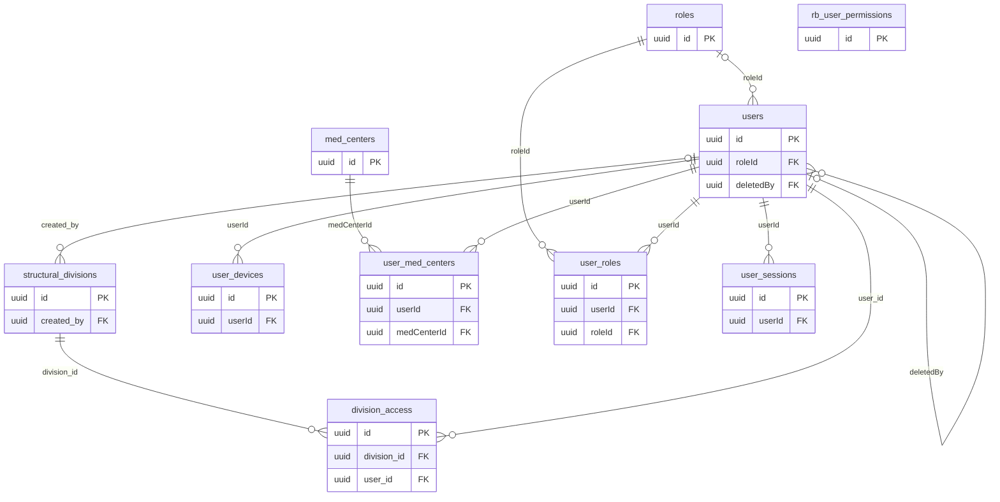

## Wiki и контент

Страницы базы знаний, структура меню, файлы, поиск и журнал изменений.

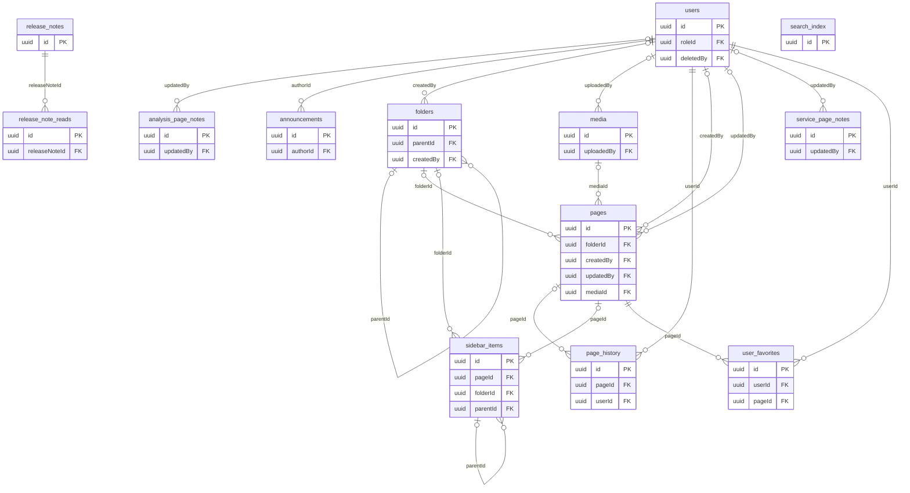

## Чаты и боты

Чаты, сообщения, реакции, подписчики и интеграции ботов.

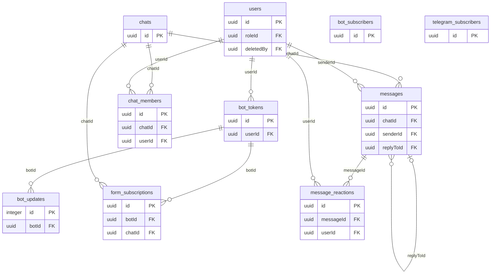

## Курсы

Учебные курсы, уроки, вопросы, прогресс и правила доступа.

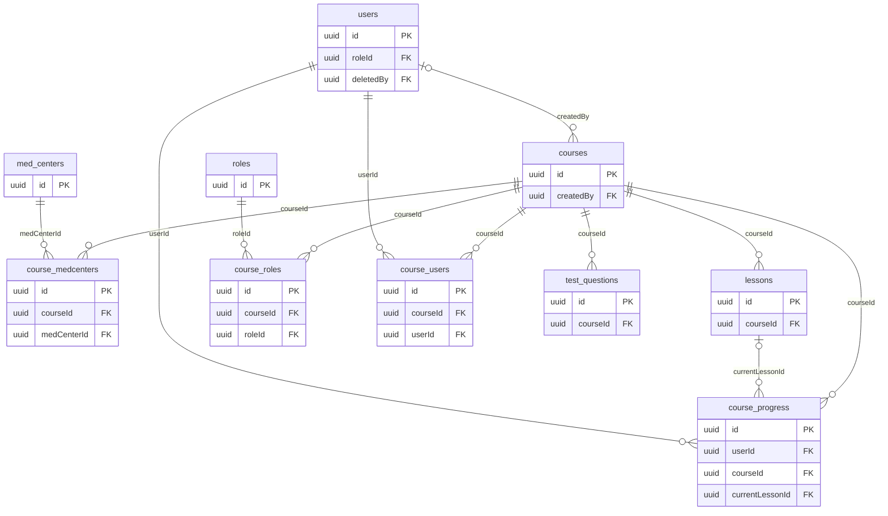

## Канбан

Доски, задачи и права доступа к ним.

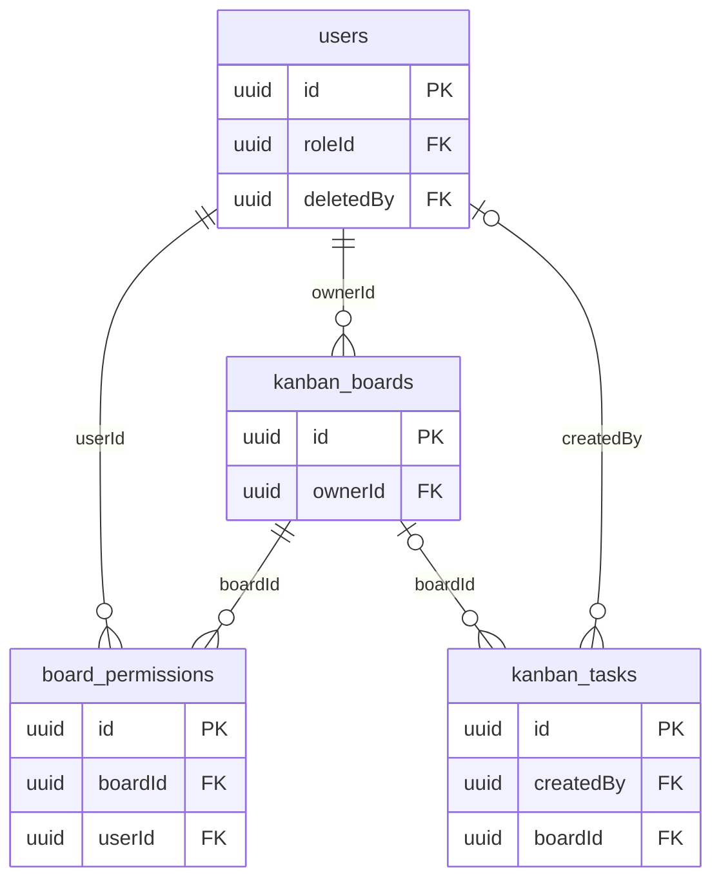

## Отзывы

Сбор, синхронизация и обработка отзывов из внешних источников.

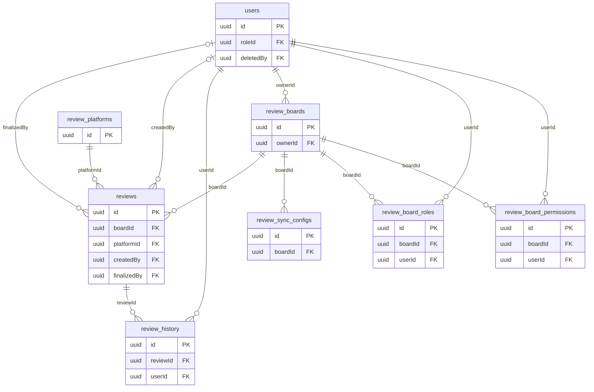

## МИС и медицинские справочники

Данные МИС, услуги, анализы, врачи, аккредитации и медицинская номенклатура.

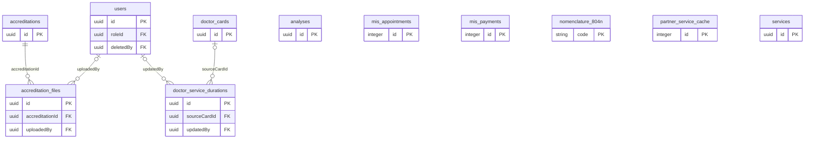

## Зарплата и реферальные бонусы

Начисления, выплаты, расходники, отчёты и настройки расчёта.

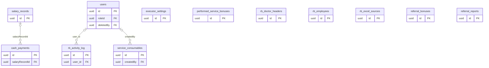

## Расписания и нормы

Расписания врачей, нормы времени, табели, кабинеты и праздники.

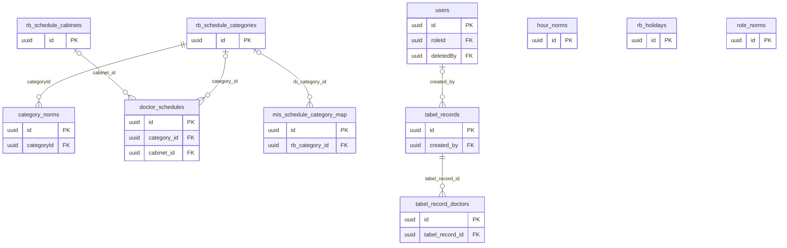

## Сравнение цен

Источники конкурентов, география, услуги, цены и сопоставления.

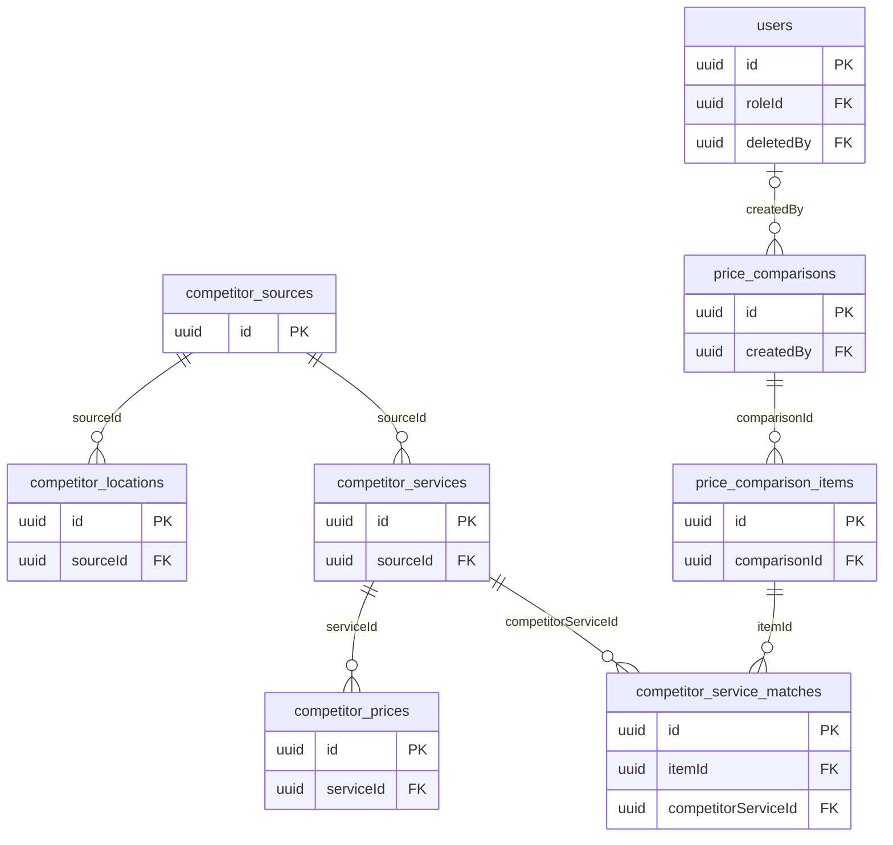

## Публичный API и формы

API-клиенты, аудит запросов, формы и доставка результатов.

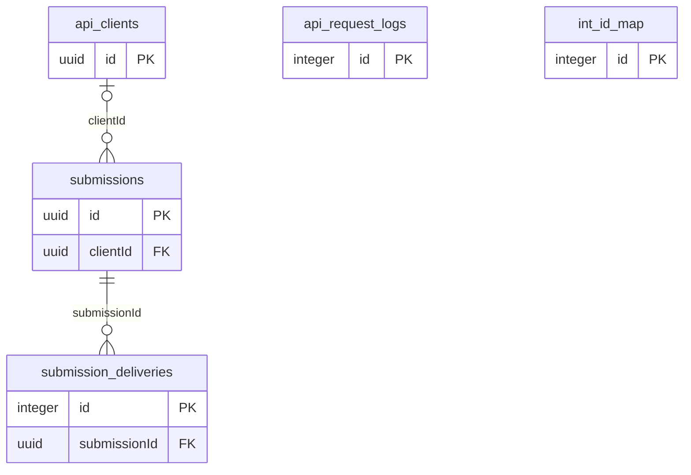

## Email

Шаблоны, журнал рассылок и пользовательское избранное.

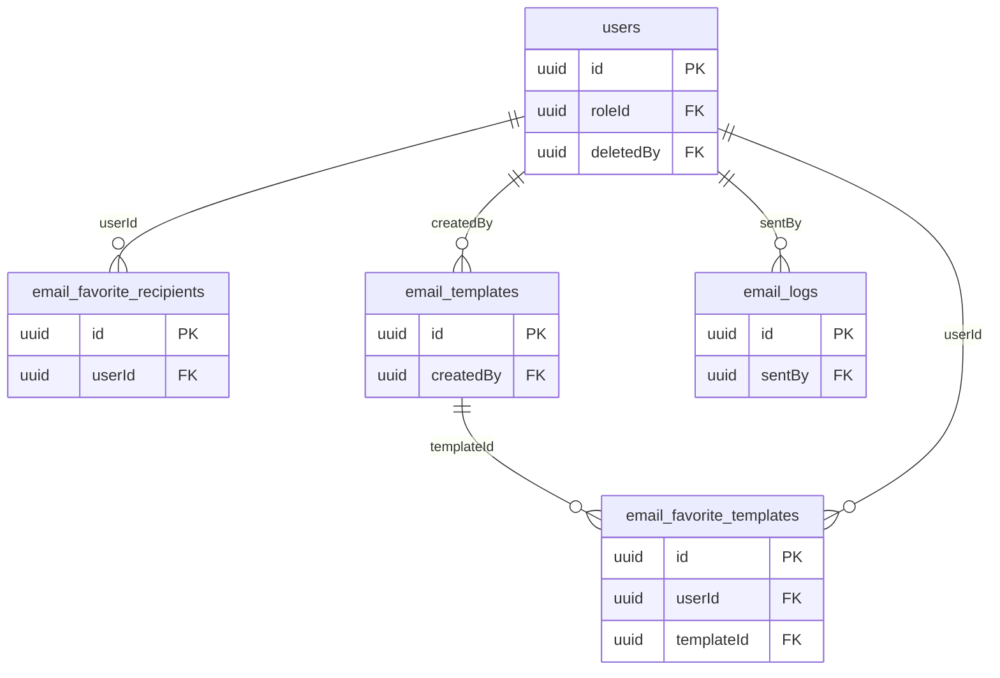

## Реестры и отчёты

Операционные журналы, реестры и специализированные медицинские отчёты.

```mermaid
erDiagram
    ambulance_report_entries {
      uuid id PK
    }
    certificate_registry_entries {
      uuid id PK
    }
    discount_report_entries {
      uuid id PK
    }
    doctor_day_report_entries {
      uuid id PK
    }
    gynecology_report_entries {
      uuid id PK
    }
    operations_report_entries {
      uuid id PK
    }
    surgery_report_entries {
      uuid id PK
    }
    therapy_report_entries {
      uuid id PK
    }
```

## Прочее и системные данные

Календарь, акции, транспорт, карта, настройки и учёт миграций.

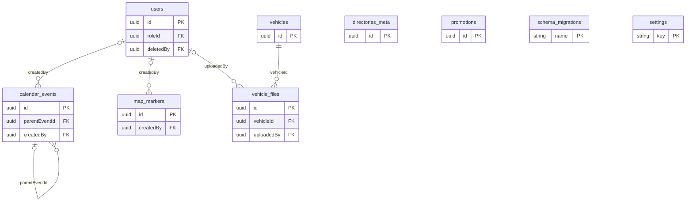
